# Cross-Module Business Flows — IERP

**Document type:** Functional discovery output (end-to-end journey map)
**Perspective:** Senior ERP Functional Consultant / Business Process Analyst / Product Owner
**Status:** Discovery — describes *ideal* ERP behaviour, not current implementation
**Created:** 2026-09-03
**Companion documents:** `EXPECTED_BUSINESS_SCENARIOS.md` (scenario catalogue), `ERP_DOMAIN_MODEL.md` (domain model)

---

## 0. How to read this document

A module is not a business process. A business process is what happens when a single real-world event travels through CRM, Sales, Inventory, Purchasing, Accounting, Employees, Support, and Reporting, leaving a consistent trail behind it.

This document maps **21 complete journeys**. Each one is described as:

| Section | Meaning |
|---|---|
| **Business trigger** | The real event that starts the journey |
| **Module chain** | The modules the event crosses, in order |
| **Journey diagram** | The flow as a sequence or flowchart |
| **Step ledger** | Per step: actor, module, business action, stock effect, financial effect, evidence |
| **Invariants across the flow** | What must be true end to end, not just per module |
| **Where it can break** | Realistic divergences and what the business expects |
| **Scenarios composed** | The scenario IDs from `EXPECTED_BUSINESS_SCENARIOS.md` this journey chains |

### Notation used in step ledgers

| Symbol | Meaning |
|---|---|
| `—` | No effect in that column |
| `⬇ stock` | Physical stock decreases |
| `⬆ stock` | Physical stock increases |
| `⇄ condition` | Stock changes condition or custody, not quantity |
| `🔒 reserve` | Availability decreases without physical movement |
| `🔓 release` | Reservation released or consumed |
| `DR` / `CR` | Ledger debit / credit |
| `TAX+` / `TAX−` | Tax recognised / un-recognised |

### The two rules that shape every flow below

1. **Delivery moves stock and recognises no tax.**
2. **Tax is recognised only when money is collected, in proportion to what was collected.**

Every journey in this document is, in some sense, a consequence of those two rules.

---

## 1. Flow index

| ID | Journey | Primary chain |
|---|---|---|
| F-01 | Normal sale from stock | CRM → Sales → Inventory → Accounting → Payment → Reporting |
| F-02 | Stock-shortage sale (back-to-back procurement) | Sales → Inventory → Purchasing → Receiving → Delivery → Accounting |
| F-03 | Product return and credit note | Sales → Inventory → Accounting |
| F-04 | Employee-generated opportunity | Employee → AI → CRM → Sales → Inventory → Accounting |
| F-05 | Partial payment and proportional tax recognition | Accounting → Payment → Tax → Reporting |
| F-06 | Chargeable support ticket to service revenue | Support → Maintenance → Inventory → Sales → Accounting |
| F-07 | Warranty service at zero revenue | Support → Maintenance → Inventory → Accounting (cost only) |
| F-08 | Supplier return and supplier credit | Inventory → Purchasing → Accounting |
| F-09 | Inter-warehouse transfer to satisfy a delivery | Sales → Inventory → Inventory → Sales |
| F-10 | Lot recall / expiry write-off | Inventory → Support → Sales → Accounting |
| F-11 | Below-floor price approval | CRM → Pricing → Sales → Audit |
| F-12 | Serialised device: sale, install, service history | Inventory → Sales → Maintenance → Inventory |
| F-13 | Overpayment to credit balance to refund | Payment → Accounting → Refund → Tax |
| F-14 | Month-end close | Employees → Inventory → Accounting → Reporting |
| F-15 | Cancelled order and released reservation | Sales → Inventory → CRM |
| F-16 | Cycle count to adjustment to variance reporting | Inventory → Accounting → Reporting |
| F-17 | Campaign to lead to customer to first sale | CRM → Sales → Accounting → Reporting |
| F-18 | Quotation expiry and re-quote | Sales → CRM → Pricing → Sales |
| F-19 | Direct customer self-service order | Customer App → Sales → Inventory → Accounting |
| F-20 | Field sale from a van warehouse | Employee → Sales → Inventory → Accounting → Payroll |
| F-21 | Procure-to-pay (full supplier cycle) | Purchasing → Inventory → Accounting → Payment |

---

## 2. F-01 — Normal sale from stock

> The reference journey. Every other flow is a variation on this one.

**Business trigger:** A qualified opportunity reaches proposal stage for goods the company holds in stock.

**Module chain:** CRM → Sales → Inventory → Accounting → Payment → Reporting

### Journey diagram

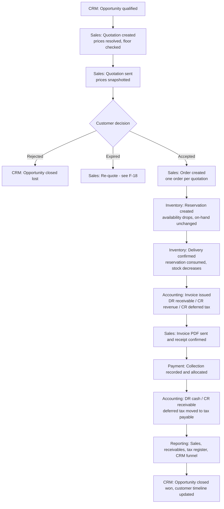

### Step ledger

| # | Actor | Module | Business action | Stock | Financial | Evidence |
|---|---|---|---|---|---|---|
| 1 | Employee | CRM | Opportunity qualified with value and expected close | — | — | Opportunity with origin and stage history |
| 2 | Employee | Sales | Quotation authored; each line's price resolved through tier rules with provenance; floor validated | — | — | Quotation lines with `resolved price source` |
| 3 | Employee | Sales | Quotation sent; totals and prices snapshotted; validity stamped | — | — | Sent timestamp, PDF, email log |
| 4 | Customer / recorder | Sales | Accept recorded with decider, recorder, timestamp, note | — | — | Decision record; expiry enforced |
| 5 | System | Sales | Order created from quotation, carrying payment term and priced lines | — | — | Order linked to quotation (one-to-one) |
| 6 | System | Inventory | Source-linked reservation created with lot/serial allocations | 🔒 reserve | — | Reservation with allocations and expiry |
| 7 | Warehouse | Inventory | Delivery confirmed; allocations picked; custody transfers | ⬇ stock, 🔓 release | **none** | Delivery operation, movements, shipment |
| 8 | Accountant | Accounting | Invoice issued from the completed delivery | — | DR receivable / CR revenue / CR **deferred** tax | Invoice, balanced entry, resolved due date |
| 9 | Employee / Customer | Sales | Invoice PDF delivered; receipt confirmed with signature | — | — | Invoice confirmation with signature |
| 10 | Payments Officer | Payment | Collection recorded with method and proof; allocated to the invoice | — | — | Payment, allocations |
| 11 | System | Accounting | Posting and proportional tax recognition | — | DR cash / CR receivable; **TAX+** deferred → payable | Tax recognition entry, balanced entry |
| 12 | System | Sales | Invoice paid amount advances; state derives to paid | — | — | Derived invoice state |
| 13 | Reviewer | Reporting | Sales, receivables ageing, tax register, funnel, customer timeline | — | — | Drill-through reports |
| 14 | Employee | CRM | Opportunity closed won; timeline shows the whole relationship | — | — | Closed-won opportunity linked to the invoice |

### Invariants across the flow

1. The quotation never touches stock in any state; the delivery never touches tax.
2. Availability drops at reservation (step 6), not at delivery (step 7) — the promise is real before the goods move.
3. Exactly **three** ledger events occur: invoice issuance, payment collection, and (in F-03) credit-note confirmation. The order, the reservation, and the delivery post nothing.
4. Revenue is recognised at step 8; tax is recognised at step 11. Between them the business has revenue and a deferred tax liability, and that is the correct picture.
5. Every price on the invoice traces back to the tier rule that produced it, through the quotation snapshot.
6. The delivery is invoiced exactly once; the quotation converts to exactly one order.

### Where it can break

| Divergence | Business expectation |
|---|---|
| Stock insufficient at step 7 | Delivery confirmation fails; route to F-02 (procure) or F-09 (transfer), or deliver partially |
| Customer decides after validity | Refused and marked expired; route to F-18 |
| Price below floor at step 2 | Blocked; route to F-11 |
| Reservation expires before step 7 | Stock frees; the order is flagged as no longer covered; re-reserve or re-source |
| Customer pays less than the invoice | Route to F-05 (proportional recognition) |
| Customer pays more | Route to F-13 (credit balance and refund) |
| Delivery correct, invoice wrong | Never edit; route to F-03 (credit note), then reissue |
| Goods delivered, never invoiced | Must surface on the **delivered-not-invoiced** exception report |

**Scenarios composed:** CR-04, SL-01, SL-02, SL-03, IN-03, IN-04, SL-06, SL-10, SL-08, AC-02, AC-03, AC-05, AC-06, SL-15, CR-07, XC-01, XC-02, XC-03, XC-07

---

## 3. F-02 — Stock-shortage sale (back-to-back procurement)

**Business trigger:** A customer accepts a quotation for goods the company does not hold.

**Module chain:** Sales → Inventory (check) → Purchasing → Receiving → Delivery → Accounting

### Journey diagram

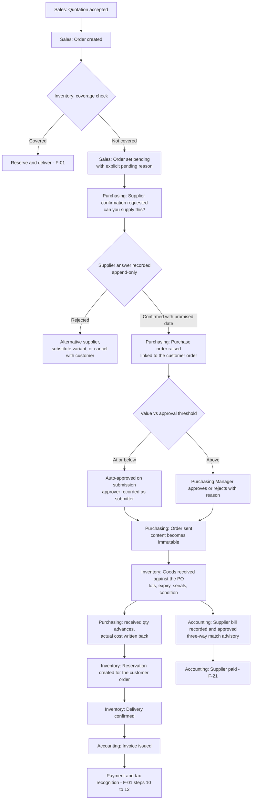

### Step ledger

| # | Actor | Module | Business action | Stock | Financial | Evidence |
|---|---|---|---|---|---|---|
| 1 | Sales | Sales | Order created; coverage check finds a gap | — | — | Order with **pending reason** naming the gap |
| 2 | Admin | Purchasing | Supplier confirmation requested against the customer order | — | — | Confirmation request |
| 3 | Admin | Purchasing | Supplier's answer recorded — confirmed with promised date, or rejected | — | — | **Append-only** confirmation; a correction is a new row |
| 4 | Buyer | Purchasing | Purchase order raised, one supplier, one destination warehouse, one currency, cost defaulted from supplier reference | — | **none** | Draft purchase order linked to the customer order |
| 5 | Buyer / Manager | Purchasing | Submitted; auto-approved at or below threshold, else explicitly approved | — | — | Submitter, approver, timestamps, rejection reason |
| 6 | Buyer | Purchasing | Sent to supplier | — | — | Sent timestamp; **content now immutable** |
| 7 | Warehouse | Inventory | Received: quantity counted, lots and expiry captured, serials registered, condition set | ⬆ stock | **none** | Receipt operation, lot identities, serialised units, movements |
| 8 | System | Purchasing | Received quantity advances under lock; actual cost written back to the supplier reference | — | — | Updated PO lines; refreshed cost provenance |
| 9 | System | Inventory | Reservation created for the waiting customer order | 🔒 reserve | — | Reservation linked to the order |
| 10 | Warehouse | Inventory | Delivery confirmed | ⬇ stock, 🔓 release | **none** | Delivery, movements |
| 11 | Accountant | Accounting | Customer invoice issued | — | DR receivable / CR revenue / CR deferred tax | Invoice, entry |
| 12 | Payables | Accounting | Supplier bill recorded against the PO; match variances flagged; approved | — | DR expense/asset + purchase tax / CR payable | Bill with advisory match, approver |
| 13 | Payments | Accounting | Supplier paid, allocated across bills | — | DR payable / CR cash | Supplier payment with allocations |

### Invariants across the flow

1. The customer order's **pending reason** is explicit — a waiting customer is never an unexplained blank state.
2. Purchasing writes **no stock**; every received unit is posted by the inventory path, with the purchase order as the receipt's source document.
3. Purchasing creates **no accounting entry**; the liability is recognised only when the supplier bill is approved.
4. Cumulative received quantity may never exceed ordered quantity — the excess is refused, not absorbed.
5. Supplier answers and purchase order approvals are append-only and attributable; a correction never erases the original answer.
6. Inbound coverage must be visible to Sales, so the customer can be given a real date derived from the supplier's promised date.

### Where it can break

| Divergence | Business expectation |
|---|---|
| Supplier rejects | Alternative supplier, substitute variant, or cancellation with the customer informed — never silent waiting |
| Supplier short-delivers | Order stays partially received; a human short-closes it with a reason (never automatic); dependent customer orders are flagged |
| Supplier over-delivers | Refused at the line; amend the order or physically reject the excess |
| Goods arrive damaged | Received to quarantine and dispositioned; the customer order is not covered by quarantined stock |
| Actual cost exceeds quoted cost | Recorded and written back; the bill's price variance is flagged advisory, and the approver decides |
| Bill arrives before receipt | Recordable; the match shows nothing received, so the approver sees exactly that risk |
| Customer cancels while awaiting supply | Route to F-15; the purchase order is separately cancelled or short-closed, and stock lands as free stock |

**Scenarios composed:** SL-03, SL-04, PU-02, PU-03, PU-04, PU-05, PU-06, PU-07, IN-01, IN-03, IN-04, SL-06, PU-09, PU-10, AC-07, AC-08, XC-07

---

## 4. F-03 — Product return and credit note

**Business trigger:** A customer returns delivered goods, or disputes an invoice.

**Module chain:** Sales → Inventory → Accounting

### Journey diagram

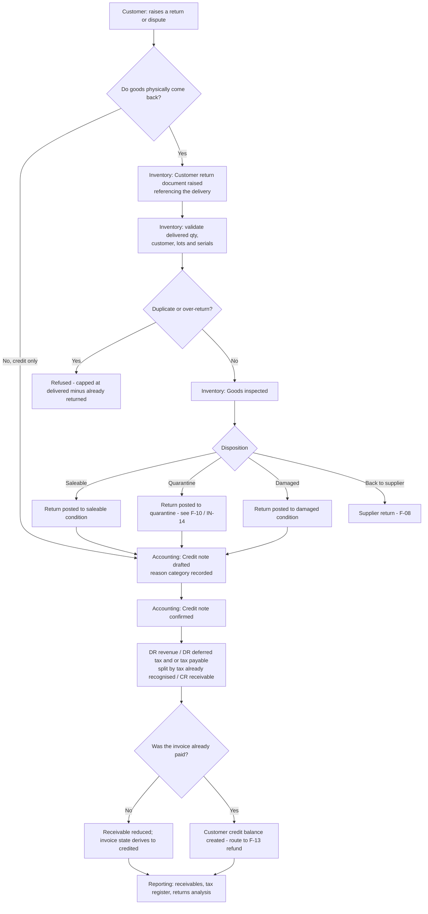

### Step ledger

| # | Actor | Module | Business action | Stock | Financial | Evidence |
|---|---|---|---|---|---|---|
| 1 | Customer / Support | Sales | Return or dispute raised against a delivery or invoice | — | — | Request with reason |
| 2 | Warehouse | Inventory | Customer return document raised, referencing the delivery | — | — | Return document with source delivery |
| 3 | System | Inventory | Validates: was it delivered, to this customer, in this quantity, from these lots and units | — | — | Refusal of duplicate or over-return |
| 4 | Inventory Manager | Inventory | Inspection and **disposition** decision | ⬆ stock at the dispositioned condition | **none** | Inspection outcome, movements, serialised custody returned |
| 5 | Accountant | Accounting | Credit note drafted against the invoice, lines paired to invoice lines, reason category set | — | — | Draft credit note (editable) |
| 6 | System | Accounting | Caps each credited quantity at the invoice line's uncredited remainder, and the total at the invoice's uncredited total | — | — | Cap enforcement |
| 7 | Accountant | Accounting | Credit note confirmed | — | DR revenue; DR deferred tax and/or tax payable **split by the ratio already recognised**; CR receivable | Confirmed credit note (immutable), balanced entry, PDF |
| 8 | System | Sales | Invoice credited amount advances; state derives to credited when fully reversed | — | — | Derived invoice state |
| 9 | Accountant | Accounting | If already collected, an available credit balance now exists | — | — | Credit balance, refundable via F-13 |

### Invariants across the flow

1. **A credit note is not a stock return, and a return is not a credit note.** They are linked but separately decided documents — which is exactly why "goods retained, credit given" and "goods returned, no credit" are both representable.
2. Nothing is deleted. A confirmed invoice is corrected by a credit note; a confirmed credit note is itself immutable.
3. The tax reversal split must be computed so the entry balances exactly — independently rounding both tax lines can produce an unbalanced entry.
4. Returned goods reach saleable availability **only** if inspection dispositioned them there. A credit must never silently restore saleable stock.
5. Return quantity is bounded by what was actually delivered, per line, net of prior returns.

### Where it can break

| Divergence | Business expectation |
|---|---|
| Goods returned but no credit agreed | Return posts stock; no credit note; the customer's balance is unchanged and the goods sit as company stock with a stated reason |
| Credit agreed but goods retained | Credit note only; stock consequence explicitly nil, and that nil is visible |
| Partial return of a partially credited line | Both caps apply independently; the remainders stay visible per line |
| Returned goods are unsaleable | Dispositioned to damaged or disposal (IN-09), and the write-off value is reported |
| Invoice fully paid and fully credited | Credit balance created; refund requires the separated record-and-approve path (F-13) |
| Wrong invoice entirely | Full credit note plus a corrected new invoice, both linked, so the trail shows what was wrong and what replaced it |

**Scenarios composed:** IN-13, IN-14, IN-09, SL-12, AC-04, AC-05, AC-06, AC-12, XC-02, XC-07

---

## 5. F-04 — Employee-generated opportunity (Employee → AI → CRM → Sales)

**Business trigger:** An employee records a voice note during a customer visit that contains a buying signal.

**Module chain:** Employee → AI → CRM → Sales → Inventory → Accounting → Payroll

### Journey diagram

```mermaid
sequenceDiagram
    actor Employee
    participant Visit as Employees module
    participant Storage as Private storage
    participant AI as Transcription provider
    participant Review as Human reviewer
    participant CRM
    participant Sales
    participant Payroll

    Employee->>Visit: Check in with GPS
    Employee->>Visit: Record voice note
    Visit->>Storage: Store audio privately
    Visit->>AI: Queue transcription (asynchronous)
    AI-->>Visit: Transcript + confidence, or failure
    Note over Visit: Failure is recorded and NEVER blocks visit completion
    Visit->>Visit: Keyword rules matched
    Visit->>Review: Sales opportunity DRAFT proposed
    Note over Review: No AI output takes effect without a recorded human decision
    Review->>CRM: Approve -> becomes a real opportunity
    Review-->>Visit: Or reject with reason (retained for rule tuning)
    CRM->>Sales: Quotation created, carrying the opportunity summary
    Sales->>Sales: Accept recorded -> order -> delivery -> invoice -> payment (F-01)
    Sales-->>Payroll: Outcome attributed to the employee
    Payroll->>Payroll: Bonus suggestion raised, approved or rejected
    Employee->>Visit: Check out; duration feeds work-time adherence
```

### Step ledger

| # | Actor | Module | Business action | Stock | Financial | Evidence |
|---|---|---|---|---|---|---|
| 1 | Employee | Employees | Visit check-in with GPS and channel recorded | — | — | Visit with check-in time, location, recording channel |
| 2 | Employee | Employees | Voice note recorded against the visit | — | — | Voice note in pending state; private audio |
| 3 | System | AI | Transcription queued and executed asynchronously | — | — | Transcript with **confidence value and confidence source label** |
| 4 | System | AI | Keyword rules matched; opportunity **draft** created | — | — | Draft referencing transcript, matched rules, and visit |
| 5 | Reviewer | CRM | Explicit human approve or reject with a decision note | — | — | Decision with identity and note; rejected drafts retained |
| 6 | System | CRM | Approved draft becomes a real opportunity, keeping its AI origin visible | — | — | Opportunity with AI origin |
| 7 | Employee | Sales | Quotation created carrying the opportunity's summary | — | — | Quotation with `sales_opportunity` link and notes |
| 8 | — | Sales → Accounting | Standard F-01 continues: accept, order, reserve, deliver, invoice, collect | ⬇ stock | Standard three postings | Full F-01 trail |
| 9 | Employee Manager | Employees | Bonus suggestion raised, optionally referencing the opportunity draft | — | — | Bonus suggestion with reason |
| 10 | System Admin | Employees | Bonus approved or rejected — terminal either way | — | — | Decision identity and note |
| 11 | Payroll Officer | Employees | Performance score computed; approved bonuses added; salary confirmed | — | — | Score breakdown; salary with copied payable base |

### Invariants across the flow

1. **AI failure never blocks visit completion.** A failed transcription is written to the transcription record and changes nothing about the visit, the score, or the salary.
2. **Confidence is never fabricated.** It is provider-reported, derived from log-probabilities, or explicitly unavailable — never defaulted to zero.
3. **No AI output takes effect without an explicit, recorded human decision.** This holds for the transcript, the opportunity draft, and the bonus suggestion alike.
4. The AI origin stays visible on the opportunity and everything it produces, so an audit can distinguish machine-originated from human-originated pipeline.
5. Rejected drafts are retained with their reasons — they are the feedback loop that tunes the keyword rules.
6. Rule edits affect only future detection; a historical draft keeps the rules that produced it.
7. Visit data recorded in the field is not editable by a reviewer; a reviewer may only add a review note.

### Where it can break

| Divergence | Business expectation |
|---|---|
| Transcription fails | Recorded as failed; the visit still completes and still scores; a human can re-queue |
| Confidence unavailable | Displayed as unavailable with its source label; the reviewer weighs it accordingly |
| Draft is noise | Rejected with a reason; rules are tuned (EM-08); noise rate is reportable |
| Draft approved but never quoted | Opportunity ages on the pipeline report as stalled |
| Employee leaves before the sale closes | Score and salary are computed for the period worked; the opportunity stays attributed to its author |
| Bonus suggested by AI | Treated identically to a human suggestion — approval is required and only approved bonuses affect pay |

**Scenarios composed:** EM-03, EM-04, EM-05, EM-06, EM-07, EM-08, CR-04, SL-01, F-01 chain, EM-09, EM-10, EM-11, XC-06

---

## 6. F-05 — Partial payment and proportional tax recognition

**Business trigger:** A customer pays part of an invoice; later, they pay the rest.

**Module chain:** Accounting → Payment → Tax → Reporting

### Journey diagram

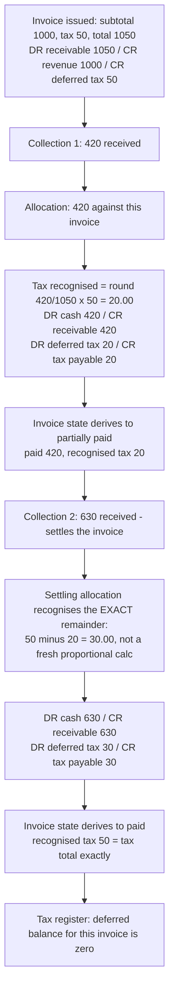

### Step ledger

| # | Event | Collected | Tax recognised this step | Cumulative recognised | Deferred remaining | Invoice state |
|---|---|---:|---:|---:|---:|---|
| 0 | Invoice issued (1050 incl. 50 tax) | 0.00 | 0.00 | 0.00 | 50.00 | issued |
| 1 | Collection of 420 | 420.00 | 20.00 (proportional) | 20.00 | 30.00 | partially paid |
| 2 | Collection of 300 | 300.00 | 14.29 (proportional) | 34.29 | 15.71 | partially paid |
| 3 | Collection of 330 (settles) | 330.00 | **15.71 (exact remainder)** | **50.00** | **0.00** | paid |

> Step 3 deliberately does **not** compute `round(330/1050 × 50) = 15.71` as a coincidence — it computes `tax_total − already_recognised`. Where rounding would otherwise leave a residual cent, the settling allocation absorbs it. This is what guarantees the recognised total equals the invoice's tax total exactly.

### Invariants across the flow

1. Tax is recognised **only** on collection, never at issuance.
2. Each non-settling allocation recognises a proportional amount; the **settling** allocation recognises the exact remainder, so the sum equals the invoice tax total with **no rounding drift**.
3. One tax recognition entry exists per invoice-and-payment allocation, and those entries are **append-only**.
4. A zero-tax invoice writes no recognition entry at all.
5. Every collection channel — cash, transfer, cheque, card — runs the same recognition and posting logic. A channel adds a record, never a second path.
6. Paid amount may never exceed the grand total after credits.
7. A payment split across three invoices writes three recognition rows whose amounts sum to the allocated total.

### Where it can break

| Divergence | Business expectation |
|---|---|
| One payment covers several invoices | One payment, several allocations, several recognition entries; each invoice settles independently |
| Payment exceeds the invoice | Excess becomes an available credit balance (F-13), never an over-allocation |
| Payment received before the invoice exists | Held as a customer advance (a liability); tax recognises when it is applied to an issued invoice |
| Provider retries a callback | Idempotency: one payment, one recognition, one posting |
| Payment bounces after posting | An explicit compensating document reverses the collection and **un-recognises** the tax; nothing is deleted |
| Credit note lands between two collections | Recognition ratio uses the invoice's tax already recognised at that moment; the credit note's reversal splits deferred versus payable by that same ratio |

**Scenarios composed:** SL-06, SL-08, SL-09, AC-02, AC-03, AC-06, AC-12, XC-07

---

## 7. F-06 — Chargeable support ticket to service revenue

**Business trigger:** A customer reports a fault on equipment that is out of warranty.

**Module chain:** Support → Maintenance → Inventory → Sales → Accounting

### Journey diagram

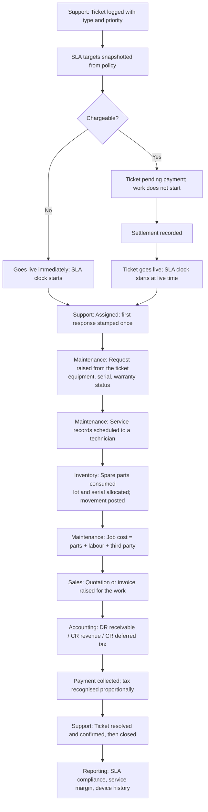

### Step ledger

| # | Actor | Module | Business action | Stock | Financial | Evidence |
|---|---|---|---|---|---|---|
| 1 | Customer / Agent | Support | Ticket logged: customer, type, priority, description, attachments | — | — | Numbered ticket; origin channel recorded |
| 2 | System | Support | SLA response and resolution targets **snapshotted** for that priority | — | — | Snapshotted targets on the ticket |
| 3 | Support Manager | Support | Flagged chargeable; ticket held pending payment | — | — | Chargeable flag; payment link record |
| 4 | Payments | Support | Settlement recorded; ticket goes live; SLA clock starts | — | Ideally DR cash / CR revenue + deferred tax | Settlement record; live timestamp |
| 5 | Support Manager | Support | Assigned; assignment appended to history | — | — | Append-only assignment history |
| 6 | Agent | Support | First customer-visible message stamps first response, once | — | — | First-response timestamp |
| 7 | Support Manager | Maintenance | Maintenance request raised from the ticket, naming equipment, serial, and warranty status | — | — | Maintenance record linked to the ticket and serialised unit |
| 8 | Technician | Maintenance | Service records scheduled and executed; findings and time recorded | — | — | Service records with technician and status history |
| 9 | Technician | Inventory | Spare parts consumed with lot and serial allocations, from a warehouse or van | ⬇ stock | — | Consumption paired with its movement; cost on the job |
| 10 | Support Manager | Maintenance | Job cost accumulated: parts, labour, third-party | — | — | Job cost breakdown |
| 11 | Accountant | Sales → Accounting | Invoice raised for the work through the **standard** invoice path | — | DR receivable / CR revenue / CR deferred tax | Invoice linked to the maintenance record |
| 12 | Payments | Accounting | Collection and proportional tax recognition (F-05) | — | DR cash / CR receivable; TAX+ | Payment, recognition entry |
| 13 | Agent / Customer | Support | Resolution recorded, confirmed, then closed | — | — | Resolution text and timestamp; breach flags stay sticky |

### Invariants across the flow

1. **Service revenue uses the same invoicing, collection, and tax machinery as goods revenue.** A second revenue path would be a second tax policy.
2. Spare-parts consumption **never** writes a stock balance directly — it posts through the canonical inventory path and is paired with the movement it produced.
3. SLA targets are snapshotted at clock start; editing the SLA policy never rewrites an in-flight ticket's due times.
4. The clock runs on continuous calendar time; only the customer-wait pause suspends it, and accumulated wait extends the resolution due time.
5. Breach flags are sticky — a late recovery never erases the fact that a target was missed.
6. The customer sees one conversation (the ticket); internally the work has its own document, cost, and parts, and the two stay linked in both directions.
7. Parts consumption reverses in **full** only; a smaller correction is a full reversal followed by a new, smaller consumption.

### Where it can break

| Divergence | Business expectation |
|---|---|
| Customer never settles a chargeable ticket | Work never starts; the ticket ages in pending payment and is visible as blocked-on-customer |
| Equipment turns out to be under warranty | Route to F-07; the charge is withdrawn and the settlement refunded (F-13) |
| Part fitted was wrong | Full reversal (MT-04) and a new consumption; both movements survive |
| Waiting on customer | SLA pauses; the accumulated wait extends the resolution due time; the pause is visible |
| Issue recurs after closure | New ticket that explicitly references the prior one (SU-07), so recurrence is reportable |
| Ticket needs a field visit | A plan task and visit are generated for the employee; the visit links back to the ticket |

**Scenarios composed:** SU-01, SU-02, SU-03, SU-04, SU-05, SU-06, SU-08, MT-01, MT-02, MT-03, MT-05, MT-06, SL-06, SL-08, IN-12

---

## 8. F-07 — Warranty service at zero revenue

**Business trigger:** A customer reports a fault on equipment still under warranty.

**Module chain:** Support → Maintenance → Inventory → Accounting (cost only)

### Journey diagram

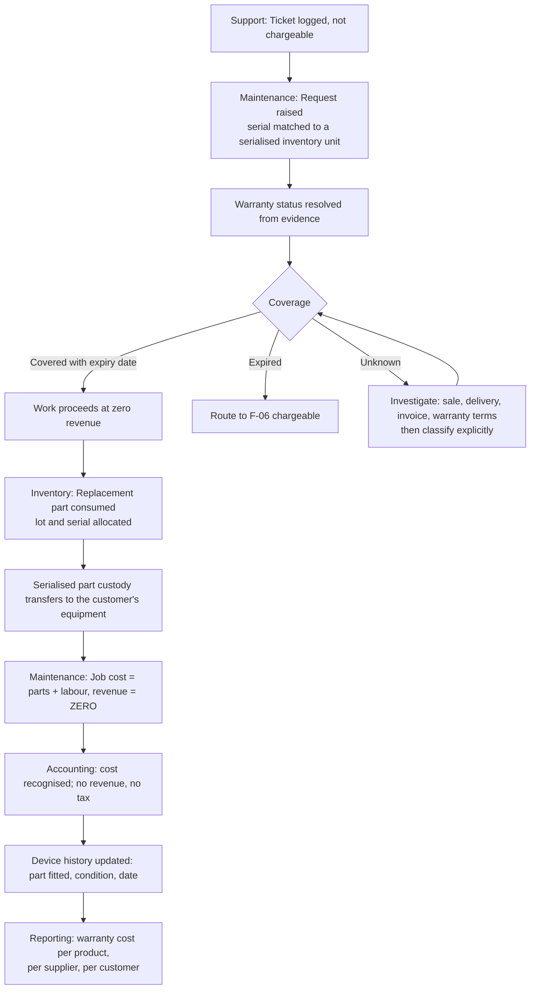

### Invariants across the flow

1. **Warranty-covered work has a real cost and zero revenue, and that must be visible.** Free-of-charge service is a cost centre, not a blank record.
2. Warranty status is explicit — covered with an expiry date, expired, or unknown. "Unknown" is a legitimate, visible state that prompts investigation, never a guess.
3. A serialised unit link is made only on a real identifier match, never on a fuzzy guess.
4. The fitted part appears in the equipment's device history, so the next claim is decided on complete evidence.
5. Warranty cost by product and by supplier is reportable — that is how a systemic quality problem becomes visible and how a supplier claim gets raised.

### Where it can break

| Divergence | Business expectation |
|---|---|
| Warranty status unknown | The claim decision is made from the device's sale, delivery, invoice, and warranty terms, and the decision plus reason is recorded (MT-08) |
| Warranty expired mid-repair | The classification at request time governs; a change is a recorded decision, not a silent re-read |
| The failure is a supplier defect | Route to F-08: supplier return with an expected outcome of replacement or credit |
| Repeated warranty failures on one product | Surfaced by warranty-cost-per-product reporting, feeding a supplier or design conversation |

**Scenarios composed:** SU-01, SU-08, MT-01, MT-02, MT-03, MT-05, MT-08, PM-10, IN-12

---

## 9. F-08 — Supplier return and supplier credit

**Business trigger:** Received goods are defective, wrong, or over-delivered — sometimes discovered only after a customer returns them.

**Module chain:** Inventory → Purchasing → Accounting

### Journey diagram

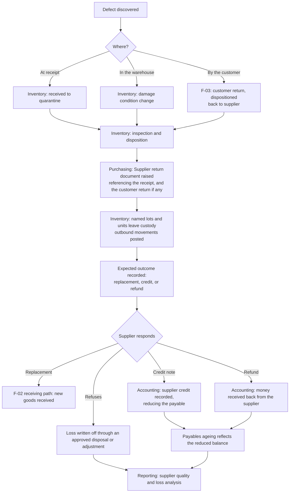

### Invariants across the flow

1. The stock leaves and the money conversation is tracked, but **no financial document is fabricated by the warehouse**. A supplier credit is an explicit accounting decision.
2. The supplier return names its source receipt, and where the goods came back from a customer, it names that return too — so a defect is traceable from the end customer to the supplier lot.
3. Lot and serial identity survive the outbound return; a supplier return is not an adjustment.
4. If the supplier refuses, the loss is written off through an approved document with a reason — never absorbed silently.
5. Supplier quality becomes measurable because returns, quarantine dispositions, and warranty costs all attribute back to the supplier and lot.

### Where it can break

| Divergence | Business expectation |
|---|---|
| Supplier accepts return but sends no credit | The expected outcome ages as an open claim on the payables and supplier-claims report |
| Replacement arrives with a different lot | Received normally as a new lot; the original lot's history is not rewritten |
| Goods must be scrapped rather than returned | Disposal (IN-09) with evidence; the loss value is reported and any supplier claim is pursued separately |
| Return crosses a period boundary | The stock event and the financial event land in their own dated periods; both are traceable |

**Scenarios composed:** IN-01, IN-07, IN-13, IN-14, IN-15, IN-09, PU-09, AC-07, PU-12

---

## 10. F-09 — Inter-warehouse transfer to satisfy a delivery

**Business trigger:** A customer order is covered company-wide, but not at the warehouse that must ship it.

**Module chain:** Sales → Inventory → Inventory → Sales

### Journey diagram

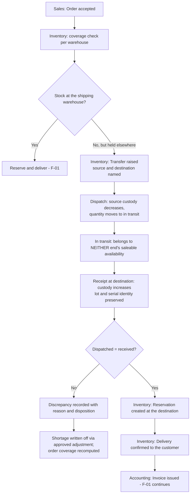

### Step ledger

| # | Actor | Module | Business action | Stock | Evidence |
|---|---|---|---|---|---|
| 1 | Sales | Sales | Order accepted; coverage checked per warehouse | — | Order with coverage picture |
| 2 | Inventory Manager | Inventory | Transfer raised with lines and allocations | — | Transfer document |
| 3 | Source warehouse | Inventory | Dispatch confirmed | ⬇ source, → in transit | Outbound movements |
| 4 | — | Inventory | In-transit quantity visible, saleable at neither end | — | In-transit position |
| 5 | Destination warehouse | Inventory | Receipt confirmed; lot and serial identity preserved | ⬆ destination | Inbound movements |
| 6 | System | Inventory | Dispatched-versus-received compared | — | Discrepancy record if they differ |
| 7 | System | Inventory | Reservation created at the destination | 🔒 reserve | Reservation |
| 8 | Warehouse | Inventory | Delivery confirmed to the customer | ⬇ stock, 🔓 release | Delivery, movements |

### Invariants across the flow

1. In-transit quantity is **visible and belongs to neither end's saleable availability** — otherwise the same units get promised twice.
2. Lot and serial identity survives the transfer; a transfer never creates or destroys traceability.
3. A dispatch-versus-receipt difference is a **discrepancy with a reason and a disposition**, never silently absorbed.
4. Cancelling a transfer still in transit is an explicit decision with a stated outcome for the in-transit quantity.
5. The customer's promised date must reflect transfer lead time, not just the existence of stock somewhere.

### Where it can break

| Divergence | Business expectation |
|---|---|
| Goods lost in transit | Discrepancy recorded, then written off through an approved adjustment; the loss is reported |
| Partial arrival | The received portion posts; the shortfall is a discrepancy with its own disposition |
| Order cancelled while goods are in transit | The transfer completes on its own terms; the goods land as free stock at the destination |
| Transfer would strip the source below its reorder level | Surfaced before dispatch so the decision is informed, not discovered later |

**Scenarios composed:** SL-03, PM-05, IN-05, IN-03, IN-04, IN-06, IN-11, IN-18

---

## 11. F-10 — Lot recall and expiry write-off

**Business trigger:** A supplier issues a recall, or a lot reaches expiry with stock still on hand.

**Module chain:** Inventory → Sales → Support → Accounting → Purchasing

### Journey diagram

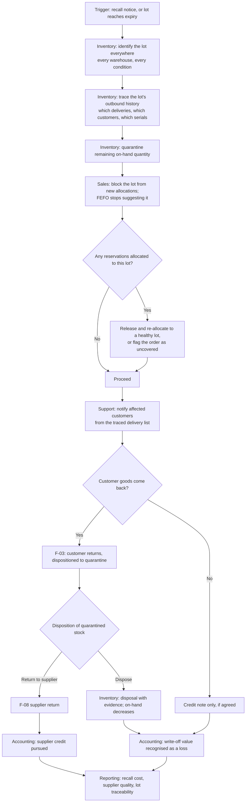

### Invariants across the flow

1. **A lot is traceable in both directions**: from a lot to every customer who received it, and from a customer's delivery back to the lot and serial.
2. Expired and quarantined quantity is on-hand but **not saleable**, and the availability answer says which.
3. FEFO stops suggesting a blocked lot immediately; existing allocations to it are re-pointed or the order is flagged uncovered — a recall must never be defeated by a stale reservation.
4. Disposal names what physically went and carries evidence; it is never automatic.
5. Undated legacy lots stay visible but sort last, so a recall search never quietly misses them.
6. The recall's total cost — written-off stock, credits issued, service effort, supplier recovery — is reportable as one number.

### Where it can break

| Divergence | Business expectation |
|---|---|
| Lot already fully delivered | Traceability still answers who has it; the flow becomes a customer-notification and credit exercise |
| Some units are serialised | Each unit is individually traceable to its current holder, which is stronger than a lot-level notice |
| Customer refuses to return | Credit note only, if agreed; the goods are recorded as customer-retained with the stock consequence explicitly nil |
| Supplier denies responsibility | Loss written off with a reason; supplier quality reporting captures the pattern |
| Recall spans a closed period | Stock events post in the open period; the financial correction references the original event dates |

**Scenarios composed:** PM-10, IN-10, IN-14, IN-09, IN-13, IN-15, SL-12, AC-13, SU-01, PU-12

---

## 12. F-11 — Below-floor price approval

**Business trigger:** A salesperson needs to quote below the variant's minimum price to win a deal.

**Module chain:** CRM → Pricing → Sales → Audit

### Journey diagram

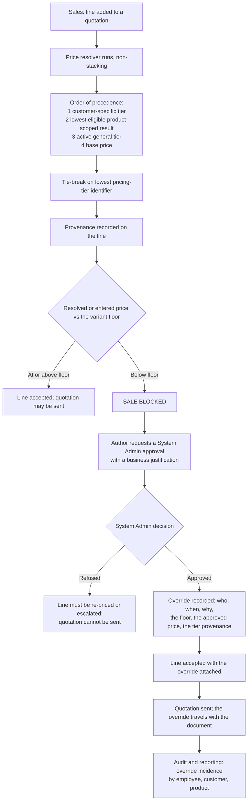

### Invariants across the flow

1. Price resolution is **deterministic and never stacks** — one rule wins, and the losing rules stay visible in the preview so the outcome is explainable to the customer.
2. The floor is a **hard control with a named exception path**, not a warning.
3. The exception is granted by someone other than the requester, and the approval records the floor, the approved price, the reason, and the tier provenance.
4. The override travels with the document, so an auditor reading the invoice can see why the price was what it was.
5. Override incidence is reportable by employee, customer, and product — a pattern of exceptions is a pricing-policy signal, not a series of one-offs.
6. An inactive customer's tier no longer resolves; eligibility is checked at resolution time, not assumed from history.

### Where it can break

| Divergence | Business expectation |
|---|---|
| Two product-scoped tiers give equal results | Deterministic tie-break on the lowest pricing-tier identifier — the same customer always gets the same answer |
| Tier expires between drafting and sending | An unsent quotation re-resolves; a sent quotation keeps its snapshot |
| Customer challenges the price later | The preview reproduces the decision with full provenance (CR-08) |
| Approval requested but never decided | The quotation stays unsendable and ages on a pending-approvals queue |
| Floor itself was set wrong | Corrected forward by a pricing change; existing sent documents keep their snapshots |

**Scenarios composed:** MD-12, PM-04, CR-08, SL-01, SL-16, XC-02, XC-05

---

## 13. F-12 — Serialised device: sale, install, and service history

**Business trigger:** The company sells a serial-tracked device that will later need service and may be under warranty.

**Module chain:** Purchasing → Inventory → Sales → Maintenance → Inventory

### Journey diagram

```mermaid
sequenceDiagram
    participant PO as Purchasing
    participant INV as Inventory
    participant SL as Sales
    participant MT as Maintenance
    participant RPT as Reporting

    PO->>INV: Receipt confirmed against the purchase order
    INV->>INV: One serialised unit registered per identifier<br/>(quantity-one movement each)
    INV->>INV: Unit enters custody: status, warehouse, receipt reference
    SL->>INV: Order accepted; reservation allocates THIS unit
    Note over INV: A unit can be actively allocated to at most one reservation
    INV->>INV: Delivery confirmed; custody transfers OUT to the customer
    INV->>SL: Invoice issued; warranty period starts from the delivery/invoice
    MT->>INV: Later, a fault is reported quoting the serial
    INV-->>MT: Device timeline returned: receipt, movements,<br/>delivery, customer, warranty position
    MT->>MT: Maintenance request linked to the serialised unit
    MT->>INV: Spare part consumed; if serialised, its custody<br/>transfers into this device
    MT->>MT: Service record completed; findings recorded
    MT->>RPT: Device history now spans purchase, sale, and every service
```

### Step ledger

| # | Actor | Module | Business action | Stock | Evidence |
|---|---|---|---|---|---|
| 1 | Warehouse | Inventory | Receipt: one serialised unit registered per identifier | ⬆ stock (one movement per device) | Serialised units with receipt reference |
| 2 | Sales | Inventory | Reservation allocates the specific unit | 🔒 reserve | Reservation with serial allocation |
| 3 | Warehouse | Inventory | Delivery: custody transfers out | ⬇ stock, ⇄ custody | Delivery with serial allocation |
| 4 | Accountant | Accounting | Invoice issued; warranty period established | — | Invoice; warranty terms |
| 5 | Support | Maintenance | Fault reported by serial; unit matched | — | Maintenance record linked to the unit |
| 6 | Technician | Inventory | Replacement part consumed and, if serialised, transferred into the device | ⬇ stock, ⇄ custody | Consumption paired with its movement |
| 7 | Reviewer | Reporting | Full device history answers any question about this unit | — | Timeline across purchase, sale, and service |

### Invariants across the flow

1. Every serialised receipt, transfer, adjustment, delivery, and condition change **references the unit** — so the timeline is complete by construction, not by reconstruction.
2. One physical unit equals one base quantity; a serial-tracked variant cannot be received, moved, or delivered in ambiguous quantities.
3. A unit can be actively allocated to at most one reservation, so two customers can never be promised the same device.
4. Unknown legacy status values normalise to an explicit "unknown" rather than being guessed.
5. Where a historical unit lacks a receipt movement, a synthetic initial receipt event may be *displayed* — derived from its receipt record and never written into history.
6. The device history is the evidence base for warranty decisions (MT-08) and recalls (F-10).

**Scenarios composed:** PM-02, PM-10, IN-01, IN-03, IN-04, IN-12, MT-01, MT-03, MT-08

---

## 14. F-13 — Overpayment to credit balance to refund

**Business trigger:** A customer pays more than they owe, or holds a confirmed credit note, and wants cash back.

**Module chain:** Payment → Accounting → Refund → Tax

### Journey diagram

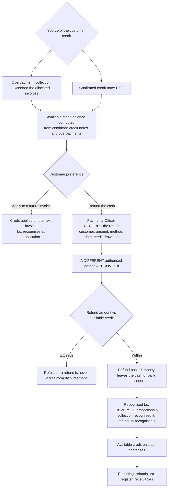

### Invariants across the flow

1. **A refund is never modelled as a negative collection.** Overloading collections would corrupt every sum built on them — including proportional tax recognition, which would recognise negative tax at the wrong moment.
2. **Recording and approving a refund are separate permissions held by different roles.** Money leaving the business is the one operation whose reversal is never free.
3. A refund is paid **only** against an available credit balance computed from confirmed credit notes and overpayments, and may never exceed it.
4. Refunding collected money **un-recognises the tax that collection recognised**, proportionally — otherwise the "tax follows collection" rule holds in one direction only.
5. The credit balance is computed from documents, never stored as an editable figure.

### Where it can break

| Divergence | Business expectation |
|---|---|
| Refund requested with no credit behind it | Refused; the customer needs a credit note first (F-03) |
| Recorder and approver are the same person | Refused by role separation, not by convention |
| Credit note reversed after the refund | The refund stands as a posted event; any correction is a new, linked document |
| Customer prefers credit against future invoices | No refund; the credit applies on the next invoice and tax recognises at application |
| Partial refund | Permitted within the available balance; tax reverses proportionally to the refunded share |

**Scenarios composed:** SL-08, SL-09, SL-12, AC-03, AC-04, AC-05, AC-06, AC-12, XC-05

---

## 15. F-14 — Month-end close

**Business trigger:** The accounting month ends.

**Module chain:** Employees → Inventory → Sales → Purchasing → Accounting → Reporting

### Journey diagram

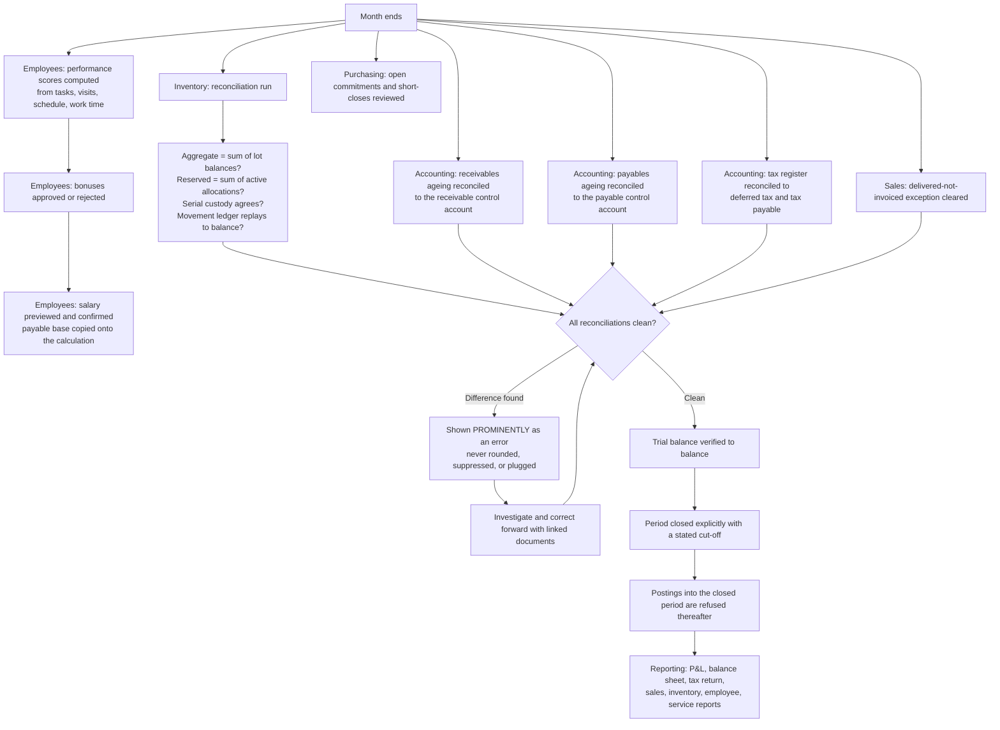

### The close checklist as a business sequence

| Order | Check | Owner | Blocking? |
|---|---|---|---|
| 1 | Delivered-not-invoiced is empty or explained | Sales / Accountant | Yes — unbilled revenue |
| 2 | Invoiced-not-collected aged and reviewed | Accountant | No — but it is the credit-control agenda |
| 3 | Stock reconciliation: aggregate, lot, serial, reservation, ledger replay | Inventory Manager | Yes |
| 4 | Open purchase commitments and short-close decisions reviewed | Purchasing Manager | No |
| 5 | Supplier bills for the period recorded and approved | Payables Officer | Yes — unrecognised liabilities |
| 6 | Receivables subledger reconciled to the control account | Accountant | Yes |
| 7 | Payables subledger reconciled to the control account | Accountant | Yes |
| 8 | Tax register reconciled to deferred tax and tax payable | Accountant | Yes |
| 9 | Performance scores and salaries confirmed | Payroll Officer | Yes for payroll |
| 10 | Trial balance verified | Accountant | Yes |
| 11 | Period closed with cut-off | Accountant | — |

### Invariants across the flow

1. **A period cannot be closed while a mandatory reconciliation shows a difference.** Any difference is shown prominently as an error and is never adjusted, rounded, suppressed, or plugged.
2. Subledgers are **computed, never stored** — a stored balance is a cache able to disagree with the documents, which is the very failure the reconciliation exists to detect.
3. Closing is an explicit, audited act with a stated cut-off; reopening requires an authorised decision.
4. A late document posts to the current open period with an explicit reference to the original event date — never by reopening silently.
5. Salary calculations are corrected by **supersession**, never by editing or deleting; the payable base is copied so a historical salary stays reproducible.
6. Performance breakdowns snapshot their inputs, so a later plan or configuration change cannot silently alter a historical score.

**Scenarios composed:** EM-09, EM-10, EM-11, IN-17, SL-15, PU-07, PU-12, AC-05, AC-06, AC-09, AC-10, XC-04

---

## 16. F-15 — Cancelled order and released reservation

**Business trigger:** A customer cancels before delivery.

**Module chain:** Sales → Inventory → CRM → Purchasing

### Journey diagram

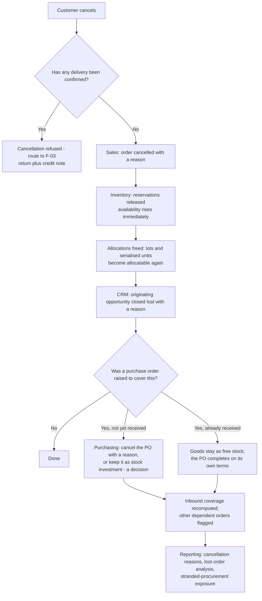

### Invariants across the flow

1. Cancellation of an **uncommitted** document is permitted and audited; cancellation of a **delivered** order is not — that path is return plus credit note.
2. Releasing a reservation frees the quantity through the trusted domain logic in one all-or-nothing operation, with an audit record naming who released it, and the freed quantity is visible on the stock screen immediately.
3. A reservation is consumed, released, or expired **exactly once**; an already-released or expired reservation cannot be released again.
4. Cancelling the customer order does **not** automatically cancel the purchase order raised to cover it — abandoning a supplier commitment is its own decision with its own owner.
5. Stranded procurement (bought for a cancelled order) must be visible as exposure, not discovered later as slow-moving stock.

**Scenarios composed:** SL-11, IN-03, CR-04, PU-07, PU-08, IN-18, XC-02

---

## 17. F-16 — Cycle count to adjustment to variance reporting

**Business trigger:** A scheduled cycle count, or a suspicion that the system and the shelf disagree.

**Module chain:** Inventory → Accounting → Reporting

### Journey diagram

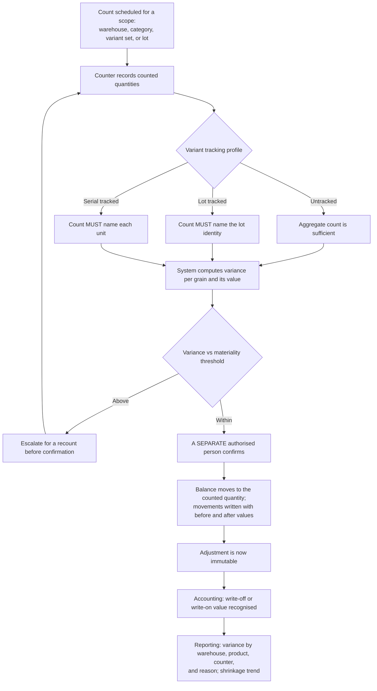

### Invariants across the flow

1. **Creating and confirming an adjustment are separate decisions.** The person who counted is not automatically the person who accepts the correction.
2. A tracked variant cannot be adjusted without naming the lot or serial identity — otherwise aggregate and lot balances silently diverge, which is the exact failure the reconciliation exists to catch.
3. Every adjustment carries a reason from a controlled list plus free text, and a historical adjustment is immutable.
4. Movements record before and after values, so the correction is self-explaining without reference to a report.
5. Variance is reported by cause, so shrinkage, mis-picks, and receiving errors are distinguishable — a single "adjustment" total teaches nothing.

**Scenarios composed:** IN-06, IN-17, IN-12, AC-01, AC-09, XC-02, XC-07

---

## 18. F-17 — Campaign to lead to customer to first sale

**Business trigger:** Marketing runs a campaign to a segment.

**Module chain:** CRM → Sales → Inventory → Accounting → Reporting

### Journey diagram

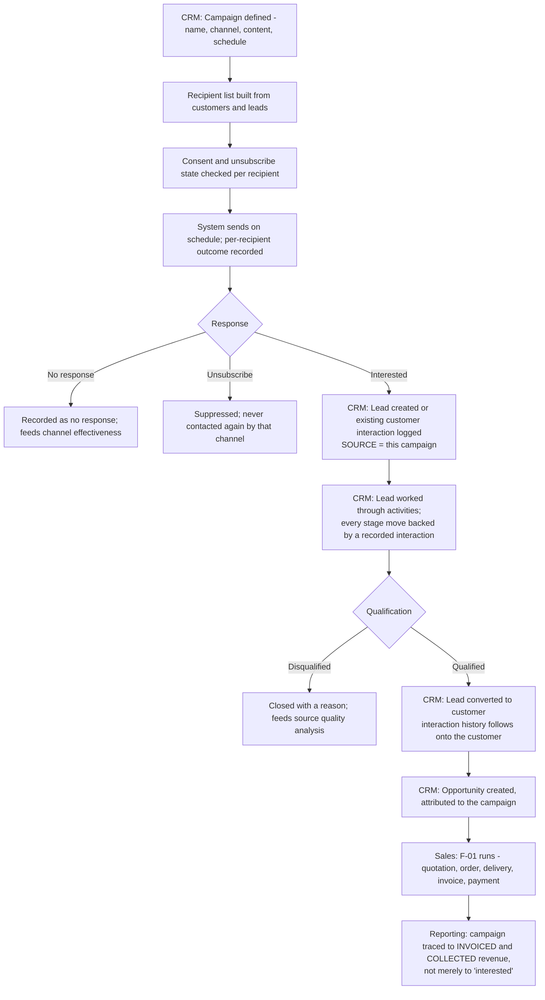

### Invariants across the flow

1. **The funnel must be traceable to money.** A campaign report that stops at "interested" cannot answer whether the campaign was worth running.
2. Lead source is mandatory, and attribution survives lead-to-customer conversion — otherwise the first sale loses its origin exactly when it becomes valuable.
3. Consent and unsubscribe state is respected on every send; a suppressed recipient is never contacted again through that channel.
4. Send failures are recorded, not silently dropped — a channel that quietly fails looks identical to a channel nobody responds to.
5. Conversion never loses interaction history, and never duplicates the party.
6. Every stage transition is dated, so velocity and ageing are computable rather than estimated.

**Scenarios composed:** CR-06, CR-01, CR-02, CR-03, CR-04, CR-07, MD-01, SL-01, F-01 chain, XC-03

---

## 19. F-18 — Quotation expiry and re-quote

**Business trigger:** A customer comes back after the quotation's validity has lapsed.

**Module chain:** Sales → CRM → Pricing → Sales

### Journey diagram

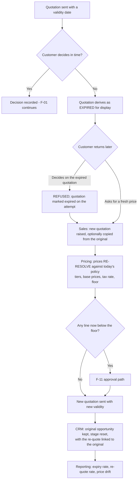

### Invariants across the flow

1. Expiry is **enforced on decision and derived for display**, so a stale offer never looks live and a late acceptance is never quietly honoured.
2. A sent quotation keeps its snapshot; a re-quote is a **new document** with newly resolved prices — the business never silently re-prices a commitment, in either direction.
3. Floor control applies again on re-resolution; yesterday's approval does not carry to today's document.
4. The re-quote links to the original, so the negotiation history reads as one thread.
5. Expiry and re-quote rates are reportable — a high expiry rate is a sales-process signal, not noise.

**Scenarios composed:** SL-01, SL-02, SL-16, MD-12, PM-04, CR-04, F-11

---

## 20. F-19 — Direct customer self-service order

**Business trigger:** A customer places an order themselves without a prior quotation.

**Module chain:** Customer App → Sales → Inventory → Accounting

### Journey diagram

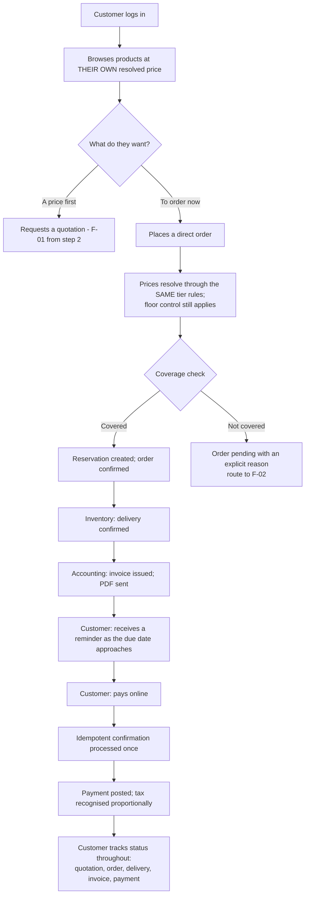

### Invariants across the flow

1. **A customer's action in-app and the same action recorded by staff produce the same business record.** The channel is metadata; the flow must not fork.
2. A customer sees only their own records, and only their own resolved price — never another customer's tier, never the floor, never cost.
3. Floor control, availability checks, reservation rules, and posting rules are identical to the staff-initiated path.
4. Online collection is **idempotent**: a retried confirmation creates one payment, one recognition, one posting.
5. What the customer is shown about availability is a deliberate disclosure decision — the customer surface need not expose warehouse-level detail, but it must never promise what cannot be delivered.

**Scenarios composed:** SL-13, PM-09, PM-05, SL-03, IN-03, IN-04, SL-06, SL-07, SL-08, XC-05

---

## 21. F-20 — Field sale from a van warehouse

**Business trigger:** An employee closes and fulfils business on site during a planned visit.

**Module chain:** Employees → Sales → Inventory → Accounting → Employees (payroll)

### Journey diagram

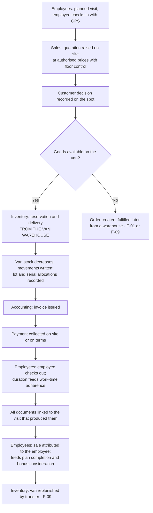

### Invariants across the flow

1. **The van is a warehouse.** Field-created documents obey exactly the same floor controls, availability checks, reservation rules, and posting rules as dashboard-created ones.
2. Every field document links back to the visit that produced it, so a visit's commercial outcome is measurable.
3. Van stock reconciles like any other warehouse — a van is a favourite place for stock to go missing precisely because it feels informal.
4. The recording channel is explicit, so a field-recorded visit is distinguishable from an office-entered one.
5. Field evidence — GPS, photos, signatures — is append-only; a reviewer may add a review note but may not edit what was captured.

**Scenarios composed:** EM-03, EM-04, SL-14, SL-01, SL-02, IN-03, IN-04, IN-05, SL-06, SL-08, EM-09

---

## 22. F-21 — Procure-to-pay (full supplier cycle)

**Business trigger:** The company decides to buy, and eventually pays for it.

**Module chain:** Purchasing → Inventory → Accounting → Payment → Reporting

### Journey diagram

```mermaid
flowchart TD
    A[Demand signal: low stock, customer back-order,<br/>project need, or planned buy] --> B[Purchasing: draft purchase order<br/>one supplier, one warehouse, one currency]
    B --> C[Costs default from supplier product references]
    C --> D[Submit for approval]
    D --> E{Total vs threshold}
    E -->|At or below| F[Auto-approved; approver recorded as submitter]
    E -->|Above| G[Purchasing Manager approves or rejects with a reason]
    E -->|Different currency| G
    F --> H[Sent to supplier; CONTENT NOW IMMUTABLE]
    G --> H
    H --> I[Supplier acknowledgement recorded, append-only,<br/>with a promised date]
    I --> J[Inventory: receipt against the PO<br/>lots, expiry, serials, condition]
    J --> K[Received quantity advances under lock;<br/>actual cost written back]
    K --> L{Fully received?}
    L -->|No| M[Partially received; awaiting balance]
    M --> N{Supplier will deliver the rest?}
    N -->|Yes| J
    N -->|No| O[Human SHORT-CLOSES with a reason - never automatic]
    L -->|Yes| P[Order received]
    O --> P
    P --> Q[Accounting: supplier bill recorded<br/>supplier's own invoice number unique per supplier]
    Q --> R[Advisory three-way match: ordered / received / billed<br/>quantity and price variances FLAGGED, not blocked]
    R --> S[Approver approves - the approver IS the control]
    S --> T[Payable recognised: DR expense or asset + purchase tax / CR payable]
    T --> U[Payment: supplier paid, allocated across bills]
    U --> V[DR payable / CR cash]
    V --> W[Reporting: payables ageing reconciled<br/>to the payable control account]
```

### Step ledger

| # | Actor | Module | Business action | Stock | Financial | Evidence |
|---|---|---|---|---|---|---|
| 1 | Buyer | Purchasing | Draft order raised with costs defaulted from supplier references | — | **none** | Draft PO with cost provenance |
| 2 | Buyer | Purchasing | Submitted; auto-approved at or below threshold, else explicit approval | — | — | Submitter, approver, timestamps |
| 3 | Buyer | Purchasing | Sent | — | — | Sent timestamp; immutability boundary |
| 4 | Buyer | Purchasing | Supplier acknowledgement recorded with promised date | — | — | Append-only confirmation |
| 5 | Warehouse | Inventory | Received with full traceability | ⬆ stock | **none** | Receipt, lots, serials, movements |
| 6 | System | Purchasing | Received quantity advances; actual cost written back | — | — | Updated lines; refreshed cost |
| 7 | Manager | Purchasing | Short-close if the balance will not arrive | — | — | Closure reason and actor |
| 8 | Payables | Accounting | Bill recorded; advisory match displayed | — | — | Bill with variance flags |
| 9 | Approver | Accounting | Bill approved | — | DR expense/asset + purchase tax / CR payable | Approval identity; balanced entry |
| 10 | Payments | Accounting | Supplier paid, allocated across bills | — | DR payable / CR cash | Payment with allocations |
| 11 | Accountant | Reporting | Payables ageing reconciled to the control account | — | — | Reconciliation proof |

### Invariants across the flow

1. A purchase order **commits money but creates no accounting entry and no stock**. The liability appears only when the bill is approved; the stock appears only when goods are received.
2. Purchasing never writes stock; every received unit is posted by the inventory path with the purchase order as the source document.
3. The supplier's own invoice number is unique per supplier — the primary **duplicate-payment control**.
4. The three-way match is **advisory, not blocking**. A blocking rule would make a legitimate over-delivery or partial bill unrecordable and push the accountant outside the system; the approver is the control.
5. Cumulative received quantity may never exceed ordered quantity, and concurrent receipts cannot over-receive.
6. Short-close is never automatic — abandoning a commitment is a business decision with an owner and a reason.
7. Approval identity and transmission timestamps are written by the system, never editable on a form.
8. The payables subledger is computed, never stored, and reconciles to the payable control account as an explicit displayed proof.

**Scenarios composed:** PU-01, PU-02, PU-03, PU-04, PU-05, PU-06, PU-07, PU-08, PU-09, PU-10, PU-11, PU-12, IN-01, AC-07, AC-08, XC-07

---

## 23. Flow interaction map

How the journeys chain into one another in practice:

```mermaid
flowchart LR
    F17[F-17 Campaign to first sale] --> F01[F-01 Normal sale]
    F04[F-04 Employee AI opportunity] --> F01
    F19[F-19 Customer self-service] --> F01
    F11[F-11 Below-floor approval] --> F01
    F18[F-18 Expiry and re-quote] --> F01
    F01 --> F05[F-05 Partial payment and tax]
    F01 --> F03[F-03 Return and credit note]
    F01 --> F15[F-15 Cancellation]
    F01 -.no stock.-> F02[F-02 Shortage to procurement]
    F01 -.wrong warehouse.-> F09[F-09 Transfer]
    F02 --> F21[F-21 Procure to pay]
    F03 --> F13[F-13 Credit balance and refund]
    F03 --> F08[F-08 Supplier return]
    F05 --> F13
    F20[F-20 Field sale from van] --> F01
    F20 --> F09
    F12[F-12 Serialised device] --> F06[F-06 Chargeable service]
    F12 --> F07[F-07 Warranty service]
    F06 --> F01
    F07 --> F08
    F10[F-10 Recall and expiry] --> F03
    F10 --> F08
    F16[F-16 Cycle count] --> F14[F-14 Month-end close]
    F21 --> F14
    F05 --> F14
    F15 --> F21
```

---

## 24. Cross-flow invariants — the rules that hold everywhere

These are the invariants that survive every journey above. If a future feature breaks one of them, it breaks the ERP, not just a module.

| # | Invariant | Why it matters across flows |
|---|---|---|
| 1 | Stock is only meaningful as `(variant, warehouse, condition)` in base units | Any other grain makes two flows disagree about the same physical goods |
| 2 | Every stock change produces an immutable movement in the same transaction | A balance without its movement is an unexplainable number |
| 3 | Availability falls on reservation, not on movement | Otherwise two flows promise the same units |
| 4 | A reservation is consumed, released, or expired exactly once | Otherwise stock is either double-committed or silently lost |
| 5 | Aggregate reserved equals the sum of active allocations | The reconciliation that proves flows 3 and 4 actually held |
| 6 | Delivery moves stock and recognises no tax | The company's fulfilment rule |
| 7 | Tax is recognised only on collection, proportionally, with the settling allocation absorbing rounding | The company's tax rule |
| 8 | Exactly the named document events post automatically to the ledger | Prevents a feature from quietly acquiring a posting path |
| 9 | Every automated posting is source-linked to its document | No orphan postings; every figure traces to a cause |
| 10 | Confirmed financial documents are corrected, never deleted | Non-destructive correction is the audit foundation |
| 11 | Posted stock documents are corrected by new linked documents, never edited | Same principle, inventory side |
| 12 | Subledgers are computed, never stored, and reconcile to their control accounts | A stored balance is a cache able to disagree with the documents |
| 13 | A reconciliation difference is shown as an error, never rounded or plugged | The difference is the finding, not a nuisance |
| 14 | Approval and execution are separated wherever money or stock leaves | Refunds, supplier payments, adjustments, price floors, purchase approvals |
| 15 | Append-only histories for supplier answers, task status, assignments, GPS, audit, and tax recognition | Evidence must survive correction |
| 16 | No AI output takes effect without a recorded human decision | Machine proposals never become business facts unattended |
| 17 | Snapshot what a document committed to: prices, tax rates, payment terms, SLA targets, performance weights, payable base | A policy change must never rewrite history |
| 18 | Derive what depends on today: overdue status, availability, ageing, subledger balances | A stored derivation is a future contradiction |
| 19 | The channel is metadata, never a second code path | Staff-recorded and self-service must produce the same record |
| 20 | Every financial and inventory operation is atomic, with deterministic lock ordering, and external callbacks are idempotent | Concurrency must not be able to break invariants 1–19 |

---

*End of document.*
