# ERP Domain Model — IERP

**Document type:** Functional discovery output (business domain model)
**Perspective:** Senior ERP Functional Consultant / Business Process Analyst / Product Owner
**Status:** Discovery — describes the *ideal* domain, not the current implementation
**Created:** 2026-09-03
**Companion documents:** `EXPECTED_BUSINESS_SCENARIOS.md`, `CROSS_MODULE_BUSINESS_FLOWS.md`

---

## 0. Purpose and reading guide

This document defines **what the business concepts are**, **who owns each fact**, **what states each concept can be in**, and **what must always be true**. It is a business model, not a schema. Where it names an entity, it names a business concept that a person in the company would recognise, not a table.

The model is organised as:

| Section | Contents |
|---|---|
| 1 | Bounded contexts — the domains and their responsibilities |
| 2 | Ubiquitous language — the vocabulary, precisely defined |
| 3 | Aggregates and entities per domain, with identity and invariants |
| 4 | Lifecycle state machines for every document that has one |
| 5 | Single-source-of-truth ownership map |
| 6 | Business event catalogue |
| 7 | Cross-domain relationship map |
| 8 | Global business invariants |
| 9 | Money, quantity, and rounding rules |
| 10 | Traceability, audit, and evidence model |
| 11 | Modelling decisions and the reasoning behind them |
| 12 | Known modelling tensions |

---

## 1. Bounded contexts

A bounded context owns a set of business facts and the rules that govern them. Contexts collaborate by **referencing each other's documents**, never by writing into each other's data.

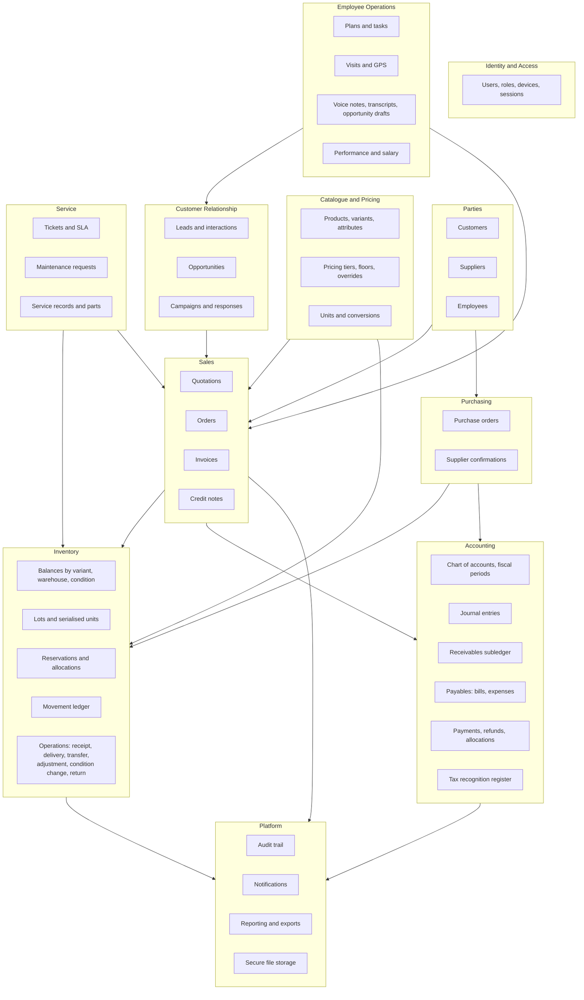
```mermaid
flowchart TB
    subgraph Identity["Identity and Access"]
        ID[Users, roles, devices, sessions]
    end

    subgraph Parties["Parties"]
        CU[Customers]
        SU[Suppliers]
        EM[Employees]
    end

    subgraph Catalog["Catalogue and Pricing"]
        PR[Products, variants, attributes]
        PT[Pricing tiers, floors, overrides]
        UM[Units and conversions]
    end

    subgraph Inv["Inventory"]
        ST[Balances by variant, warehouse, condition]
        LT[Lots and serialised units]
        RS[Reservations and allocations]
        MV[Movement ledger]
        OP[Operations: receipt, delivery, transfer,<br/>adjustment, condition change, return]
    end

    subgraph Sales["Sales"]
        QT[Quotations]
        OR[Orders]
        IV[Invoices]
        CN[Credit notes]
    end

    subgraph Purch["Purchasing"]
        PO[Purchase orders]
        SC[Supplier confirmations]
    end

    subgraph Acct["Accounting"]
        COA[Chart of accounts, fiscal periods]
        JE[Journal entries]
        AR[Receivables subledger]
        AP[Payables: bills, expenses]
        PY[Payments, refunds, allocations]
        TX[Tax recognition register]
    end

    subgraph Field["Employee Operations"]
        PL[Plans and tasks]
        VS[Visits and GPS]
        AI[Voice notes, transcripts, opportunity drafts]
        PF[Performance and salary]
    end

    subgraph Rel["Customer Relationship"]
        LD[Leads and interactions]
        OPP[Opportunities]
        CM[Campaigns and responses]
    end

    subgraph Svc["Service"]
        TK[Tickets and SLA]
        MR[Maintenance requests]
        SR[Service records and parts]
    end

    subgraph Sys["Platform"]
        AU[Audit trail]
        NT[Notifications]
        RP[Reporting and exports]
        FS[Secure file storage]
    end

    Rel --> Sales
    Field --> Rel
    Parties --> Sales
    Parties --> Purch
    Catalog --> Sales
    Catalog --> Inv
    Sales --> Inv
    Purch --> Inv
    Sales --> Acct
    Purch --> Acct
    Svc --> Inv
    Svc --> Sales
    Field --> Sales
    Inv --> Sys
    Acct --> Sys
    Sales --> Sys
```

### 1.1 Context responsibilities and boundaries

| Context | Owns | Must not own |
|---|---|---|
| **Identity & Access** | Login identity, roles, permissions, devices, session state | Any business fact about the party the user represents |
| **Parties** | Customer, supplier, and employee commercial identity, codes, terms, compensation model | Prices (Catalogue), balances (Accounting), stock (Inventory) |
| **Catalogue & Pricing** | Products, variants, attributes, tracking profiles, units, base and minimum prices, discount policy, price resolution | Stock quantity, availability, cost, sold history |
| **Inventory** | Physical truth: balances, lots, serialised units, reservations, movements, and the operations that change them | Prices, revenue, cost recognition, customer relationship |
| **Sales** | Commercial commitment: quotations, orders, invoices, credit notes, and their lifecycles | Stock posting, ledger posting mechanics, tax computation policy |
| **Purchasing** | Supply commitment: purchase orders, approvals, supplier acknowledgements | Stock writing, accounting entries, supplier bills |
| **Accounting** | Ledger, periods, postings, subledgers, tax recognition, payables, payments, refunds | Fulfilment state, physical stock, commercial negotiation |
| **Employee Operations** | Plans, tasks, visits, GPS, voice notes, AI drafts, performance, salary | Sales documents (it *creates* them, it does not own their lifecycle) |
| **Customer Relationship** | Leads, interactions, opportunities, campaigns, attribution | Customer commercial identity (Parties), prices (Catalogue) |
| **Service** | Tickets, SLA, maintenance requests, service records, parts consumption records | Stock posting (it *invokes* Inventory), revenue recognition (it *invokes* Sales) |
| **Platform** | Audit, notifications, reporting, exports, secure files, document numbering | Any business rule of its own |

### 1.2 The two structural rules of context collaboration

1. **One posting path per kind of truth.** All stock change goes through Inventory's single posting entry point. All ledger change goes through Accounting's single posting service. A context that needs a stock or ledger effect *invokes* the owner; it never writes the effect itself.
2. **Reference, don't replicate.** A context that needs another's fact holds a reference and reads it. Where a value must be frozen at a moment in time (a price, a tax rate, a payment term, an SLA target, a payable base), it is **snapshotted deliberately and labelled as a snapshot** — never cached casually.

---

## 2. Ubiquitous language

Precision here prevents a whole class of downstream disagreement.

### 2.1 Catalogue and pricing

| Term | Definition | Not to be confused with |
|---|---|---|
| **Product** | The commercial thing the company sells and markets | Variant — a product holds no stock and has no price |
| **Variant** | The stockable, sellable SKU; the unit of inventory, pricing, and traceability | Product; a variant is what is counted |
| **Attribute / attribute value** | The dimension that distinguishes variants of one product | Tracking profile |
| **Tracking profile** | The variant's physical control settings: base unit, lot tracking, expiry, serial tracking, allocation style | Product classification |
| **Base unit** | The single unit every balance and movement for that variant is expressed in | Transaction unit |
| **Transaction unit** | A permitted unit a document line may be captured in, with a conversion to base | Base unit |
| **Identifier** | SKU, barcode, GTIN, UDI, serial, IoT id — names a thing, never a quantity | Quantity |
| **Base price** | The variant's list price before any discount policy | Resolved price |
| **Minimum price (floor)** | The lowest price the variant may be sold at without explicit approval | Cost |
| **Pricing tier** | A discount policy of one of three kinds: general, customer-specific, or product-scoped | A price; a tier produces prices |
| **Resolved price** | The single non-stacked price for one customer and one variant, with recorded provenance | Base price |
| **Price provenance** | The record of which rule produced a resolved price, and which lost | A note |
| **Floor override** | An explicit System Admin approval to sell below the floor, with reason and approver | A warning acknowledged |

### 2.2 Inventory

| Term | Definition | Not to be confused with |
|---|---|---|
| **Warehouse** | A custody boundary; a dimension of every balance | A location or bin, which is a sub-dimension and not part of the balance key |
| **Condition** | The saleability state of stock at a place: saleable, quarantine, damaged, expired | Status of a document |
| **On-hand** | Physical quantity held, in base units, at a variant, warehouse, and condition | Available |
| **Reserved** | Quantity committed to a document but not yet moved | On-hand |
| **Available** | On-hand minus reserved, at saleable condition | On-hand |
| **In transit** | Quantity dispatched from one warehouse and not yet received at another; saleable at neither end | On-hand at either end |
| **Lot** | A stable physical batch identity, optionally carrying an expiry date | A lot balance, which is a lot's quantity at a place and condition |
| **Serialised unit** | One physical unit with its own identity, current custody, and condition | A lot |
| **Reservation** | A source-linked commitment reducing availability | An allocation |
| **Allocation** | The specific lots and serialised units a reservation or an outbound line names | A reservation |
| **Movement** | An immutable record of one stock change at the grain that changed | A balance; the balance is a read model, the movement is the ledger |
| **Operation** | A business document that causes stock change: receipt, delivery, transfer, adjustment, condition change, return | A movement; one operation produces many movements |
| **Shipment** | Logistics tracking of a delivery's physical journey and arrival confirmation | A delivery; a shipment never posts stock |
| **Disposition** | The decision about what happens to inspected or returned goods | An adjustment |
| **FEFO** | First-expiry-first-out; the outbound suggestion rule for expiry-controlled lots | A hard constraint; it is a suggestion unless the profile mandates explicit allocation |

### 2.3 Sales and money

| Term | Definition | Not to be confused with |
|---|---|---|
| **Quotation** | A commercial offer with a validity period; never touches stock | Order |
| **Order** | The accepted commitment; the spine carrying **fulfilment state** and, separately, **payment state** | Invoice |
| **Delivery** | The custody transfer to the customer; moves stock, recognises no tax | Shipment; invoice |
| **Invoice** | The receivable; recognises revenue and defers tax on issuance | Delivery; payment |
| **Credit note** | The non-destructive correction of an invoice; reverses revenue and tax proportionally | A stock return |
| **Payment (collection)** | Money received, allocated across invoices | Refund; allocation |
| **Allocation** | The portion of a payment applied to one specific invoice | Payment |
| **Advance** | Money collected before an invoice exists; a liability until applied | Payment against an invoice |
| **Refund** | Money returned to a customer against an available credit balance; a distinct document, never a negative collection | Credit note |
| **Available credit balance** | Computed from confirmed credit notes and overpayments; the ceiling on any refund | A stored balance |
| **Deferred tax** | Tax charged on an issued invoice but not yet collected | Tax payable |
| **Tax payable** | Tax recognised because money was collected; the remittable liability | Deferred tax |
| **Payment term** | The due-date policy: net days plus grace days | Due date, which is the term's resolved output |
| **Overdue** | Derived from due date plus grace days; never stored | A status someone sets |

### 2.4 Purchasing and payables

| Term | Definition | Not to be confused with |
|---|---|---|
| **Purchase order** | A commitment to buy; creates no stock and no accounting entry | Receipt; bill |
| **Supplier confirmation** | An admin-recorded supplier answer; append-only | An order status |
| **Receipt** | The inventory operation that brings purchased goods into custody | Purchase order; bill |
| **Bill** | The supplier's invoice; recognises the payable **on approval** | Purchase order; payment |
| **Expense** | A cost with no supplier bill; recognises the payable on approval | Bill |
| **Three-way match** | The advisory comparison of ordered, received, and billed quantities and prices | A blocking control; the approver is the control |
| **Supplier payment** | Money paid out, allocated across bills | Customer payment; the two are deliberately separate |
| **Short-close** | The explicit human decision to abandon an outstanding ordered quantity | Cancellation, which requires zero receipts |

### 2.5 Employee operations

| Term | Definition | Not to be confused with |
|---|---|---|
| **Monthly plan** | One plan per employee per month, carrying four weighted factors summing to 100 | Task |
| **Evaluation factor** | Task completion, visit completion, schedule adherence, or work-time adherence, each with a weight | Score |
| **Task** | A unit of planned work with mandatory dates and an append-only status history | Visit |
| **Visit** | A customer call with check-in, check-out, GPS, notes, and attachments | Task |
| **Recording channel** | Whether a visit was field-recorded or dashboard-entered | Status |
| **Voice note** | Audio captured in the field, transcribed asynchronously | Transcript |
| **Confidence source** | Whether a transcript's confidence is provider-reported, derived from log-probabilities, or unavailable | Confidence value |
| **Opportunity draft** | An AI proposal awaiting an explicit human decision | Opportunity |
| **Performance score** | The weighted total with a full breakdown snapshotting its inputs | Task-completion percentage, which is display only |
| **Payable base** | Base salary or commission target, copied onto the calculation at calculation time | Final salary |
| **Supersession** | Replacing a confirmed salary calculation with a recalculation, retaining both | Editing or deleting |

### 2.6 Service

| Term | Definition | Not to be confused with |
|---|---|---|
| **Ticket** | The customer-facing support conversation, with priority and SLA | Maintenance request |
| **SLA target** | Response and resolution minutes, **snapshotted** at clock start | The SLA policy, which may later change |
| **Breach flag** | Sticky once set; a late recovery never erases it | Current lateness |
| **Maintenance request** | The work needed on identified equipment, with an explicit warranty status | Ticket |
| **Service record** | The assigned work item under a maintenance request | Maintenance request |
| **Parts consumption** | A record of stock consumed on a service record, paired with the movement it produced | An adjustment |
| **Warranty status** | Covered with an expiry date, expired, or unknown — never guessed | Chargeability, which it drives but does not equal |

---

## 3. Aggregates and entities

An **aggregate** is a consistency boundary: everything inside it changes together, in one transaction, under one set of rules. A **reference** across aggregates is by identity only.

### 3.1 Parties

| Aggregate | Root identity | Contains | Key invariants |
|---|---|---|---|
| **Customer** | Unique customer code | Contact details, addresses, tax identity, default payment term, tier assignments, lifecycle state | One profile per identity; code unique; deactivation preserves history and ends pricing eligibility; no credit limit concept |
| **Supplier** | Unique supplier code | Contact details, country, currency, payment terms, product references with cost provenance | Code unique; referenced supplier is never hard-deleted; cost references are defaults refreshed by received cost |
| **Employee** | Unique employee code | Job title, contact data, app-access state, compensation model | Exactly one of base salary or commission target is set; access revocation preserves authored history |

### 3.2 Catalogue and pricing

| Aggregate | Root identity | Contains | Key invariants |
|---|---|---|---|
| **Product** | Product identity | Names (bilingual), category, brand, manufacturer, origin, media, lifecycle state | Holds no stock and no price; needs at least one variant to transact |
| **Variant** | SKU | Identifiers, attribute values, **tracking profile**, base price, minimum price, supplier references | SKU unique; base unit and tracking profile immutable once stock history exists; serial-tracked means one unit per base quantity of one |
| **Unit & variant unit** | Unit identity | Name, physical family, per-variant conversion to base | Conversions only within one physical family; a variant has exactly one active base unit |
| **Pricing tier** | Tier identity | Kind (general / customer-specific / product-scoped), discount, product links, customer assignments, validity window | Resolution never stacks; deterministic tie-break on lowest tier identifier; percentage-only for general and customer-specific; product-scoped may be percentage or fixed |
| **Price floor override** | Override identity | Variant, customer, floor, approved price, approver, reason, tier provenance | Created only by System Admin approval; immutable; travels with the document it permitted |

### 3.3 Inventory

| Aggregate | Root identity | Contains | Key invariants |
|---|---|---|---|
| **Stock balance** | (variant, warehouse, condition) | On-hand, reserved, available, reorder level | Available never negative without an approved override; only the posting service may write it |
| **Lot** | Lot identity | Lot number, expiry date, origin receipt; lot balances per warehouse and condition | Required for a lot-tracked variant; expiry required where the profile demands it; identity survives transfer |
| **Serialised unit** | Serial / IoT identifier | Current status, custody warehouse, condition, receipt reference | One unit equals one base quantity; at most one active reservation allocation; unknown legacy status normalises to explicit unknown |
| **Reservation** | Reservation identity | Source document, variant, warehouse, quantity, allocations, expiry, status | Consumed, released, or expired exactly once; aggregate reserved equals the sum of active allocations; never hand-created |
| **Movement** | Movement identity | Variant, warehouse, condition before and after, quantity, lot, serial, source document, actor, timestamp | Immutable; written only inside the posting transaction; never edited or deleted |
| **Inventory operation** | Document number | Type (receipt / delivery / transfer), lines with allocations, lifecycle stage, source document | Posts stock only at custody transitions; corrected only by linked compensating documents |
| **Adjustment** | Document number | Scope, counted-versus-system lines with allocations, reason, creator, confirmer | Create and confirm are separate decisions; tracked variants require allocations; immutable once confirmed |
| **Condition change** | Document number | Lots or units, condition before and after, cause, actor | Damage, recovery, and disposal are separate documents; recovery references its damage |
| **Return (customer / supplier)** | Document number | Source delivery or receipt, lines, inspection outcome, disposition, expected financial outcome | Capped at delivered or received minus already returned; posts stock, never money |
| **Shipment** | Shipment identity | Delivery reference, carrier, tracking, confirmation identity and timestamp | **Never posts stock** |

### 3.4 Sales

| Aggregate | Root identity | Contains | Key invariants |
|---|---|---|---|
| **Quotation** | Quotation number | Customer, author, payment term, lines with price provenance, totals, validity, decision record | Never touches stock; prices snapshot on send; decided exactly once; converts to at most one order |
| **Order** | Order number | Customer, source quotation, payment term, priced lines, **fulfilment state**, **payment state**, pending reason | One order per quotation; fulfilment and payment states are independent axes; posts nothing to the ledger |
| **Invoice** | Invoice number | Customer, source delivery, payment term, resolved due date, lines, totals, paid amount, credited amount, recognised tax | A delivery is invoiced at most once; immutable and undeletable once issued; overdue derived, never stored |
| **Credit note** | Credit note number | Invoice, reason category, lines paired to invoice lines, totals | Each line capped at the invoice line's uncredited remainder; immutable once confirmed; holds **no** stock relationship |
| **Invoice confirmation** | Confirmation identity | Signer, timestamp, signature attachment | Evidence of document delivery only; never a posting event |

### 3.5 Purchasing

| Aggregate | Root identity | Contains | Key invariants |
|---|---|---|---|
| **Purchase order** | Purchase order number | Supplier, destination warehouse, currency, lines with cost provenance, totals, approval and transmission trail, closure record | Creates no stock and no ledger entry; immutable once sent; each variant-and-unit appears once; received never exceeds ordered |
| **Supplier confirmation** | Confirmation identity | Polymorphic target (customer order or purchase order), supplier, answer, promised date, notes, recorder | **Append-only**; a correction is a new confirmation; promised date not before the target's order date |

### 3.6 Accounting

| Aggregate | Root identity | Contains | Key invariants |
|---|---|---|---|
| **Chart account** | Account code | Type, parent, postable flag, active flag | Postings only to postable leaves; account with postings never deleted and never retyped |
| **Fiscal period** | Period identity | Range, open or closed state, close record | Postings refused into a closed period; closing is audited; reopening is an authorised decision |
| **Journal entry** | Entry number | Balanced lines, narrative, date, source document reference, poster | Debits equal credits before posting; immutable once posted; corrected only by a linked reversing entry |
| **Tax recognition entry** | Entry identity | Invoice, payment, allocation amount, recognised tax, date, journal reference | **Append-only**; one per invoice-and-payment allocation; settling allocation recognises the exact remainder |
| **Payment (customer)** | Payment number | Method, amount, date, reference, proof, allocations | Allocation total never exceeds the payment; posted through one service for every channel; idempotent for external channels |
| **Refund** | Refund number | Customer, amount, method, credit drawn on, recorder, approver | Recorder and approver are different roles; never exceeds available credit; reverses recognised tax proportionally; **never a negative payment** |
| **Bill** | Supplier's invoice number, unique per supplier | Supplier, dates, payment term, lines with accounts, purchase-order references, lifecycle | Duplicate-payment control is the unique supplier invoice number; match is advisory; payable recognised on approval |
| **Expense** | Expense number | Expense account, optional supplier and requesting employee, receipt attachment, lifecycle | Approval and payment are separate decisions with separate owners |
| **Supplier payment** | Payment number | Method, amount, date, allocations across bills | Separate from customer payments; never auto-netted against receivables |

### 3.7 Customer relationship

| Aggregate | Root identity | Contains | Key invariants |
|---|---|---|---|
| **Lead** | Lead identity | Name, company, contacts, **source**, pipeline state, conversion target | Source mandatory; stage moves only through a recorded interaction; conversion preserves history and never duplicates the party |
| **Interaction** | Interaction identity | Lead or customer, employee, type, timestamp, notes, outcome | Dated and attributed; feeds one unified customer timeline |
| **Opportunity** | Opportunity identity | Party, need, value, expected close, stage, **origin**, produced quotation | Origin never lost, especially an AI origin; closed lost requires a reason from a controlled list |
| **Campaign** | Campaign identity | Channel, content, schedule, recipients, send outcomes, responses | Consent respected on every send; failures recorded; attribution survives to invoiced and collected revenue |

### 3.8 Employee operations

| Aggregate | Root identity | Contains | Key invariants |
|---|---|---|---|
| **Monthly plan** | (employee, month) | Targets, four weighted factors, tasks, planned visits, lifecycle | Weights sum to exactly 100; one active plan per employee per month; a copy carries no execution history |
| **Task** | Task identity | Plan, dates, optional customer, append-only status history | Status history append-only; overdue tasks surface on a queue |
| **Visit** | Visit identity | Customer, planned window, check-in and check-out, GPS trail, notes, attachments, recording channel, review notes | Field-recorded data not editable by a reviewer, who may only add a note; missing check-out is an exception, not a completion |
| **Voice note** | Voice note identity | Visit, private audio, processing state, transcript | AI failure never blocks visit completion; audio served only through signed authenticated access |
| **Transcript** | Transcript identity | Text, confidence value, **confidence source**, matched keyword rules | Confidence never fabricated; missing confidence is explicitly unavailable |
| **Opportunity draft** | Draft identity | Transcript, matched rules, visit, human decision with note | No effect without an explicit recorded human decision; rejected drafts retained |
| **Performance score** | (plan, employee) | Per-factor scores, weighted total, **full breakdown with snapshotted inputs** | Deterministic and reproducible; display metrics kept distinct from the money-driving score |
| **Salary calculation** | Calculation identity | Copied payable base, performance percent, approved bonuses, final amount, confirmer, supersession chain | Corrected only by supersession; never edited, never deleted; only approved bonuses contribute |
| **Bonus suggestion** | Suggestion identity | Employee, plan, optional draft reference, amount, reason, decision | Approved and rejected are terminal; only approved affects pay |

### 3.9 Service

| Aggregate | Root identity | Contains | Key invariants |
|---|---|---|---|
| **Ticket** | Ticket number | Customer, type, priority, description, attachments, chargeable flag, **snapshotted SLA targets**, clock timestamps, sticky breach flags, message thread, append-only assignment history, continuation reference | Targets snapshotted at clock start; only customer-wait pauses the clock; breach flags sticky; internal notes never customer-visible |
| **Maintenance request** | Request identity | Customer, source ticket, variant, serial, serialised-unit link, **warranty status and expiry**, problem, lifecycle | Warranty status explicit, never guessed; covered requires an expiry date; unit link only on a real identifier match |
| **Service record** | Record identity | Request, technician, due date, findings, status history | Request closes only when its service records resolve |
| **Parts consumption** | Consumption identity | Service record, variant, warehouse, quantity, allocations, **paired movement**, reversal fields | Never writes a balance directly; **full reversal only**; immutable except for reversal fields set at most once |

### 3.10 Platform

| Aggregate | Root identity | Contains | Key invariants |
|---|---|---|---|
| **Audit entry** | Entry identity | Actor, action, target, timestamp, channel, before and after values, reason | Append-only; never editable or deletable by any surface, including System Admin |
| **Notification** | Notification identity | Party, template, channel, payload, delivery attempts and outcomes | Failures recorded and retried, never silently dropped; references the document, never replaces it |
| **Document number sequence** | Family identity | Format, current value | Unique per family including over soft-deleted rows; never reused; cancelled documents keep their numbers |
| **Export** | Export identity | Report, parameters, requester, timestamp, artefact | Parameters retained so any figure is reproducible |

---

## 4. Lifecycle state machines

Only documents with a real business lifecycle appear here. A state is a business condition, and every transition is an explicit, authorised, audited act.

### 4.1 Quotation

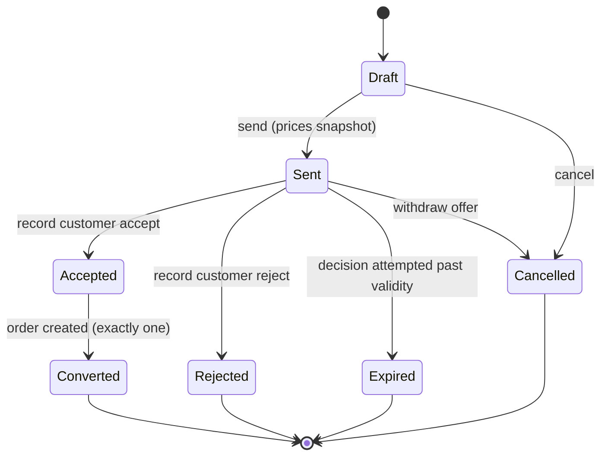
```mermaid
stateDiagram-v2
    [*] --> Draft
    Draft --> Sent: send (prices snapshot)
    Draft --> Cancelled: cancel
    Sent --> Accepted: record customer accept
    Sent --> Rejected: record customer reject
    Sent --> Expired: decision attempted past validity
    Sent --> Cancelled: withdraw offer
    Accepted --> Converted: order created (exactly one)
    Rejected --> [*]
    Expired --> [*]
    Cancelled --> [*]
    Converted --> [*]
```

**Rules:** expiry is enforced on decision *and* derived for display. The decision is recorded once, preserving both the decider's and the recorder's identity. A quotation converts to at most one order and holds no stock relationship in any state.

### 4.2 Order — two independent axes

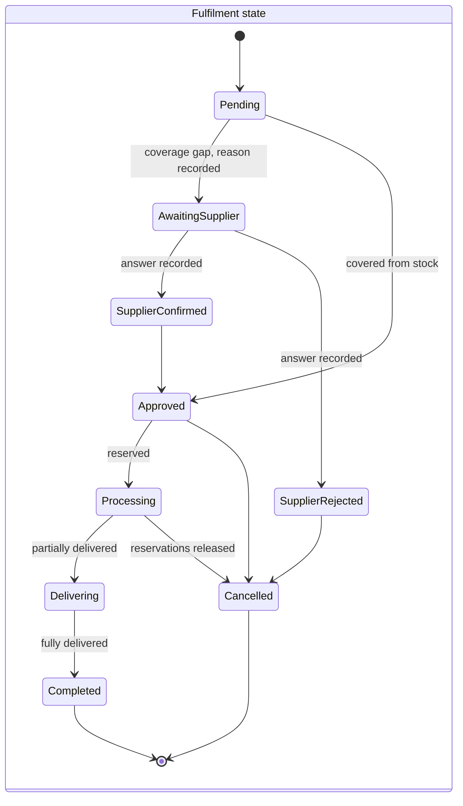
```mermaid
stateDiagram-v2
    direction LR
    state "Fulfilment state" as F {
        [*] --> Pending
        Pending --> AwaitingSupplier: coverage gap, reason recorded
        AwaitingSupplier --> SupplierConfirmed: answer recorded
        AwaitingSupplier --> SupplierRejected: answer recorded
        SupplierRejected --> Cancelled
        SupplierConfirmed --> Approved
        Pending --> Approved: covered from stock
        Approved --> Processing: reserved
        Processing --> Delivering: partially delivered
        Delivering --> Completed: fully delivered
        Approved --> Cancelled
        Processing --> Cancelled: reservations released
        Completed --> [*]
        Cancelled --> [*]
    }
```

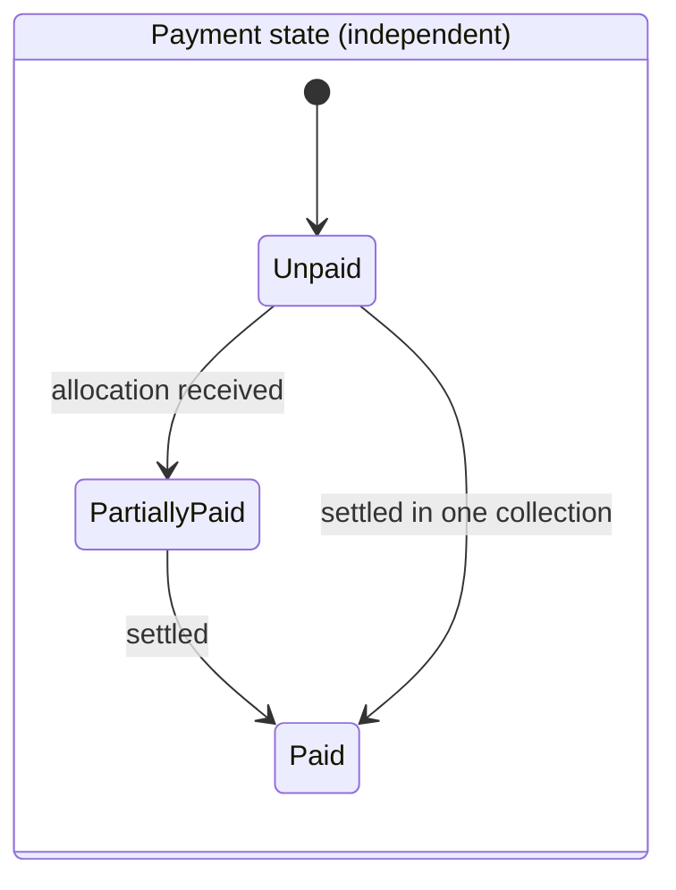
```mermaid
stateDiagram-v2
    direction LR
    state "Payment state (independent)" as P {
        [*] --> Unpaid
        Unpaid --> PartiallyPaid: allocation received
        PartiallyPaid --> Paid: settled
        Unpaid --> Paid: settled in one collection
    }
```

**Rules:** fulfilment and payment are genuinely independent — an order can be completed and unpaid at once, which is the normal case on payment terms. A pending order always carries an explicit **pending reason**. The order posts nothing to the ledger.

### 4.3 Inventory operation (receipt, delivery, transfer)

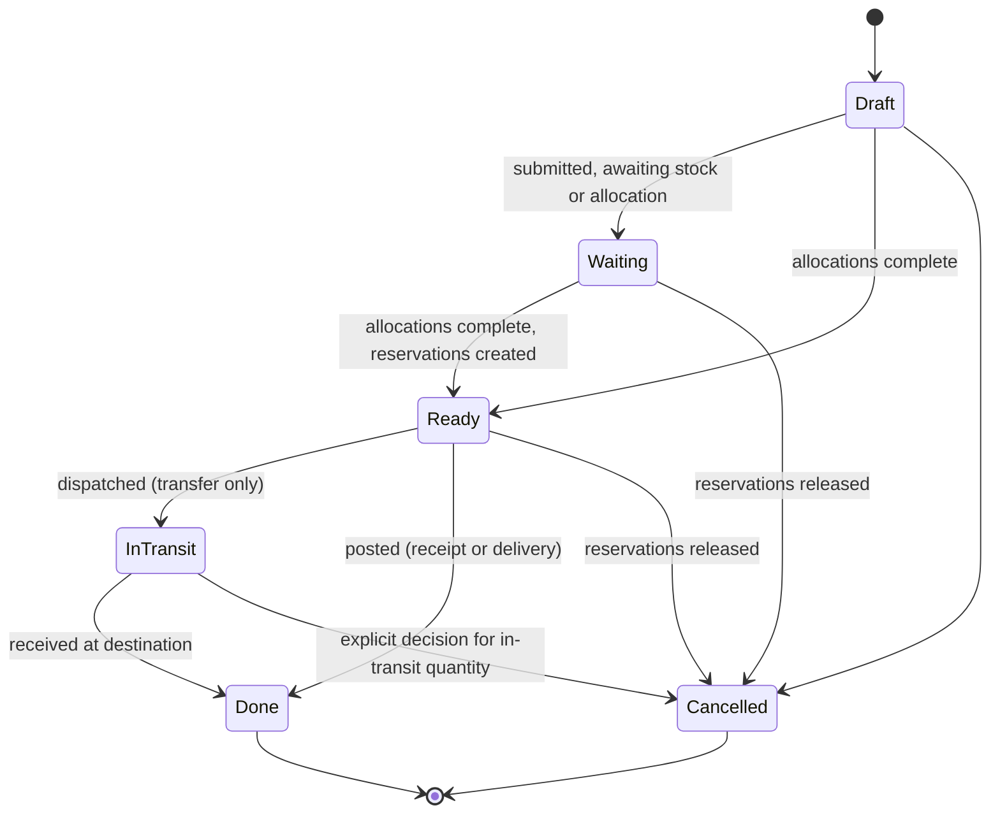
```mermaid
stateDiagram-v2
    [*] --> Draft
    Draft --> Waiting: submitted, awaiting stock or allocation
    Waiting --> Ready: allocations complete, reservations created
    Draft --> Ready: allocations complete
    Ready --> InTransit: dispatched (transfer only)
    InTransit --> Done: received at destination
    Ready --> Done: posted (receipt or delivery)
    Draft --> Cancelled
    Waiting --> Cancelled: reservations released
    Ready --> Cancelled: reservations released
    InTransit --> Cancelled: explicit decision for in-transit quantity
    Done --> [*]
    Cancelled --> [*]
```

**Rules:** stock posts only on the transition into `Done` (and, for transfers, on dispatch into `InTransit` and on receipt into `Done`). `Ready` is where reservations are created. A `Done` operation is immutable — correction is a new linked document (a compensating correction, a customer return, or a transfer discrepancy record).

### 4.4 Invoice

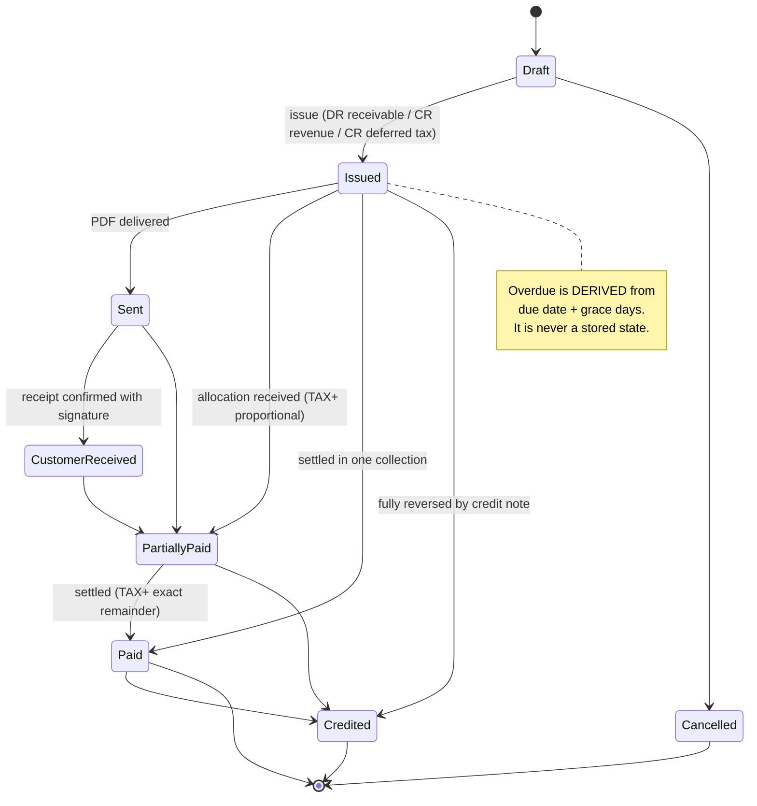
```mermaid
stateDiagram-v2
    [*] --> Draft
    Draft --> Issued: issue (DR receivable / CR revenue / CR deferred tax)
    Draft --> Cancelled
    Issued --> Sent: PDF delivered
    Sent --> CustomerReceived: receipt confirmed with signature
    Issued --> PartiallyPaid: allocation received (TAX+ proportional)
    Sent --> PartiallyPaid
    CustomerReceived --> PartiallyPaid
    PartiallyPaid --> Paid: settled (TAX+ exact remainder)
    Issued --> Paid: settled in one collection
    Issued --> Credited: fully reversed by credit note
    PartiallyPaid --> Credited
    Paid --> Credited
    Cancelled --> [*]
    Paid --> [*]
    Credited --> [*]
    note right of Issued
        Overdue is DERIVED from
        due date + grace days.
        It is never a stored state.
    end note
```

**Rules:** once issued, customer, lines, and totals are immutable and the document is never deletable by any path. A delivery is invoiced at most once. Revenue recognises on issuance; tax does not.

### 4.5 Credit note

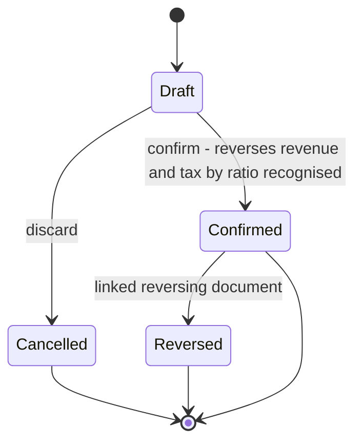
```mermaid
stateDiagram-v2
    [*] --> Draft
    Draft --> Confirmed: confirm - reverses revenue and tax by ratio recognised
    Draft --> Cancelled: discard
    Confirmed --> Reversed: linked reversing document
    Cancelled --> [*]
    Reversed --> [*]
    Confirmed --> [*]
```

**Rules:** a draft may be edited or discarded; a confirmed credit note is immutable and never deletable. Each line is capped at its invoice line's uncredited remainder. The tax split is computed so the entry balances exactly. The credit note holds **no** stock relationship.

### 4.6 Payment and refund

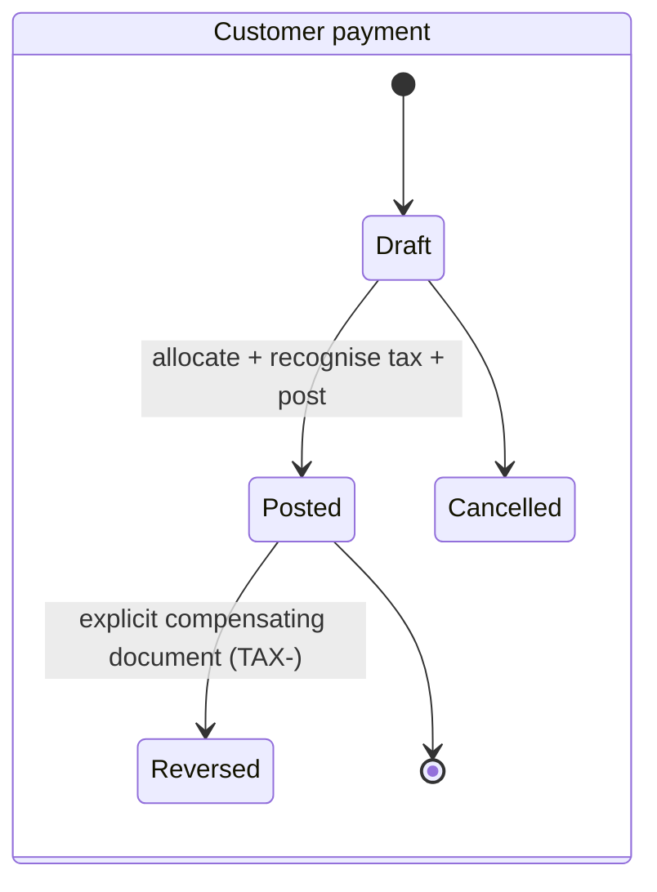
```mermaid
stateDiagram-v2
    state "Customer payment" as CP {
        [*] --> Draft
        Draft --> Posted: allocate + recognise tax + post
        Draft --> Cancelled
        Posted --> Reversed: explicit compensating document (TAX-)
        Posted --> [*]
    }
```

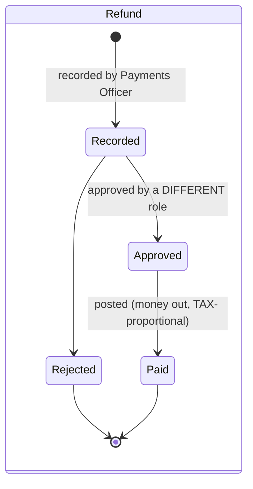
```mermaid
stateDiagram-v2
    state "Refund" as RF {
        [*] --> Recorded: recorded by Payments Officer
        Recorded --> Approved: approved by a DIFFERENT role
        Recorded --> Rejected
        Approved --> Paid: posted (money out, TAX- proportional)
        Rejected --> [*]
        Paid --> [*]
    }
```

**Rules:** every collection channel uses the same posting and recognition logic. External channels are idempotent. A refund is capped by the computed available credit balance and is never a negative collection.

### 4.7 Purchase order

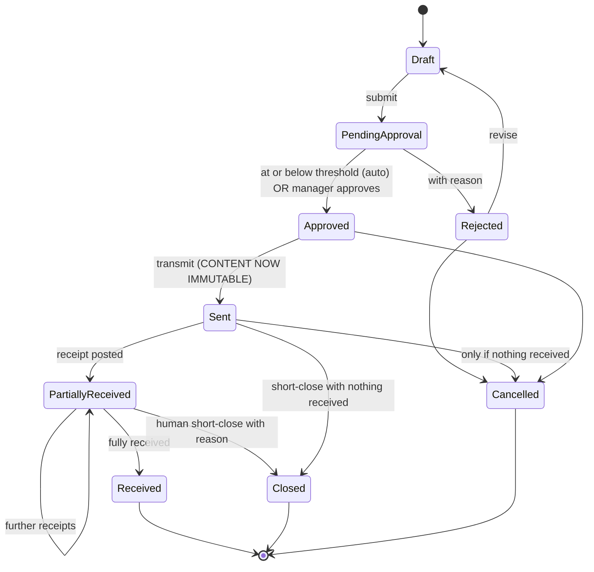
```mermaid
stateDiagram-v2
    [*] --> Draft
    Draft --> PendingApproval: submit
    PendingApproval --> Approved: at or below threshold (auto) OR manager approves
    PendingApproval --> Rejected: with reason
    Rejected --> Draft: revise
    Rejected --> Cancelled
    Approved --> Sent: transmit (CONTENT NOW IMMUTABLE)
    Sent --> PartiallyReceived: receipt posted
    PartiallyReceived --> PartiallyReceived: further receipts
    PartiallyReceived --> Received: fully received
    PartiallyReceived --> Closed: human short-close with reason
    Sent --> Closed: short-close with nothing received
    Sent --> Cancelled: only if nothing received
    Approved --> Cancelled
    Received --> [*]
    Closed --> [*]
    Cancelled --> [*]
```

**Rules:** a cross-currency order always routes to explicit approval — no conversion. Auto-approval records the approver as the submitter, so the record is honest. Short-close is never automatic. An order with any receipt cannot be cancelled.

### 4.8 Supplier confirmation

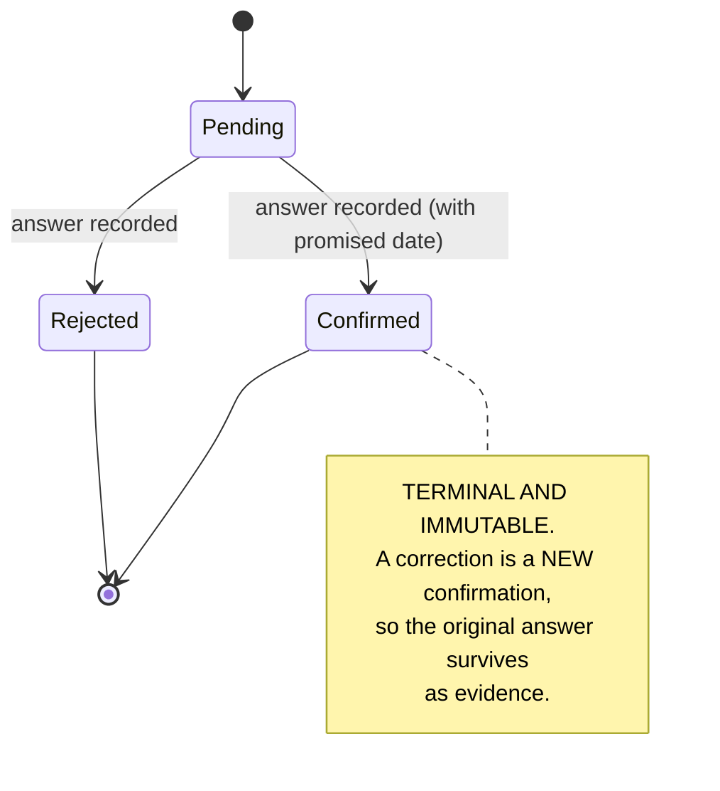
```mermaid
stateDiagram-v2
    [*] --> Pending
    Pending --> Confirmed: answer recorded (with promised date)
    Pending --> Rejected: answer recorded
    Confirmed --> [*]
    Rejected --> [*]
    note right of Confirmed
        TERMINAL AND IMMUTABLE.
        A correction is a NEW confirmation,
        so the original answer survives
        as evidence.
    end note
```

### 4.9 Bill and expense

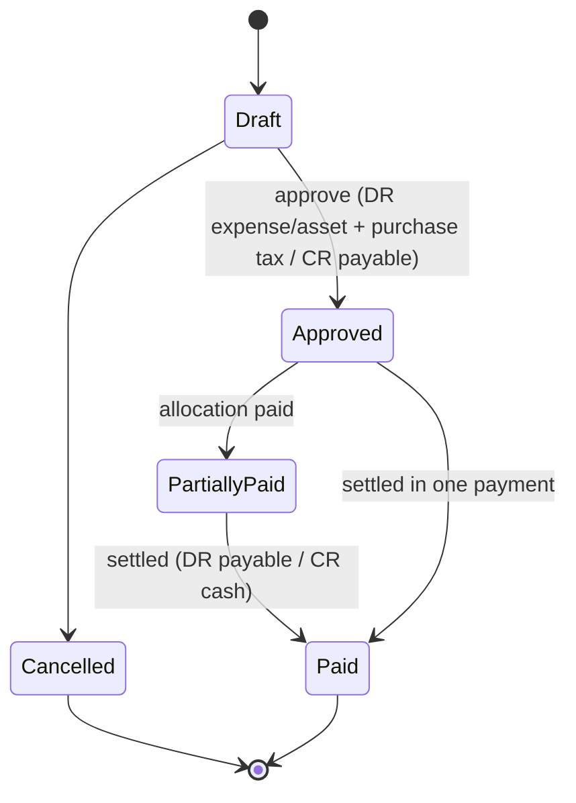
```mermaid
stateDiagram-v2
    [*] --> Draft
    Draft --> Approved: approve (DR expense/asset + purchase tax / CR payable)
    Draft --> Cancelled
    Approved --> PartiallyPaid: allocation paid
    PartiallyPaid --> Paid: settled (DR payable / CR cash)
    Approved --> Paid: settled in one payment
    Cancelled --> [*]
    Paid --> [*]
```

**Rules:** the payable is recognised at **approval**, not at recording — an unapproved bill is not yet a liability. The three-way match is displayed and flagged, never blocking.

### 4.10 Reservation

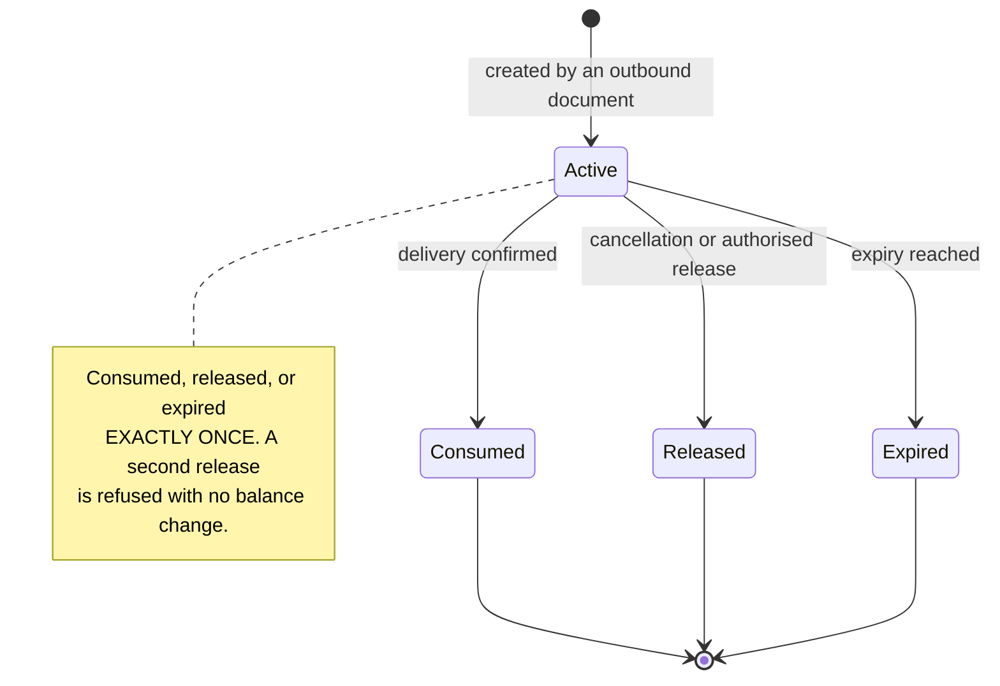
```mermaid
stateDiagram-v2
    [*] --> Active: created by an outbound document
    Active --> Consumed: delivery confirmed
    Active --> Released: cancellation or authorised release
    Active --> Expired: expiry reached
    Consumed --> [*]
    Released --> [*]
    Expired --> [*]
    note right of Active
        Consumed, released, or expired
        EXACTLY ONCE. A second release
        is refused with no balance change.
    end note
```

### 4.11 Ticket

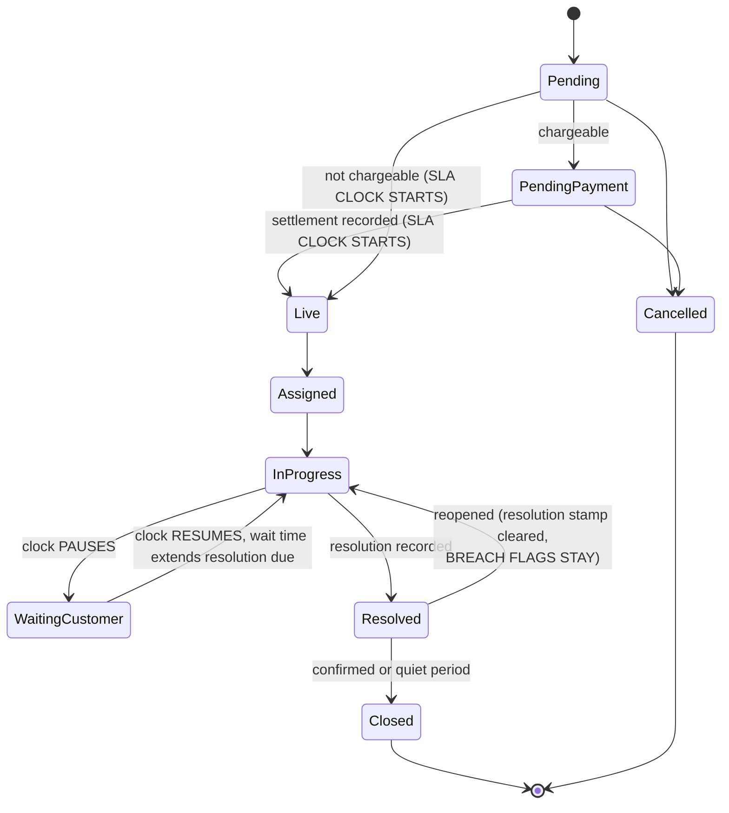
```mermaid
stateDiagram-v2
    [*] --> Pending
    Pending --> PendingPayment: chargeable
    PendingPayment --> Live: settlement recorded (SLA CLOCK STARTS)
    Pending --> Live: not chargeable (SLA CLOCK STARTS)
    Live --> Assigned
    Assigned --> InProgress
    InProgress --> WaitingCustomer: clock PAUSES
    WaitingCustomer --> InProgress: clock RESUMES, wait time extends resolution due
    InProgress --> Resolved: resolution recorded
    Resolved --> Closed: confirmed or quiet period
    Resolved --> InProgress: reopened (resolution stamp cleared,<br/>BREACH FLAGS STAY)
    Pending --> Cancelled
    PendingPayment --> Cancelled
    Closed --> [*]
    Cancelled --> [*]
```

### 4.12 Maintenance request and service record

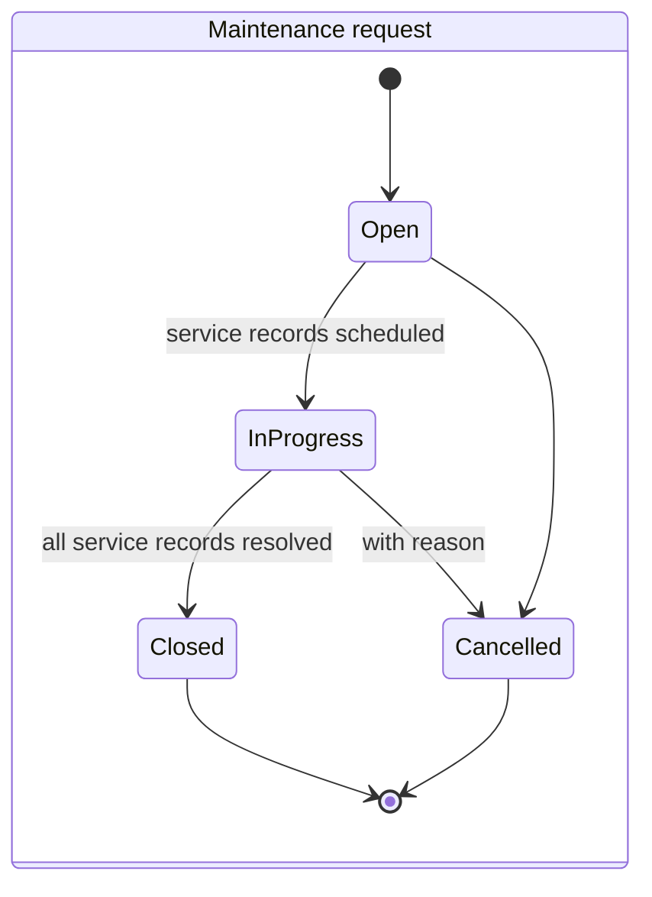
```mermaid
stateDiagram-v2
    state "Maintenance request" as MR {
        [*] --> Open
        Open --> InProgress: service records scheduled
        InProgress --> Closed: all service records resolved
        Open --> Cancelled
        InProgress --> Cancelled: with reason
        Closed --> [*]
        Cancelled --> [*]
    }
```

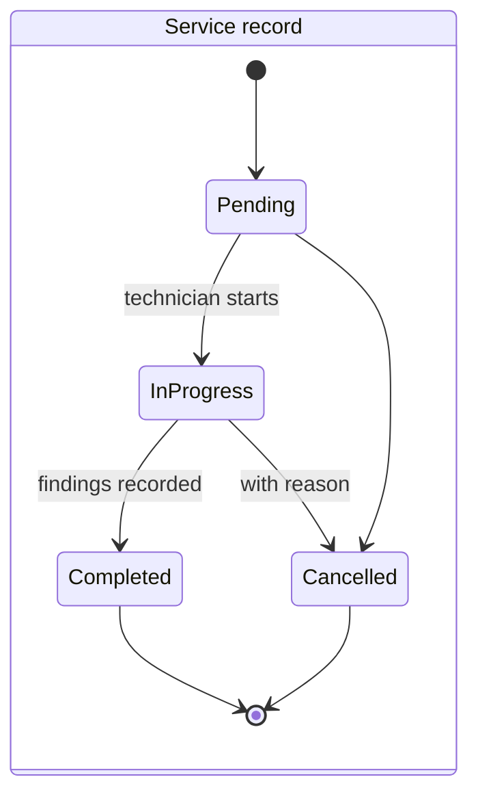
```mermaid
stateDiagram-v2
    state "Service record" as SR {
        [*] --> Pending
        Pending --> InProgress: technician starts
        InProgress --> Completed: findings recorded
        Pending --> Cancelled
        InProgress --> Cancelled: with reason
        Completed --> [*]
        Cancelled --> [*]
    }
```

### 4.13 Employee plan, task, visit, and salary

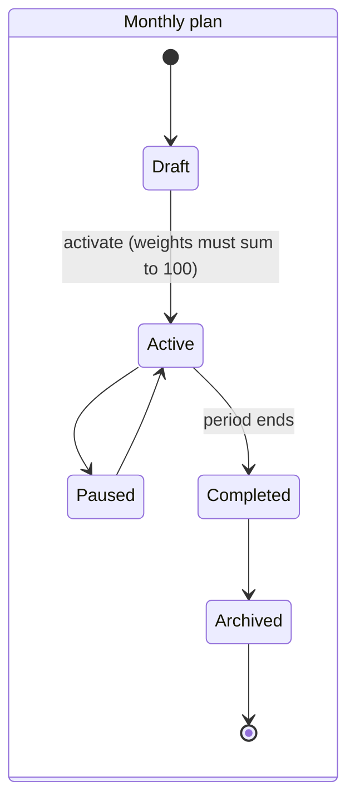
```mermaid
stateDiagram-v2
    state "Monthly plan" as PLN {
        [*] --> Draft
        Draft --> Active: activate (weights must sum to 100)
        Active --> Paused
        Paused --> Active
        Active --> Completed: period ends
        Completed --> Archived
        Archived --> [*]
    }
```

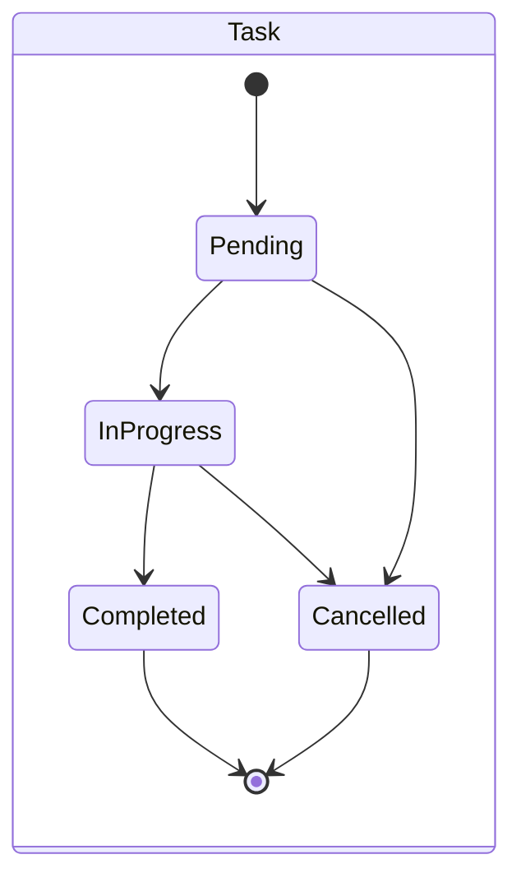
```mermaid
stateDiagram-v2
    state "Task" as TSK {
        [*] --> Pending
        Pending --> InProgress
        InProgress --> Completed
        Pending --> Cancelled
        InProgress --> Cancelled
        Completed --> [*]
        Cancelled --> [*]
    }
```

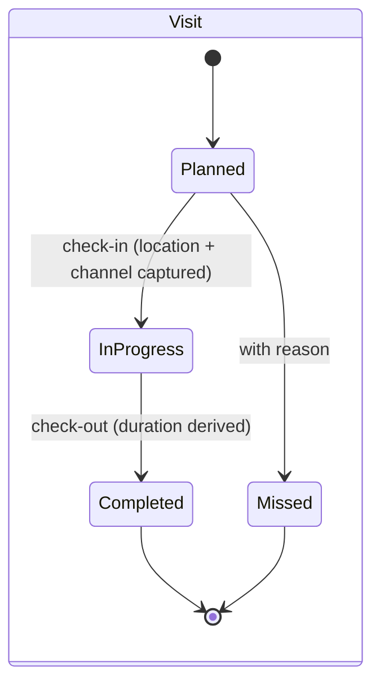
```mermaid
stateDiagram-v2
    state "Visit" as VIS {
        [*] --> Planned
        Planned --> InProgress: check-in (location + channel captured)
        InProgress --> Completed: check-out (duration derived)
        Planned --> Missed: with reason
        Completed --> [*]
        Missed --> [*]
    }
```

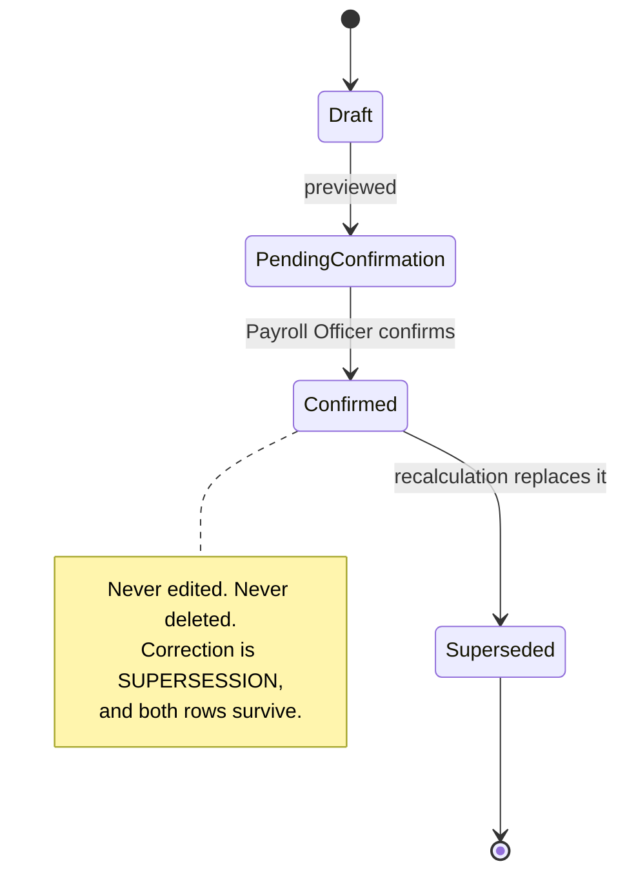
```mermaid
stateDiagram-v2
    [*] --> Draft
    Draft --> PendingConfirmation: previewed
    PendingConfirmation --> Confirmed: Payroll Officer confirms
    Confirmed --> Superseded: recalculation replaces it
    Superseded --> [*]
    note right of Confirmed
        Never edited. Never deleted.
        Correction is SUPERSESSION,
        and both rows survive.
    end note
```

### 4.14 Voice note, transcript, and opportunity draft

```mermaid
stateDiagram-v2
    state "Voice note" as VN {
        [*] --> Pending
        Pending --> Processing
        Processing --> Transcribed
        Processing --> Failed: recorded, NEVER blocks the visit
        Transcribed --> [*]
        Failed --> [*]
    }
```

```mermaid
stateDiagram-v2
    state "Opportunity draft" as OD {
        [*] --> Draft: AI proposal
        Draft --> Approved: explicit human decision + note
        Draft --> Rejected: explicit human decision + reason (RETAINED)
        Approved --> [*]
        Rejected --> [*]
    }
```

### 4.15 Lead and opportunity

```mermaid
stateDiagram-v2
    state "Lead" as LD {
        [*] --> New
        New --> Contacted: interaction recorded
        Contacted --> Qualified: interaction recorded
        Qualified --> Converted: becomes a customer, history follows
        New --> Disqualified: with reason
        Contacted --> Disqualified: with reason
        Qualified --> Disqualified: with reason
        Converted --> [*]
        Disqualified --> [*]
    }
```

```mermaid
stateDiagram-v2
    state "Opportunity" as OPP {
        [*] --> Identified
        Identified --> Qualified
        Qualified --> Proposed: quotation created
        Proposed --> Won: quotation accepted
        Proposed --> Lost: quotation rejected or expired (reason required)
        Qualified --> Lost: with reason
        Won --> [*]
        Lost --> [*]
    }
```

---

## 5. Single-source-of-truth ownership map

The most valuable table in this document. Every row answers: *when two screens disagree, which one is right?*

| Business fact | Sole owner | Everyone else | Failure if duplicated |
|---|---|---|---|
| Physical stock quantity | Inventory balance at (variant, warehouse, condition) | Reads it | Two stock figures; nobody knows what is sellable |
| Why stock changed | Movement ledger | Reads it | Unexplainable balances |
| What is committed and to whom | Reservation with allocations | Reads it | Double-promised units |
| Which physical lot or unit is where | Lot balances and serialised-unit custody | Reads it | Traceability and recall both fail |
| Unit conversion for a variant | Variant unit definitions | Normalise through it | Quantities silently change meaning |
| Base price and floor | Variant | Reads it | A sale below the floor becomes possible |
| Discount policy | Pricing tier | Resolve through it | Stacked or unexplainable discounts |
| The price on a sent document | The document's own snapshot | — | Policy changes rewrite commitments |
| Customer commercial identity | Customer profile | References it | Two parties, one receivable split in half |
| Payment-term policy | Payment term | Snapshot onto documents | Historical due dates shift under policy edits |
| Due date of an issued invoice | The invoice's stored resolved date | — | The same as above |
| Overdue status | **Derived** from due date plus grace | Never stored | A stored flag drifts from reality |
| Amount owed by a customer | Invoices minus credits minus allocations, computed | Never stored as a balance | A cached balance disagrees with documents and ledger |
| Amount owed to a supplier | Bills minus allocations, computed | Never stored | The same |
| Tax charged | Invoice tax total | Reads it | Two tax figures |
| Tax recognised | Tax recognition entries (append-only) | Aggregates read from them | The register stops reconciling |
| Ledger balances | Journal entry lines | Reports derive from them | Reports that disagree with the ledger |
| Which documents post automatically | The named posting-event list | — | Features silently acquire posting paths |
| Purchase commitment | Purchase order | References it | Phantom inbound coverage |
| Received quantity | Purchase order line, advanced under lock by the receipt | — | Over-receipt races |
| Supplier's answer | Append-only supplier confirmations | Reads the latest | An overwritten answer destroys evidence |
| Actual purchase cost | Received cost written back to the supplier reference | Defaults from it | Ordering forever from a stale price list |
| Ticket SLA target | The ticket's snapshot at clock start | Policy is the source only at that moment | Editing policy rewrites in-flight commitments |
| Warranty coverage | Maintenance request's explicit warranty status and expiry | Reads it | Guessed coverage, disputed claims |
| Parts consumed on a job | Consumption record paired with its movement | Reads it | Job cost and stock disagree |
| Employee compensation model | Employee profile (exactly one of base or target) | — | Ambiguous pay |
| Payable base for a historical salary | The salary calculation's copied value | — | Profile edits rewrite past pay |
| Performance score inputs | The score's snapshotted breakdown | — | Plan edits silently rewrite history |
| Who did what, when | Audit trail (append-only) | — | No accountability |
| Document identity | The number sequence for that family | — | Reused or ambiguous references |

---

## 6. Business event catalogue

Events are how contexts stay coordinated without writing into each other. Each is a business fact that has already happened.

| Event | Raised by | Consumed by | Business consequence |
|---|---|---|---|
| `CustomerAccepted` | Parties | CRM, Sales | Party becomes transactable |
| `PricingPolicyChanged` | Catalogue | Sales | Open drafts re-resolve; sent documents keep snapshots |
| `PriceFloorOverrideApproved` | Catalogue | Sales, Audit, Reporting | The blocked line becomes sendable, with provenance attached |
| `QuotationSent` | Sales | CRM, Notifications | Prices snapshot; opportunity advances to proposed |
| `QuotationDecided` | Sales | CRM, Sales | Opportunity closes won or lost; conversion becomes possible |
| `OrderCreated` | Sales | Inventory, Purchasing | Coverage check; reservation or procurement |
| `OrderCoverageGap` | Sales | Purchasing | Supplier confirmation or purchase order raised |
| `StockReserved` | Inventory | Sales, Reporting | Availability falls; the promise becomes real |
| `ReservationReleased` | Inventory | Sales, Reporting | Availability rises; order coverage recomputed |
| `ReservationExpired` | Inventory | Sales, Notifications | Order flagged as no longer covered |
| `GoodsReceived` | Inventory | Purchasing, Sales, Accounting | PO lines advance; cost written back; waiting orders can proceed |
| `DeliveryConfirmed` | Inventory | Sales, Accounting | Reservation consumed; the delivery becomes invoiceable; **no tax** |
| `TransferDiscrepancyRecorded` | Inventory | Accounting, Reporting | Shortage routed to an approved write-off |
| `StockConditionChanged` | Inventory | Sales, Reporting, Notifications | Availability changes without a quantity change |
| `LotNearingExpiry` | Inventory | Notifications, Sales | Expiry work queue; FEFO prioritisation |
| `StockBelowReorderLevel` | Inventory | Purchasing, Notifications | A human decides to buy or transfer |
| `InvoiceIssued` | Sales | Accounting, Notifications | **Posting 1:** DR receivable / CR revenue / CR deferred tax |
| `PaymentCollected` | Accounting | Sales, Accounting, Notifications | **Posting 2:** cash in, receivable down, tax deferred → payable |
| `CreditNoteConfirmed` | Sales | Accounting, Inventory (reference only) | **Posting 3:** revenue and tax reversed proportionally |
| `RefundApproved` | Accounting | Accounting, Notifications | **Posting 4:** money out; recognised tax reversed proportionally |
| `BillApproved` | Accounting | Accounting, Purchasing | Payable recognised |
| `SupplierPaymentPosted` | Accounting | Accounting | Payable cleared |
| `SupplierAnswerRecorded` | Purchasing | Sales, Notifications | Waiting customer order advances or is re-sourced |
| `PurchaseOrderSent` | Purchasing | Reporting | Content becomes immutable; inbound coverage appears |
| `PurchaseOrderShortClosed` | Purchasing | Sales, Reporting | Inbound coverage disappears; dependent orders flagged |
| `CustomerReturnDispositioned` | Inventory | Sales, Accounting | Stock lands at a condition; a credit decision becomes possible |
| `VisitCompleted` | Employees | CRM, Employees | Duration feeds work-time adherence; produced documents attach |
| `VoiceNoteTranscribed` | Employees | Employees | Keyword rules run; a draft may be proposed |
| `VoiceNoteTranscriptionFailed` | Employees | Employees | Recorded; **nothing else changes** |
| `OpportunityDraftDecided` | Employees | CRM | Approved drafts become real opportunities |
| `PerformanceScored` | Employees | Employees | Salary calculation becomes possible |
| `SalaryConfirmed` | Employees | Reporting, Audit | Pay is committed; corrections are supersessions |
| `TicketWentLive` | Service | Service, Notifications | SLA targets snapshot; the clock starts |
| `SlaBreached` | Service | Notifications, Reporting | Flag set; sticky thereafter |
| `PartsConsumed` | Service | Inventory, Reporting | Stock decreases through the canonical path; job cost accrues |
| `MaintenanceClosed` | Service | Sales, Reporting | Chargeable work becomes invoiceable; device history updates |
| `FiscalPeriodClosed` | Accounting | Accounting, Reporting | Postings into it are refused thereafter |
| `ReconciliationDifferenceDetected` | Inventory / Accounting | Reporting, Notifications | Shown as an error; blocks period close |

> **Note on posting events:** exactly four ledger-posting events are named above — invoice issuance, payment collection, credit-note confirmation, and refund approval — plus the payables pair (bill/expense approval and their payment). Everything else in this catalogue posts nothing. Adding a fifth posting path is a governance decision (AC-16), not a feature side effect.

---

## 7. Cross-domain relationship map

```mermaid
erDiagram
    CUSTOMER ||--o{ LEAD : "converted from"
    CUSTOMER ||--o{ OPPORTUNITY : "has"
    CUSTOMER ||--o{ QUOTATION : "receives"
    CUSTOMER ||--o{ ORDER : "places"
    CUSTOMER ||--o{ INVOICE : "owes on"
    CUSTOMER ||--o{ CREDIT_NOTE : "credited by"
    CUSTOMER ||--o{ PAYMENT : "pays"
    CUSTOMER ||--o{ TICKET : "raises"
    CUSTOMER ||--o{ MAINTENANCE_REQUEST : "requests"
    CUSTOMER ||--o{ VISIT : "is visited"
    CUSTOMER ||--o{ PRICING_TIER_ASSIGNMENT : "assigned"

    PRODUCT ||--|{ VARIANT : "sold as"
    VARIANT ||--o{ STOCK_BALANCE : "counted at"
    VARIANT ||--o{ LOT : "batched as"
    VARIANT ||--o{ SERIALISED_UNIT : "individualised as"
    VARIANT ||--o{ VARIANT_UNIT : "transacted in"
    VARIANT ||--o{ PRICING_TIER_PRODUCT : "discounted by"
    VARIANT ||--o| PRICE_FLOOR : "protected by"

    WAREHOUSE ||--o{ STOCK_BALANCE : "holds"
    WAREHOUSE ||--o{ INVENTORY_OPERATION : "source or destination"

    OPPORTUNITY ||--o| QUOTATION : "produces"
    QUOTATION ||--o| ORDER : "converts to (exactly one)"
    ORDER ||--o{ INVENTORY_OPERATION : "fulfilled by deliveries"
    INVENTORY_OPERATION ||--o| INVOICE : "invoiced once"
    INVENTORY_OPERATION ||--o| SHIPMENT : "tracked by"
    INVENTORY_OPERATION ||--o{ RESERVATION : "consumes"
    INVENTORY_OPERATION ||--|{ MOVEMENT : "posts"
    INVOICE ||--o{ CREDIT_NOTE : "corrected by"
    INVOICE ||--o{ PAYMENT_ALLOCATION : "settled by"
    PAYMENT ||--|{ PAYMENT_ALLOCATION : "split into"
    PAYMENT_ALLOCATION ||--o| TAX_RECOGNITION : "recognises"
    CREDIT_NOTE ||--o| REFUND : "may fund"

    SUPPLIER ||--o{ PURCHASE_ORDER : "receives"
    SUPPLIER ||--o{ SUPPLIER_CONFIRMATION : "answers"
    SUPPLIER ||--o{ BILL : "invoices us"
    SUPPLIER ||--o{ SUPPLIER_PAYMENT : "is paid"
    PURCHASE_ORDER ||--o{ INVENTORY_OPERATION : "received by"
    PURCHASE_ORDER ||--o{ BILL_LINE : "matched advisory"
    ORDER ||--o{ SUPPLIER_CONFIRMATION : "back-order answered"

    RESERVATION ||--|{ ALLOCATION : "names lots and units"
    LOT ||--o{ ALLOCATION : "allocated"
    SERIALISED_UNIT ||--o{ ALLOCATION : "allocated"
    SERIALISED_UNIT ||--o{ MOVEMENT : "traced by"
    SERIALISED_UNIT ||--o{ MAINTENANCE_REQUEST : "serviced as"

    EMPLOYEE ||--o{ MONTHLY_PLAN : "measured by"
    MONTHLY_PLAN ||--|{ TASK : "contains"
    MONTHLY_PLAN ||--o{ VISIT : "plans"
    MONTHLY_PLAN ||--o| PERFORMANCE_SCORE : "scored as"
    PERFORMANCE_SCORE ||--o| SALARY_CALCULATION : "pays"
    VISIT ||--o{ VOICE_NOTE : "captures"
    VOICE_NOTE ||--o| TRANSCRIPT : "transcribed to"
    TRANSCRIPT ||--o{ OPPORTUNITY_DRAFT : "may propose"
    OPPORTUNITY_DRAFT ||--o| OPPORTUNITY : "approved into"
    OPPORTUNITY_DRAFT ||--o{ BONUS_SUGGESTION : "may justify"
    EMPLOYEE ||--o{ QUOTATION : "authors"
    EMPLOYEE ||--o{ SERVICE_RECORD : "performs"

    TICKET ||--o{ MAINTENANCE_REQUEST : "escalates to"
    TICKET ||--o| TICKET : "continues"
    MAINTENANCE_REQUEST ||--|{ SERVICE_RECORD : "scheduled as"
    SERVICE_RECORD ||--o{ PARTS_CONSUMPTION : "consumes"
    PARTS_CONSUMPTION ||--|| MOVEMENT : "paired with"

    JOURNAL_ENTRY ||--|{ JOURNAL_LINE : "balanced by"
    CHART_ACCOUNT ||--o{ JOURNAL_LINE : "posted to"
    FISCAL_PERIOD ||--o{ JOURNAL_ENTRY : "contains"
    INVOICE ||--o| JOURNAL_ENTRY : "posts on issuance"
    PAYMENT ||--o| JOURNAL_ENTRY : "posts on collection"
    CREDIT_NOTE ||--o| JOURNAL_ENTRY : "posts on confirmation"
    REFUND ||--o| JOURNAL_ENTRY : "posts on approval"
    BILL ||--o| JOURNAL_ENTRY : "posts on approval"
```

### 7.1 Deliberate non-relationships

Equally important is what must **not** be connected:

| Not related | Why |
|---|---|
| Quotation → stock | A quotation is an offer, not a commitment of goods, in any state |
| Credit note → stock | A credit note is a financial correction; goods coming back is a separate return document |
| Purchase order → stock | A purchase order commits money, not goods; the receipt moves goods |
| Purchase order → ledger | A commitment is not a liability; the approved bill is |
| Shipment → stock | Shipment tracks a journey; custody transfer at delivery is the stock event |
| Order → ledger | The order is a fulfilment and money-tracking spine, not a posting document |
| Customer receivable ↔ supplier payable for the same party | Never auto-netted; two separate relationships with separate documents |
| SLA policy → in-flight ticket | The ticket snapshots its targets; the live policy is not joined |

---

## 8. Global business invariants

Grouped by the failure each one prevents.

### 8.1 Physical truth

| # | Invariant |
|---|---|
| P1 | Stock quantity is meaningful only as `(variant, warehouse, condition)` in base units |
| P2 | Every stock change produces an immutable movement inside the same transaction |
| P3 | Only one posting path may mutate a balance, lot balance, serial custody, or reservation allocation |
| P4 | Available quantity is never negative except through an explicitly approved override |
| P5 | Aggregate on-hand equals the sum of lot balances for a lot-tracked variant |
| P6 | Aggregate reserved equals the sum of active reservation allocations |
| P7 | A serialised unit is in exactly one custody and at most one active allocation |
| P8 | A reservation is consumed, released, or expired exactly once |
| P9 | Lot and serial identity survive transfers, returns, and condition changes |
| P10 | The movement ledger replays to the current balance for any variant, warehouse, and condition |

### 8.2 Commercial truth

| # | Invariant |
|---|---|
| C1 | Price resolution is deterministic, non-stacking, and records its provenance |
| C2 | No line is sold below the variant floor without a recorded System Admin approval |
| C3 | A sent quotation's prices and totals are snapshots and never change |
| C4 | A quotation converts to at most one order; a delivery is invoiced at most once |
| C5 | Fulfilment state and payment state are independent axes |
| C6 | A pending order always carries an explicit pending reason |
| C7 | A customer sees only their own records and only their own resolved price |

### 8.3 Financial truth

| # | Invariant |
|---|---|
| F1 | Debits equal credits before any entry posts |
| F2 | Only postable leaf accounts receive lines |
| F3 | Revenue is recognised on invoice issuance; **tax is not** |
| F4 | Tax is recognised only on collection, proportionally, with the settling allocation absorbing rounding so the total is exact |
| F5 | A refund reverses recognised tax proportionally, and is never a negative collection |
| F6 | A refund never exceeds the computed available credit balance, and its recorder and approver are different roles |
| F7 | Only the named posting events post automatically; every posting is source-linked to its document |
| F8 | Confirmed financial documents are corrected by linked documents, never edited or deleted |
| F9 | Subledgers are computed, never stored, and reconcile to their control accounts as a displayed proof |
| F10 | A reconciliation difference is shown as an error and is never rounded, suppressed, adjusted, or plugged |
| F11 | Postings into a closed period are refused; a late document posts to an open period referencing the original event date |
| F12 | Allocation totals never exceed their payment; paid amount never exceeds grand total after credits |

### 8.4 Evidence and accountability

| # | Invariant |
|---|---|
| E1 | Every sensitive action writes an append-only audit entry with actor, target, channel, before and after values |
| E2 | Append-only histories exist for supplier answers, task status, ticket assignments, GPS trails, and tax recognition |
| E3 | Field-recorded visit data is not editable by a reviewer, who may only add a review note |
| E4 | No AI output takes effect without an explicit, recorded human decision |
| E5 | Confidence is never fabricated; a missing value is explicitly unavailable, with its source labelled |
| E6 | Approval and execution are separated wherever money or stock leaves the business |
| E7 | Snapshots are deliberate and labelled: prices, tax rates, payment terms, SLA targets, plan weights, payable base |
| E8 | Derivations are never stored: overdue status, availability, ageing, subledger balances, breach state at a moment |
| E9 | Document numbers are unique per family including over soft-deleted rows, and are never reused |
| E10 | Sensitive files are private and served only through authenticated, access-scoped, time-limited links |

### 8.5 Operational integrity

| # | Invariant |
|---|---|
| O1 | Every financial and inventory operation is atomic, with deterministic lock ordering |
| O2 | External callbacks are idempotent: one event, one record, one posting |
| O3 | Authorisation is checked at page-open and action-execution time, on every path including bulk actions and direct service calls |
| O4 | Hiding a control is never authorisation |
| O5 | A channel is a record, never a second code path — staff-recorded and self-service produce the same business record |
| O6 | AI or external-provider failure never blocks a business operation that does not logically depend on it |

---

## 9. Money, quantity, and rounding rules

| Concern | Rule |
|---|---|
| Money storage | Fixed-scale decimal; never floating point |
| Money scale | Two decimal places for amounts; a wider scale permitted for unit prices where the business requires it |
| Quantity storage | Fixed-scale decimal; three decimal places, constrained further by the base unit's declared precision |
| Quantity normalisation | Every line is captured in a transaction unit and normalised to base quantity **before** it touches a balance |
| Rounding point | Round at the line, then sum — never sum unrounded and round the total, which lets a document's total disagree with its visible lines |
| Tax proportional recognition | `round(allocation ÷ invoice grand total × invoice tax total, 2)` for every allocation **except** the settling one |
| Tax settlement recognition | The settling allocation recognises `invoice tax total − already recognised`, absorbing all accumulated rounding so the sum is exact |
| Zero-tax invoice | Writes no tax recognition entry at all |
| Credit-note tax split | Deferred versus payable split by the ratio of the invoice's tax already recognised, computed so the entry balances exactly — never by rounding both lines independently |
| Refund tax reversal | Proportional to the refunded share of what was collected |
| Negative amounts | Only where a reversal is explicitly modelled; a refund is a positive amount on a refund document, not a negative payment |
| Currency | Every document carries its currency; all lines on one document share it; no implicit conversion anywhere |
| Cross-currency approval | Routed to explicit human approval rather than converted |
| Performance score | Weights sum to exactly 100; the breakdown stores numerator, denominator, ratio, weight, and contribution per factor |
| Salary | `payable base × (performance percent ÷ 100) + approved bonuses`, with the payable base copied at calculation time |

---

## 10. Traceability, audit, and evidence model

### 10.1 The four traceability questions the model must answer

```mermaid
flowchart LR
    Q1[Where did this number come from?] --> A1[Every ledger line is source-linked<br/>to its document; every balance replays<br/>from its movements]
    Q2[Who decided this, and why?] --> A2[Every state transition names its actor,<br/>timestamp, channel, and reason;<br/>approvals name approver and justification]
    Q3[Where is this physical thing,<br/>and where has it been?] --> A3[Lot and serial identity carried on every<br/>movement, allocation, operation,<br/>and service record]
    Q4[What did we commit to, at the time?] --> A4[Deliberate snapshots: prices, tax rate,<br/>payment term, SLA target, plan weights,<br/>payable base]
```

### 10.2 Evidence classes

| Class | Examples | Rule |
|---|---|---|
| **Immutable ledgers** | Movements, journal entries, tax recognition entries | Written once inside the operation's transaction; never edited or deleted |
| **Append-only histories** | Supplier answers, task status logs, ticket assignments, GPS trails, audit entries | New rows only; a correction is a new row that leaves the original standing |
| **Snapshots** | Sent quotation prices, invoice due date and tax rate, SLA targets, plan weights, salary payable base, performance breakdown inputs | Copied at a business moment and labelled as of that moment |
| **Attachments** | Invoice and credit-note PDFs, payment proofs, ticket and visit files, voice notes, signatures, expense receipts, disposal evidence | Private storage; authenticated, access-scoped, time-limited access; validated on upload |
| **Derivations** | Overdue status, availability, subledger balances, ageing buckets, service margin | Computed on read; never stored, so they cannot drift |
| **Supersessions** | Salary recalculations, corrected credit-note-and-reissue pairs, replaced consumptions | Both the superseded and the superseding record survive, linked |

### 10.3 Correction model by document class

| Document class | How it is corrected | Never |
|---|---|---|
| Draft anything | Edit or discard freely | — |
| Sent quotation | New quotation, linked | Edited |
| Confirmed stock operation | Linked compensating document: correction, return, or discrepancy record | Edited or deleted |
| Issued invoice | Credit note, optionally followed by a corrected new invoice | Edited or deleted |
| Confirmed credit note | Linked reversing document | Edited or deleted |
| Posted payment | Explicit compensating document that un-recognises its tax | Deleted |
| Posted journal entry | Reversing entry referencing the original | Edited |
| Sent purchase order | Cancellation with zero receipts, or short-close, or a documented amendment | Edited |
| Answered supplier confirmation | A new confirmation | Edited |
| Confirmed salary calculation | Recalculation that supersedes | Edited or deleted |
| Parts consumption | Full reversal, then a new consumption | Partially edited |
| Audit entry | Never corrected — it records what happened | Edited or deleted, by anyone |

---

## 11. Modelling decisions and their reasoning

These are the judgement calls that give the model its shape. Each is recorded with its reasoning so a future change is a decision rather than an accident.

| # | Decision | Reasoning |
|---|---|---|
| 1 | **Product and variant are separate concepts, and only the variant is stockable** | Stock, price, traceability, and units all belong to the sellable SKU. Putting a quantity on a product makes every multi-variant product ambiguous |
| 2 | **Condition is part of the balance key** | Damaged, quarantined, and expired goods are physically present and commercially unavailable. Without condition in the key, "on-hand" answers a question nobody asked |
| 3 | **Location or bin is deliberately not part of the balance key** | Adding it multiplies every balance, every reconciliation, and every allocation for a putaway convenience the business has not yet asked for |
| 4 | **Tracking profile lives on the variant, not on a product type** | Three product categories cannot express "countable, non-expiring, serialised" versus "lot-tracked with expiry". Encoding physical control indirectly through a commercial category makes both wrong |
| 5 | **The tracking profile is immutable once stock history exists** | Changing it retroactively changes what every historical quantity meant |
| 6 | **Availability falls on reservation, not on movement** | Two salespeople must not be able to promise the same units. The commitment, not the forklift, is what makes stock unavailable |
| 7 | **Reservations are source-linked and allocation-bearing** | An anonymous reserved number cannot answer "why can't I sell this?" or survive a recall |
| 8 | **One posting path for stock; one for the ledger** | A workflow that updates a balance and separately remembers to write its movement will eventually forget |
| 9 | **The movement ledger is the audit record; the balance is a read model** | Reversing the roles makes every historical question a reconstruction |
| 10 | **Delivery moves stock and recognises no tax** | The company's fulfilment rule. Keeping the two events separate is what makes the tax rule expressible |
| 11 | **Tax is recognised only on collection, proportionally** | The company's defining accounting rule, stated in the PRD as a business rule, not a preference |
| 12 | **The settling allocation absorbs rounding** | Otherwise a fully collected invoice can leave a residual cent of deferred tax forever, and the register never reconciles |
| 13 | **A refund is a distinct document, never a negative collection** | Overloading collections would corrupt every sum built on them, and would recognise negative tax at the wrong moment |
| 14 | **A refund is capped by a computed available credit balance** | Without the cap, the refund surface becomes a way to move money out with no document behind it |
| 15 | **Refund recording and approval are held by different roles** | Money leaving the business is the one operation whose reversal is never free |
| 16 | **Subledgers are computed, never stored** | A stored balance is a cache able to disagree with the documents and the ledger, which is the failure the reconciliation exists to detect |
| 17 | **A reconciliation difference is displayed as an error and never plugged** | The difference is the finding. Hiding it converts a detectable problem into an undetectable one |
| 18 | **The credit note holds no stock relationship** | Goods retained with credit, and goods returned without credit, are both real. Coupling them makes one of the two unrepresentable |
| 19 | **The return document is separate from the credit note** | Same reasoning, from the inventory side: physical disposition and financial consequence are separate decisions with separate owners |
| 20 | **Purchasing writes no stock and no ledger entry** | A commitment is neither goods nor a liability. Receiving creates goods; bill approval creates the liability |
| 21 | **The three-way match is advisory, not blocking** | A blocking rule makes a legitimate over-delivery or partial bill unrecordable and pushes the accountant outside the system. The approver is the control |
| 22 | **Supplier answers are append-only** | An overwritten answer destroys the evidence of what the supplier actually said and when |
| 23 | **Short-close is never automatic** | Abandoning a commitment is a business decision with an owner and a reason |
| 24 | **Transmission is the purchase order's immutability boundary** | What the supplier was told must be what the system holds |
| 25 | **Fulfilment state and payment state are independent axes on the order** | On payment terms, "delivered and unpaid" is the normal case, not an anomaly |
| 26 | **Overdue is derived, never stored** | A stored flag drifts, and a policy edit would retroactively brand historical invoices |
| 27 | **Sent documents snapshot; open documents re-resolve** | A commitment must not change under the customer; a draft must not go stale |
| 28 | **Price provenance travels with the line** | An auditor reading an invoice must be able to see why the price was what it was |
| 29 | **The floor is a hard control with a named exception path** | A warning that can be clicked through is not a control |
| 30 | **SLA targets are snapshotted at clock start** | Editing a policy must never rewrite an in-flight commitment to a customer |
| 31 | **Breach flags are sticky** | A late recovery does not undo a missed target; reporting must show what actually happened |
| 32 | **Warranty status is explicit, including "unknown"** | A guessed coverage decision is a dispute waiting to happen; "unknown" is an honest, actionable state |
| 33 | **Parts consumption is paired with the movement it produced** | Job cost and stock must never be able to disagree about the same part |
| 34 | **Parts consumption reverses in full only** | Partial reversal invites a second, divergent quantity path; a full reversal plus a new consumption is unambiguous |
| 35 | **No AI output takes effect without a recorded human decision** | A machine proposal is not a business fact; the decision is what makes it one |
| 36 | **Confidence is never fabricated and its source is labelled** | A defaulted zero and a genuinely low confidence are different facts, and a reviewer must be able to tell them apart |
| 37 | **AI failure never blocks a business operation** | The visit happened whether or not the transcription succeeded |
| 38 | **Salary is corrected by supersession** | Payroll history must be reproducible; the payable base is copied for the same reason |
| 39 | **Performance breakdowns snapshot their inputs** | Otherwise a later plan edit silently rewrites a historical score and the pay derived from it |
| 40 | **Plan weights must sum to exactly 100** | An employee must never be measured against an incoherent scale |
| 41 | **The channel is metadata, never a second code path** | A staff-recorded customer decision and an in-app one must produce the same record, or the business has two truths |
| 42 | **Automated posting is a named, governed list** | Otherwise features acquire posting paths as side effects, and the ledger stops being explainable |

---

## 12. Known modelling tensions

Recorded so they are managed rather than rediscovered.

| # | Tension | Current position | Risk if unresolved |
|---|---|---|---|
| 1 | **No cost model** | Inventory valuation and cost-of-goods-sold posting are out of scope | Margin is not derivable; the inventory asset is not on the balance sheet; service jobs cost parts at no recognised value |
| 2 | **Delivery posts no ledger entry** | Deliberate — the named posting list has three sales events, none of them delivery | Combined with tension 1, revenue and its cost land in different periods, or the cost lands nowhere |
| 3 | **Ticket revenue is unrecognised** | Chargeable-ticket settlement is recorded but posts nothing | Service revenue exists commercially and not financially; the tax rule applies to goods but not to services |
| 4 | **Two returns concepts coexist** | A canonical return document is targeted; an interim movement-ledger view is explicitly superseded | Until the canonical document lands, returns are visible but not operable, and a credit note can be mistaken for a stock return |
| 5 | **Supplier returns have no document** | Out of scope in Purchasing; targeted by the inventory returns phase | Defective goods leave through an adjustment, which loses the supplier claim and the quality signal |
| 6 | **Single currency in a multi-currency-shaped model** | Purchase orders carry a currency and refuse conversion; the ledger is single-currency | Coherent today, but the first genuinely foreign supplier or customer forces a decision under time pressure |
| 7 | **Customer and employee surfaces are recorded on their behalf** | Deliberate deferral of the customer and employee applications | Acceptable only while the recorded action produces the identical business record; the moment a surface forks the flow, the model has two truths |
| 8 | **One collection channel is built; the model assumes several** | The posting and recognition services are channel-agnostic by design | The design holds only if the second channel adds a record rather than a second posting path |
| 9 | **No attendance system, but work-time is scored** | Work-time adherence derives from visit check-in and check-out only | Honest and bounded — but the score means "field time", not "working time", and must be labelled as such to be fair |
| 10 | **The primary Product/Inventory SRS is absent from the repository** | Inventory traceability requirements are reconstructed from derivative specifications | Requirements drift against the authoritative source; **this must be reconciled before inventory remediation is considered complete** |
| 11 | **Bin and location deferred, packages exist physically** | Locations are a putaway sub-dimension; packages are containers, never balances | Warehouse staff will ask for bin-level counting; the answer must stay "not in the balance key" until a decision changes it |
| 12 | **Advance payments versus tax timing** | An advance is a liability until applied; tax recognises on application | Correct, but requires the advance to be visibly distinct from a collection, or the tax register will look wrong to anyone reading raw payments |

---

## 13. Model summary — the ten sentences that define this ERP

1. A **variant at a warehouse in a condition** is the only meaningful unit of stock, expressed in base units.
2. **Every stock change writes a movement in the same transaction**, through exactly one posting path.
3. **Availability falls when something is promised**, not when it is moved.
4. **A delivery moves goods and recognises no tax.**
5. **Tax is recognised only when money is collected**, proportionally, with the settling collection absorbing rounding so the total is exact.
6. **Exactly the named document events post to the ledger**, and every posting is source-linked to its document.
7. **Nothing confirmed is ever edited or deleted** — corrections are new, linked documents.
8. **Subledgers are computed and must reconcile to their control accounts**, and a difference is an error, never a rounding.
9. **What a document committed to is snapshotted; what depends on today is derived** — and the two are never confused.
10. **No machine output and no money movement takes effect without a named human decision**, and every such decision leaves an append-only trail.

---

*End of document.*
