# Data Flow Diagrams

## 1. DFD Overview

The diagrams describe how System Admin, Customer, Employee, Stripe, AI provider, and mail service exchange data with the Laravel API and database.

## 2. Context Diagram

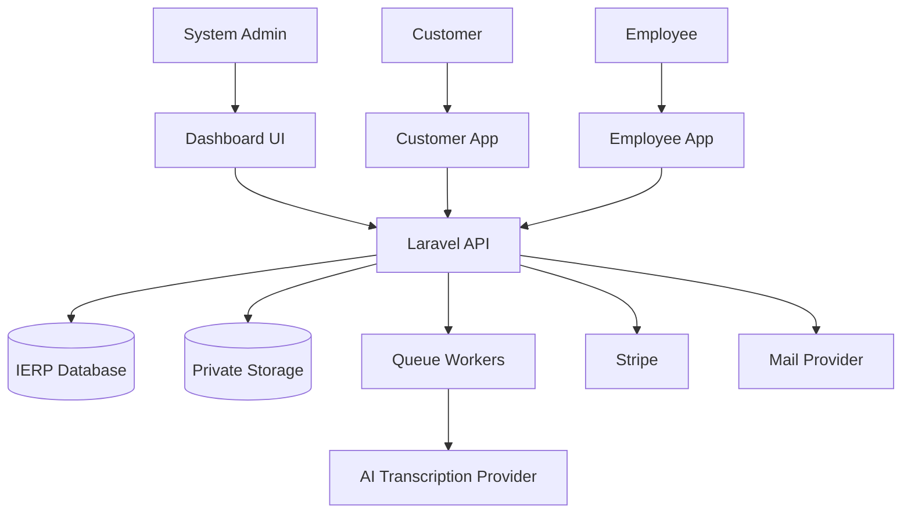

## 3. Level 0 DFD

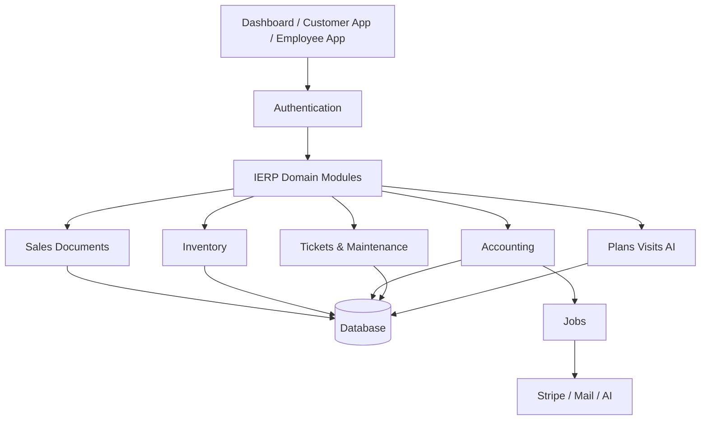

## 4. Level 1 DFD Per Main Feature

### Product and Variant Management

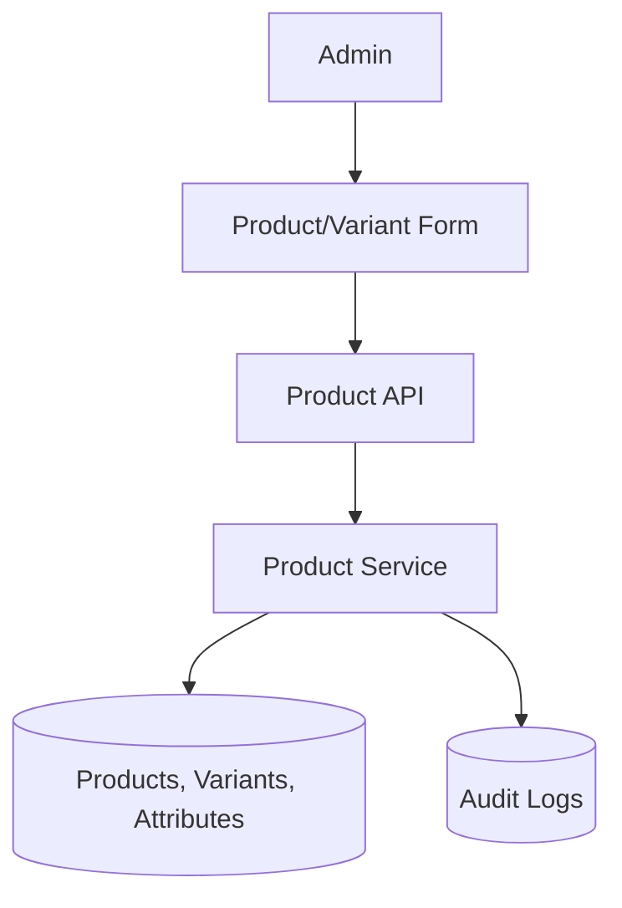

### Multi-Warehouse Inventory Movement

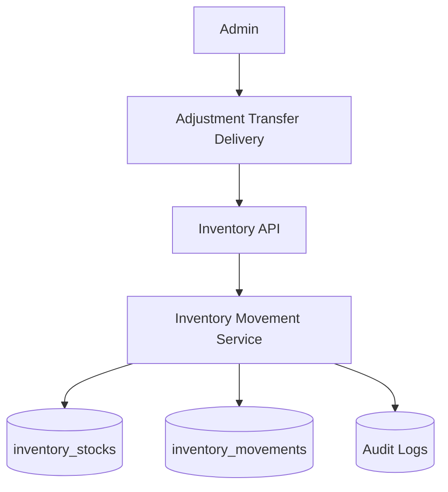

### Quotation to Payment

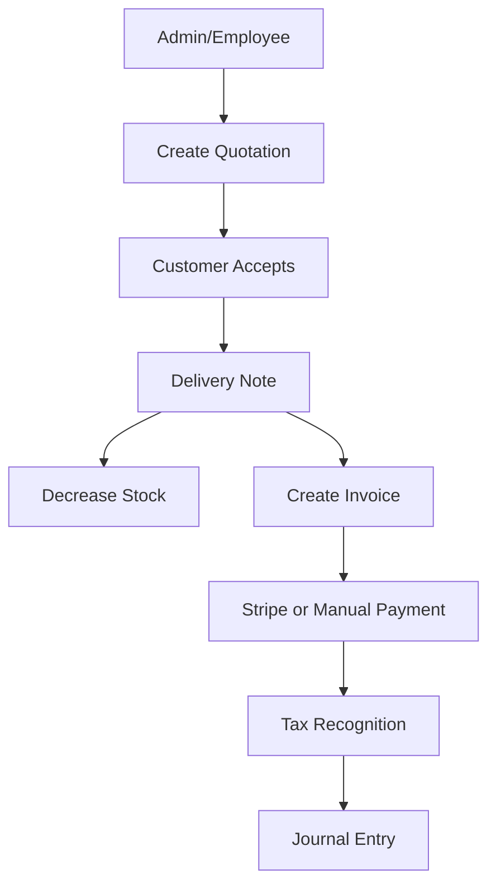

### Stripe Payment and Tax Recognition

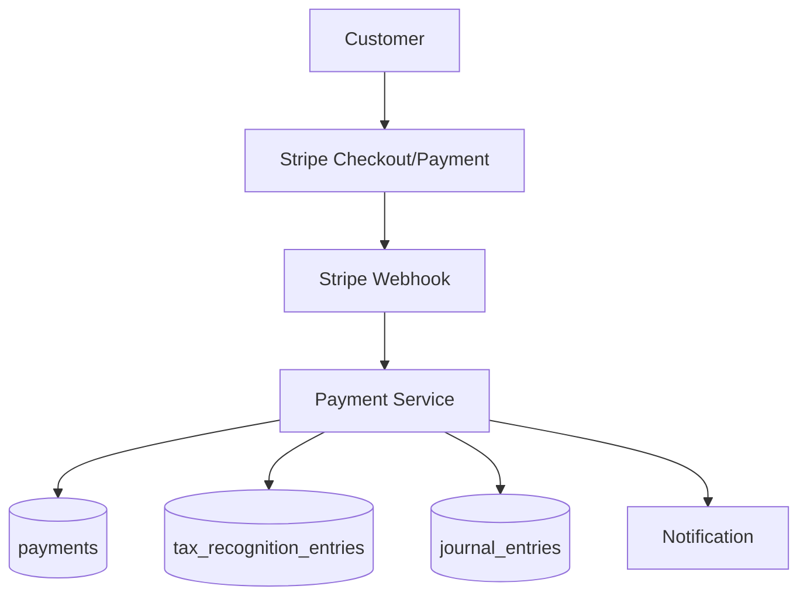

### Manual Payment and Tax Recognition

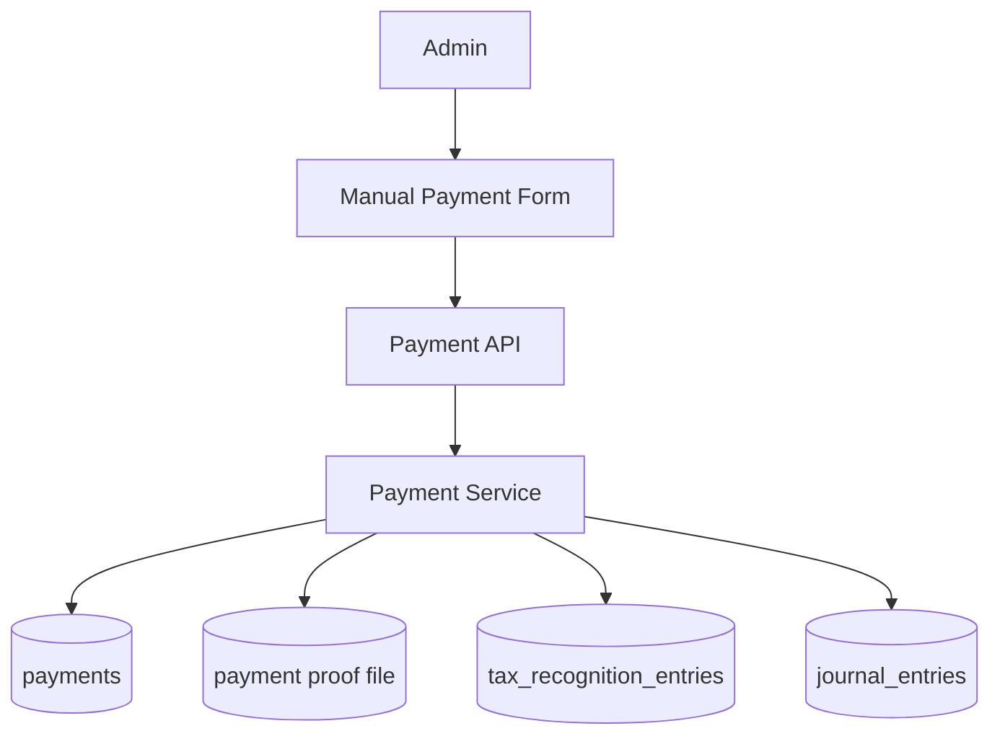

### Employee Visit, GPS, and Voice Note

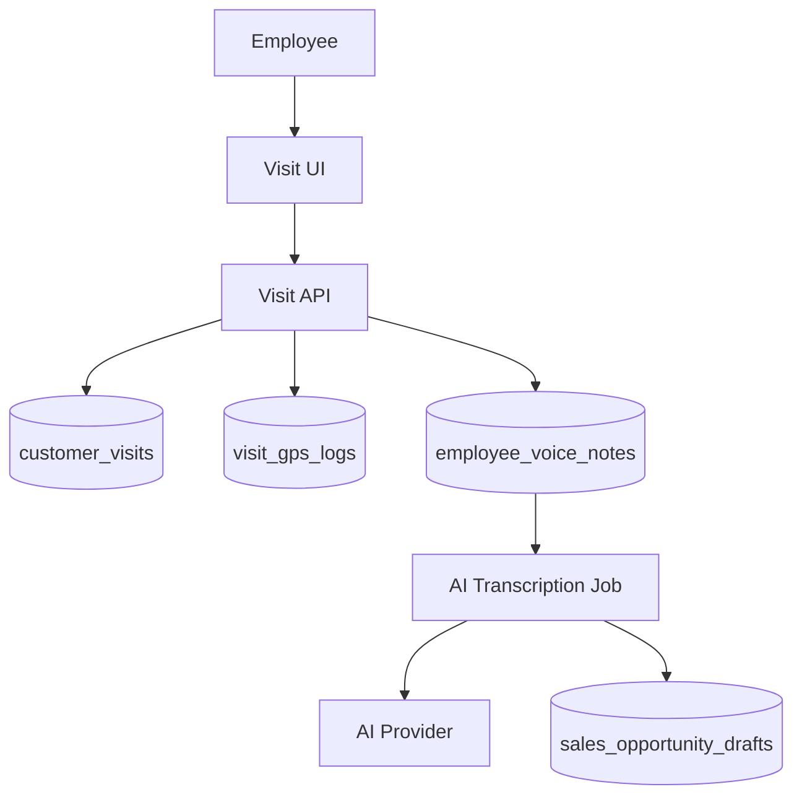

### Ticket and Maintenance

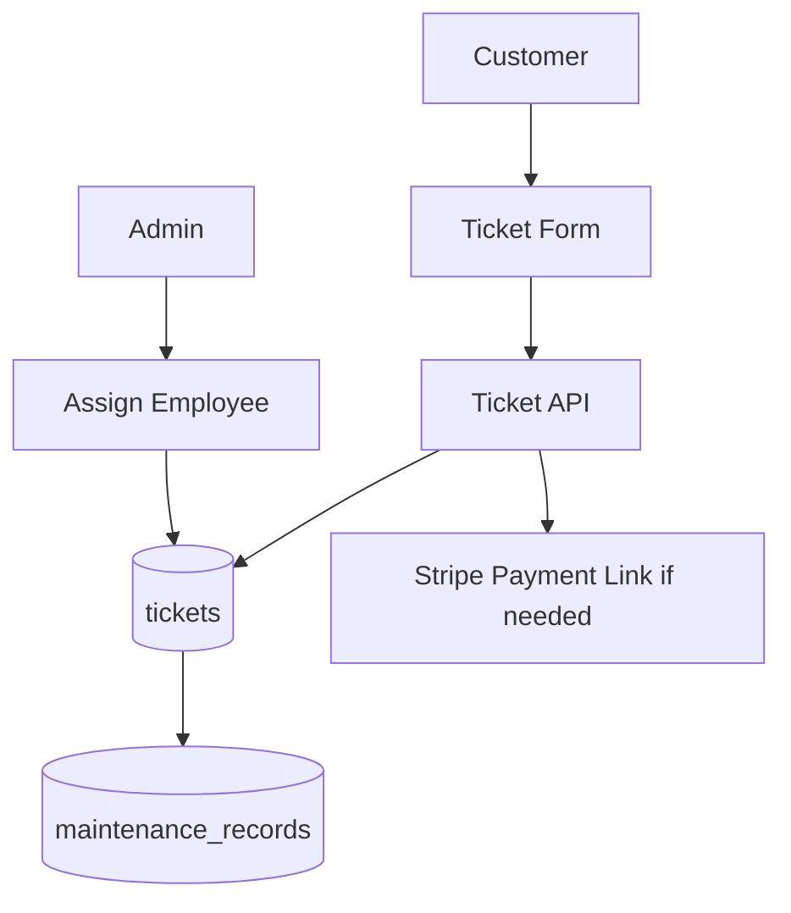

### CRM and Marketing

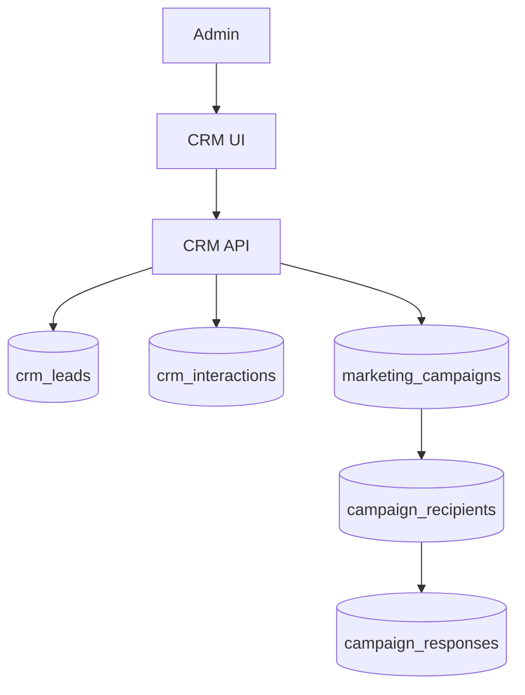

### Audit Logging

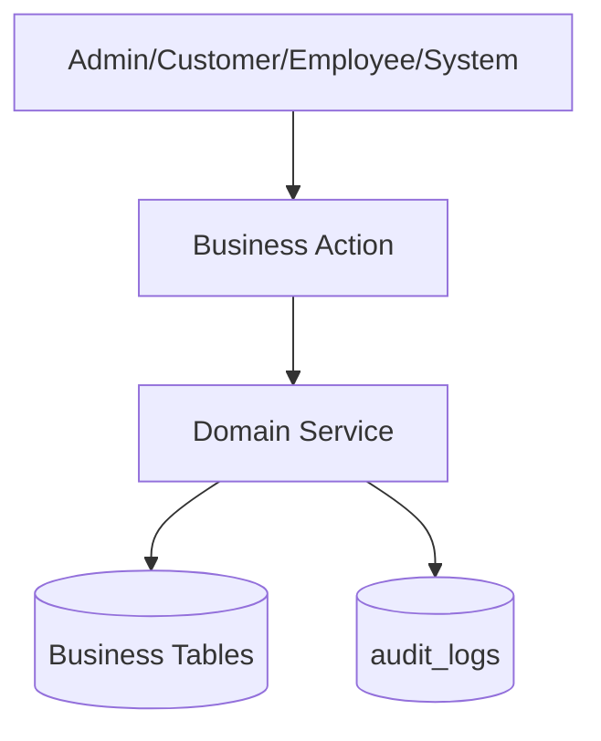

## 5. Data Stores

- Users and profiles.
- Product catalog and variants.
- Warehouses and inventory.
- Sales documents.
- Accounting and journals.
- Payments and tax recognition.
- Tickets and maintenance.
- CRM and marketing.
- AI and sales drafts.
- Notifications and audit logs.

## 6. External Systems

- Stripe.
- Mail provider.
- AI transcription provider.
- Private file storage.

## 7. Open Questions

- Which AI provider will be used?
- Which push notification provider will be used?

## 8. Future Spec Kit Extraction Map

| Future Spec | Scope |
|---|---|
| 001-project-foundation | Project rules, actors, glossary, non-functional requirements |
| 002-database-foundation | Base schema, migrations, seed data, data integrity |
| 003-auth-users-access | Authentication and user type access |
| 004-products-variants-warehouses-inventory | Catalog, variants, warehouses, stock movements |
| 005-chart-of-accounts-and-journals | COA, fiscal periods, journals, posting rules |
| 006-sales-flow-quotation-delivery-invoice | Quotation, delivery note, invoice lifecycle |
| 007-payments-stripe-manual-tax-recognition | Stripe, manual payments, tax recognition |
| 008-credit-notes | Credit note workflows and accounting reversal |
| 009-customer-app-flows | Product browsing, quotations, orders, invoices, tickets |
| 010-employee-app-plans-visits-ai | Plans, visits, GPS, voice notes, AI sales drafts |
| 011-tickets-maintenance | Support tickets and maintenance records |
| 012-crm-marketing | Leads, interactions, campaigns, responses |
| 013-reporting-notifications | Reports, alerts, reminders, audit visibility |
