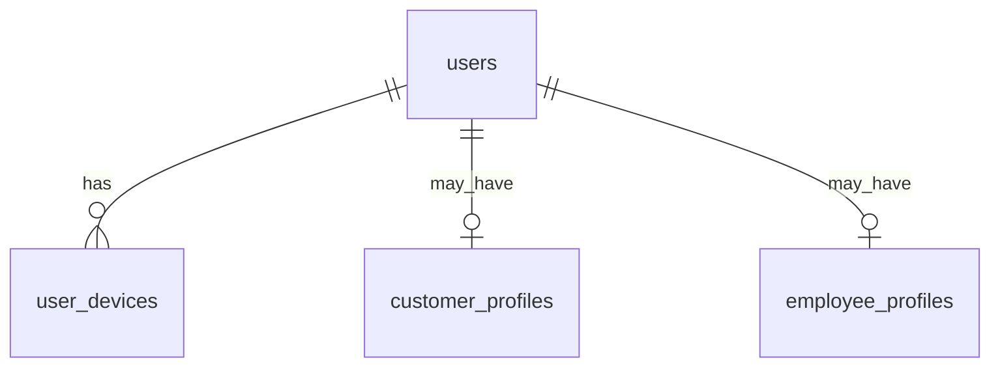
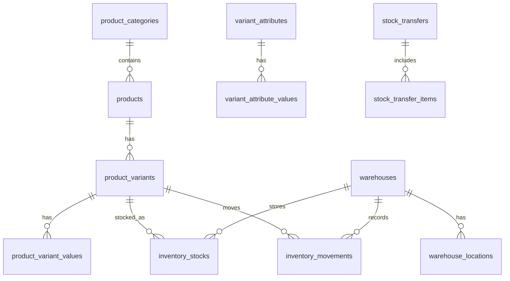
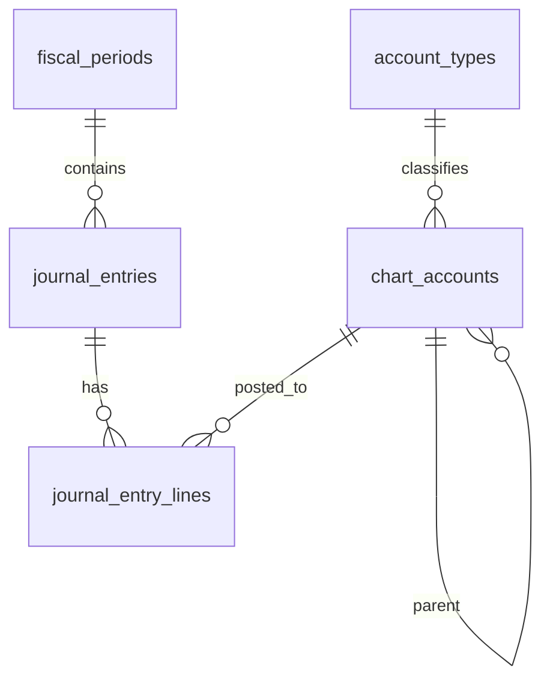
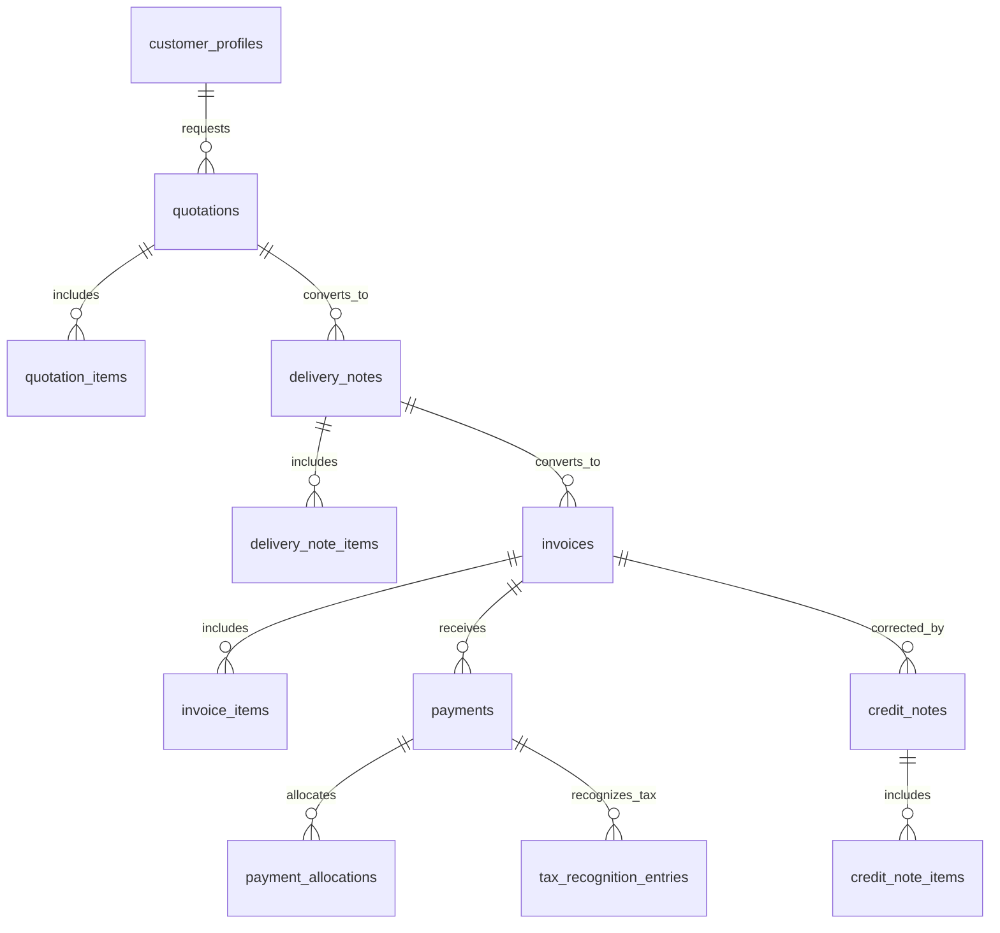
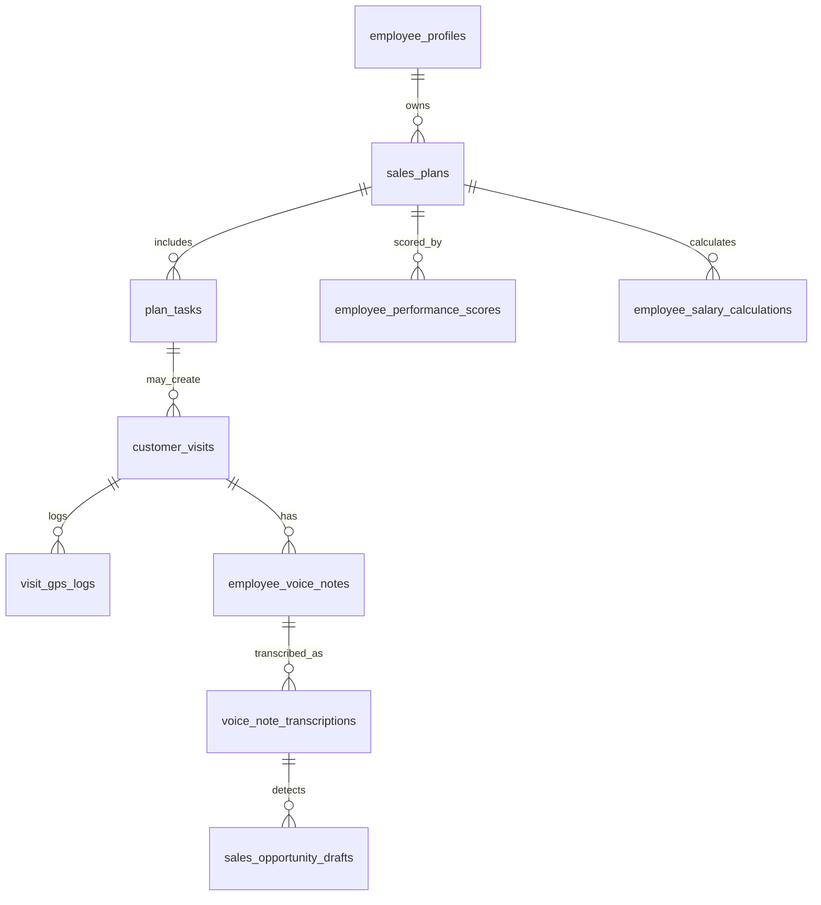
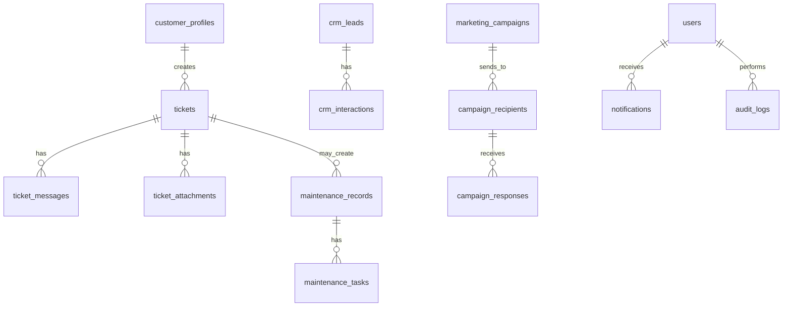

# Entity Relationship Diagram

## 1. Database Overview

The IERP database is a normalized relational schema for a Laravel API ERP. It supports product variants, multi-warehouse inventory, full chart of accounts, journal entries, sales documents, payments, tax recognition, employee plans, AI voice-note processing, tickets, maintenance, CRM, notifications, and audit logs.

## 2. Design Principles

- Use relational integrity with foreign keys.
- Use decimal values for money and quantities.
- Track stock by `product_variant_id + warehouse_id`.
- Create an inventory movement for every stock-changing operation.
- Do not physically delete confirmed financial documents.
- Recognize tax only on collected payments.
- Use audit logs for sensitive operations.

## 3. Entity Groups

| Group | Tables |
|---|---|
| Identity | users, user_devices |
| Parties | customer_profiles, employee_profiles, suppliers |
| Products | product_categories, products, product_variants, variant_attributes, variant_attribute_values, product_files |
| Inventory | warehouses, warehouse_locations, inventory_stocks, inventory_movements, adjustments, transfers, reservations |
| Accounting | account_types, chart_accounts, fiscal_periods, journal_entries, journal_entry_lines |
| Sales | quotations, orders, supplier_confirmations, delivery_notes, invoices, credit_notes |
| Payments | payment_methods, payments, manual_payment_records, stripe_payment_records, tax_recognition_entries |
| Employee Operations | sales_plans, plan_tasks, visits, GPS logs, voice notes, transcriptions, performance, salary |
| Support | tickets, maintenance_records, maintenance_tasks |
| CRM | customer_profiles, pricing_tiers, customer_pricing_tiers, pricing_tier_products, crm_leads, crm_interactions, marketing_campaigns, recipients, responses |
| System | notifications, email_logs, push logs, audit_logs, export_logs |

## 4. Full Entity List

`users`, `user_devices`, `customer_profiles`, `employee_profiles`, `suppliers`, `product_categories`, `products`, `variant_attributes`, `variant_attribute_values`, `product_variants`, `product_variant_values`, `product_files`, `pricing_tiers`, `customer_pricing_tiers`, `pricing_tier_products`, `price_floor_overrides`, `warehouses`, `warehouse_locations`, `inventory_stocks`, `inventory_movements`, `inventory_adjustments`, `inventory_adjustment_items`, `stock_transfers`, `stock_transfer_items`, `stock_reservations`, `account_types`, `chart_accounts`, `fiscal_periods`, `journal_entries`, `journal_entry_lines`, `payment_terms`, `quotations`, `quotation_items`, `orders`, `order_items`, `supplier_confirmations`, `delivery_notes`, `delivery_note_items`, `invoices`, `invoice_items`, `invoice_files`, `invoice_confirmations`, `credit_notes`, `credit_note_items`, `payment_methods`, `payments`, `payment_allocations`, `manual_payment_records`, `stripe_payment_records`, `tax_recognition_entries`, `sales_plans`, `plan_tasks`, `task_status_logs`, `customer_visits`, `visit_gps_logs`, `employee_voice_notes`, `voice_note_transcriptions`, `ai_keyword_rules`, `sales_opportunity_drafts`, `employee_performance_scores`, `employee_salary_calculations`, `bonus_suggestions`, `tickets`, `ticket_messages`, `ticket_attachments`, `ticket_assignments`, `ticket_payment_links`, `maintenance_records`, `maintenance_tasks`, `crm_leads`, `crm_interactions`, `marketing_campaigns`, `campaign_recipients`, `campaign_responses`, `notifications`, `notification_templates`, `email_logs`, `push_notification_logs`, `audit_logs`, `export_logs`

## 5. Relationships

- Users may have customer or employee profiles.
- Products have variants and variants have attribute values.
- Warehouses hold stock balances per product variant.
- Inventory movements reference source documents using `source_type` and `source_id`.
- Quotations convert to delivery notes; delivery notes convert to invoices; invoices receive payments.
- Payments generate tax recognition entries and journal entries.
- Credit notes correct invoices without destructive deletion.
- Employee plans contain tasks; tasks may produce visits; visits may produce voice notes; AI may produce sales opportunity drafts.
- Tickets may create maintenance records.
- CRM campaigns target customers or leads.
- Pricing tiers may be general, customer-specific, or product-scoped. Product
  links and customer assignments are resolved without discount stacking.

## 6. Table Definitions

### Table: `users`

| Column | Type | Nullable | Default | Description |
|---|---|---|---|---|
| `id` | bigint unsigned | No | auto increment | Primary key |
| `name` | varchar(255) | No |  | Full name |
| `email` | varchar(255) | No |  | Unique login email |
| `phone` | varchar(50) | Yes | null | Phone number |
| `password` | varchar(255) | No |  | Hashed password |
| `user_type` | enum(admin,customer,employee) | No |  | Primary user type |
| `is_active` | boolean | No | true | Can user login |
| `created_at` | timestamp | No | current timestamp | Creation timestamp |
| `updated_at` | timestamp | No | current timestamp | Update timestamp |
| `deleted_at` | timestamp | Yes | null | Soft delete timestamp |

#### Indexes
- Primary key on `id`.
- Index all foreign key columns.
- Index `status`, document number, date fields, and searchable code/name fields where applicable.

#### Constraints
- Enforce foreign keys for parent records.
- Enforce uniqueness for business numbers/codes/SKUs where applicable.

#### Notes
- Use transactions for changes that touch financial or inventory records.

### Table: `user_devices`

| Column | Type | Nullable | Default | Description |
|---|---|---|---|---|
| `id` | bigint unsigned | No | auto increment | Primary key |
| `user_id` | bigint unsigned | No |  | Owner user |
| `device_token` | varchar(500) | No |  | Push token |
| `platform` | varchar(50) | No |  | ios/android/web |
| `last_seen_at` | timestamp | Yes | null | Last activity |
| `created_at` | timestamp | No | current timestamp | Creation timestamp |
| `updated_at` | timestamp | No | current timestamp | Update timestamp |
| `created_by` | bigint unsigned | Yes | null | User who created the record |
| `updated_by` | bigint unsigned | Yes | null | User who last updated the record |
| `deleted_at` | timestamp | Yes | null | Soft delete timestamp |

#### Indexes
- Primary key on `id`.
- Index all foreign key columns.
- Index `status`, document number, date fields, and searchable code/name fields where applicable.

#### Constraints
- Enforce foreign keys for parent records.
- Enforce uniqueness for business numbers/codes/SKUs where applicable.

#### Notes
- Use transactions for changes that touch financial or inventory records.

### Table: `customer_profiles`

| Column | Type | Nullable | Default | Description |
|---|---|---|---|---|
| `id` | bigint unsigned | No | auto increment | Primary key |
| `user_id` | bigint unsigned | No |  | Linked user |
| `customer_code` | varchar(50) | No |  | Unique customer code |
| `company_name` | varchar(255) | Yes | null | Customer company |
| `address` | text | Yes | null | Primary address |
| `default_payment_term_id` | bigint unsigned | Yes | null | Default payment term |
| `created_at` | timestamp | No | current timestamp | Creation timestamp |
| `updated_at` | timestamp | No | current timestamp | Update timestamp |
| `created_by` | bigint unsigned | Yes | null | User who created the record |
| `updated_by` | bigint unsigned | Yes | null | User who last updated the record |
| `deleted_at` | timestamp | Yes | null | Soft delete timestamp |

#### Indexes
- Primary key on `id`.
- Index all foreign key columns.
- Index `status`, document number, date fields, and searchable code/name fields where applicable.

#### Constraints
- Enforce foreign keys for parent records.
- Enforce uniqueness for business numbers/codes/SKUs where applicable.

#### Notes
- Use transactions for changes that touch financial or inventory records.

### Table: `employee_profiles`

| Column | Type | Nullable | Default | Description |
|---|---|---|---|---|
| `id` | bigint unsigned | No | auto increment | Primary key |
| `user_id` | bigint unsigned | No |  | Linked user; unique — one profile per employee-channel user |
| `employee_code` | varchar(50) | No |  | Unique employee code, checked against soft-deleted rows too |
| `job_title` | varchar(150) | No |  | Employee role |
| `phone` | varchar(30) | Yes | null | Contact phone |
| `email` | varchar(150) | Yes | null | Contact email |
| `is_active` | boolean | No | true | Dashboard/app access toggle |
| `use_base_salary` | boolean | No | true | Whether a fixed base salary applies |
| `base_salary` | decimal(15,2) | Yes | null | Required when `use_base_salary` is true |
| `commission_target_amount` | decimal(15,2) | Yes | null | Payable base for performance-only employees; required when `use_base_salary` is false |
| `salary_calculation_mode` | varchar(30) | No |  | `performance_only` or `base_plus_performance` |
| `created_at` | timestamp | No | current timestamp | Creation timestamp |
| `updated_at` | timestamp | No | current timestamp | Update timestamp |
| `created_by` | bigint unsigned | Yes | null | User who created the record |
| `updated_by` | bigint unsigned | Yes | null | User who last updated the record |
| `deleted_at` | timestamp | Yes | null | Soft delete timestamp (archiving) |

#### Indexes
- Primary key on `id`.
- Unique on `user_id` and `employee_code`.
- Index `is_active` and `job_title` for search/filter.

#### Constraints
- Enforce foreign keys for parent records.
- Exactly one of `base_salary` / `commission_target_amount` is required, chosen by `use_base_salary`; neither may be null at the same time.

#### Notes
- Archiving an employee is a soft delete; it never removes plan, visit, or bonus history.
- Use transactions for changes that touch financial or inventory records.

### Table: `suppliers`

| Column | Type | Nullable | Default | Description |
|---|---|---|---|---|
| `id` | bigint unsigned | No | auto increment | Primary key |
| `name` | varchar(255) | No |  | Supplier name |
| `code` | varchar(50) | No |  | Supplier code |
| `email` | varchar(255) | Yes | null | Supplier email |
| `phone` | varchar(50) | Yes | null | Supplier phone |
| `address` | text | Yes | null | Supplier address |
| `created_at` | timestamp | No | current timestamp | Creation timestamp |
| `updated_at` | timestamp | No | current timestamp | Update timestamp |
| `created_by` | bigint unsigned | Yes | null | User who created the record |
| `updated_by` | bigint unsigned | Yes | null | User who last updated the record |
| `deleted_at` | timestamp | Yes | null | Soft delete timestamp |

#### Indexes
- Primary key on `id`.
- Index all foreign key columns.
- Index `status`, document number, date fields, and searchable code/name fields where applicable.

#### Constraints
- Enforce foreign keys for parent records.
- Enforce uniqueness for business numbers/codes/SKUs where applicable.

#### Notes
- Use transactions for changes that touch financial or inventory records.

### Table: `product_categories`

| Column | Type | Nullable | Default | Description |
|---|---|---|---|---|
| `id` | bigint unsigned | No | auto increment | Primary key |
| `name` | varchar(255) | No |  | Category name |
| `parent_id` | bigint unsigned | Yes | null | Parent category |
| `is_active` | boolean | No | true | Visibility flag |
| `created_at` | timestamp | No | current timestamp | Creation timestamp |
| `updated_at` | timestamp | No | current timestamp | Update timestamp |
| `created_by` | bigint unsigned | Yes | null | User who created the record |
| `updated_by` | bigint unsigned | Yes | null | User who last updated the record |
| `deleted_at` | timestamp | Yes | null | Soft delete timestamp |

#### Indexes
- Primary key on `id`.
- Index all foreign key columns.
- Index `status`, document number, date fields, and searchable code/name fields where applicable.

#### Constraints
- Enforce foreign keys for parent records.
- Enforce uniqueness for business numbers/codes/SKUs where applicable.

#### Notes
- Use transactions for changes that touch financial or inventory records.

### Table: `products`

| Column | Type | Nullable | Default | Description |
|---|---|---|---|---|
| `id` | bigint unsigned | No | auto increment | Primary key |
| `category_id` | bigint unsigned | Yes | null | Product category |
| `sku` | varchar(100) | No |  | Base SKU |
| `name` | varchar(255) | No |  | Product name |
| `description` | text | Yes | null | Description |
| `is_active` | boolean | No | true | Can be sold |
| `created_at` | timestamp | No | current timestamp | Creation timestamp |
| `updated_at` | timestamp | No | current timestamp | Update timestamp |
| `created_by` | bigint unsigned | Yes | null | User who created the record |
| `updated_by` | bigint unsigned | Yes | null | User who last updated the record |
| `deleted_at` | timestamp | Yes | null | Soft delete timestamp |

#### Indexes
- Primary key on `id`.
- Index all foreign key columns.
- Index `status`, document number, date fields, and searchable code/name fields where applicable.

#### Constraints
- Enforce foreign keys for parent records.
- Enforce uniqueness for business numbers/codes/SKUs where applicable.

#### Notes
- Use transactions for changes that touch financial or inventory records.

### Table: `variant_attributes`

| Column | Type | Nullable | Default | Description |
|---|---|---|---|---|
| `id` | bigint unsigned | No | auto increment | Primary key |
| `name` | varchar(100) | No |  | Attribute name such as color |
| `type` | varchar(50) | No | text | Value type |
| `is_active` | boolean | No | true | Can be used |
| `created_at` | timestamp | No | current timestamp | Creation timestamp |
| `updated_at` | timestamp | No | current timestamp | Update timestamp |
| `created_by` | bigint unsigned | Yes | null | User who created the record |
| `updated_by` | bigint unsigned | Yes | null | User who last updated the record |
| `deleted_at` | timestamp | Yes | null | Soft delete timestamp |

#### Indexes
- Primary key on `id`.
- Index all foreign key columns.
- Index `status`, document number, date fields, and searchable code/name fields where applicable.

#### Constraints
- Enforce foreign keys for parent records.
- Enforce uniqueness for business numbers/codes/SKUs where applicable.

#### Notes
- Use transactions for changes that touch financial or inventory records.

### Table: `variant_attribute_values`

| Column | Type | Nullable | Default | Description |
|---|---|---|---|---|
| `id` | bigint unsigned | No | auto increment | Primary key |
| `variant_attribute_id` | bigint unsigned | No |  | Attribute |
| `value` | varchar(255) | No |  | Attribute value |
| `sort_order` | int | No | 0 | Display order |
| `created_at` | timestamp | No | current timestamp | Creation timestamp |
| `updated_at` | timestamp | No | current timestamp | Update timestamp |
| `created_by` | bigint unsigned | Yes | null | User who created the record |
| `updated_by` | bigint unsigned | Yes | null | User who last updated the record |
| `deleted_at` | timestamp | Yes | null | Soft delete timestamp |

#### Indexes
- Primary key on `id`.
- Index all foreign key columns.
- Index `status`, document number, date fields, and searchable code/name fields where applicable.

#### Constraints
- Enforce foreign keys for parent records.
- Enforce uniqueness for business numbers/codes/SKUs where applicable.

#### Notes
- Use transactions for changes that touch financial or inventory records.

### Table: `product_variants`

| Column | Type | Nullable | Default | Description |
|---|---|---|---|---|
| `id` | bigint unsigned | No | auto increment | Primary key |
| `product_id` | bigint unsigned | No |  | Parent product |
| `sku` | varchar(100) | No |  | Variant SKU |
| `name` | varchar(255) | No |  | Variant display name |
| `barcode` | varchar(100) | Yes | null | Barcode |
| `unit_price` | decimal(15,2) | No | 0 | Default sale price |
| `cost_price` | decimal(15,2) | Yes | null | Cost price |
| `base_price` | decimal(15,2) | Yes | null | Computed base price used as the basis for customer tiers and discounts |
| `min_price` | decimal(15,2) | Yes | null | Minimum allowed selling price (price floor); sale below this is blocked unless a System Admin approves the override |
| `is_active` | boolean | No | true | Can be sold |
| `created_at` | timestamp | No | current timestamp | Creation timestamp |
| `updated_at` | timestamp | No | current timestamp | Update timestamp |
| `created_by` | bigint unsigned | Yes | null | User who created the record |
| `updated_by` | bigint unsigned | Yes | null | User who last updated the record |
| `deleted_at` | timestamp | Yes | null | Soft delete timestamp |

#### Indexes
- Primary key on `id`.
- Index all foreign key columns.
- Index `status`, document number, date fields, and searchable code/name fields where applicable.

#### Constraints
- Enforce foreign keys for parent records.
- Enforce uniqueness for business numbers/codes/SKUs where applicable.

#### Notes
- Use transactions for changes that touch financial or inventory records.

### Table: `product_variant_values`

| Column | Type | Nullable | Default | Description |
|---|---|---|---|---|
| `id` | bigint unsigned | No | auto increment | Primary key |
| `product_variant_id` | bigint unsigned | No |  | Variant |
| `variant_attribute_id` | bigint unsigned | No |  | Attribute |
| `variant_attribute_value_id` | bigint unsigned | No |  | Value |
| `created_at` | timestamp | No | current timestamp | Creation timestamp |
| `updated_at` | timestamp | No | current timestamp | Update timestamp |

#### Indexes
- Primary key on `id`.
- Index all foreign key columns.
- Index `status`, document number, date fields, and searchable code/name fields where applicable.

#### Constraints
- Enforce foreign keys for parent records.
- Enforce uniqueness for business numbers/codes/SKUs where applicable.

#### Notes
- Use transactions for changes that touch financial or inventory records.

### Table: `product_files`

| Column | Type | Nullable | Default | Description |
|---|---|---|---|---|
| `id` | bigint unsigned | No | auto increment | Primary key |
| `product_id` | bigint unsigned | Yes | null | Product |
| `product_variant_id` | bigint unsigned | Yes | null | Variant |
| `file_path` | varchar(500) | No |  | Stored file path |
| `file_type` | varchar(50) | No |  | image/document |
| `sort_order` | int | No | 0 | Display order |
| `created_at` | timestamp | No | current timestamp | Creation timestamp |
| `updated_at` | timestamp | No | current timestamp | Update timestamp |
| `created_by` | bigint unsigned | Yes | null | User who created the record |
| `updated_by` | bigint unsigned | Yes | null | User who last updated the record |
| `deleted_at` | timestamp | Yes | null | Soft delete timestamp |

#### Indexes
- Primary key on `id`.
- Index all foreign key columns.
- Index `status`, document number, date fields, and searchable code/name fields where applicable.

#### Constraints
- Enforce foreign keys for parent records.
- Enforce uniqueness for business numbers/codes/SKUs where applicable.

#### Notes
- Use transactions for changes that touch financial or inventory records.

### Table: `pricing_tiers`

| Column | Type | Nullable | Default | Description |
|---|---|---|---|---|
| `id` | bigint unsigned | No | auto increment | Primary key |
| `name` | varchar(150) | No |  | Unique tier name |
| `tier_type` | varchar(30) | No | `general`, `customer_specific`, or `product_scoped` |
| `discount_type` | varchar(20) | No | `percentage` or `fixed`; fixed is valid only for product-scoped tiers |
| `discount_value` | decimal(15,2) | No | 0 | Percentage from 0 to 100, or a positive fixed discount |
| `customer_user_id` | bigint unsigned | Yes | null | Required only for a customer-specific tier |
| `visibility` | varchar(20) | Yes | null | `public` or `restricted`; product-scoped only |
| `valid_from` | date | Yes | null | Inclusive start date; product-scoped only |
| `valid_until` | date | Yes | null | Inclusive end date; product-scoped only |
| `is_active` | boolean | No | true | Whether the tier is usable |
| `created_at` | timestamp | No | current timestamp | Creation timestamp |
| `updated_at` | timestamp | No | current timestamp | Update timestamp |
| `created_by` | bigint unsigned | Yes | null | User who created the record |
| `updated_by` | bigint unsigned | Yes | null | User who last updated the record |
| `deleted_at` | timestamp | Yes | null | Soft delete timestamp |

#### Indexes
- Primary key on `id` and unique tier name.
- Index `(tier_type, is_active, deleted_at)`.
- Index `(is_active, valid_from, valid_until, deleted_at)` and `(visibility, is_active, deleted_at)`.
- Index all foreign key columns.

#### Constraints
- Enforce customer and blameable foreign keys.
- General and customer-specific tiers are percentage-only.
- Only product-scoped tiers may define visibility, dates, fixed discounts, or product links.

#### Notes
- Fresh tiers are created with an explicit `general`, `customer_specific`, or `product_scoped` type.
- The fresh schema stores percentage/fixed configuration in `discount_type` and `discount_value`; it has no `discount_percent` compatibility column.
- Use transactions for tier lifecycle, product links, assignments, and audit writes.

### Table: `customer_pricing_tiers`

| Column | Type | Nullable | Default | Description |
|---|---|---|---|---|
| `id` | bigint unsigned | No | auto increment | Primary key |
| `customer_user_id` | bigint unsigned | No |  | Customer-channel user; its active customer profile determines eligibility |
| `pricing_tier_id` | bigint unsigned | No |  | Assigned general or product-scoped pricing tier |
| `is_active` | boolean | No | true | Whether the assignment is active |
| `created_at` | timestamp | No | current timestamp | Creation timestamp |
| `updated_at` | timestamp | No | current timestamp | Update timestamp |

#### Indexes
- Primary key on `id`.
- Unique `(customer_user_id, pricing_tier_id)`.
- Index all foreign key columns.

#### Constraints
- Enforce user and pricing-tier foreign keys.
- One active general assignment is allowed per customer; multiple active product-scoped assignments may coexist.

#### Notes
- Customer-specific tiers continue to use `pricing_tiers.customer_user_id` and do not create a pivot row.
- Customer deactivation preserves assignment history but makes assignments ineligible.

### Table: `pricing_tier_products`

| Column | Type | Nullable | Default | Description |
|---|---|---|---|---|
| `pricing_tier_id` | bigint unsigned | No |  | Product-scoped pricing tier |
| `product_id` | bigint unsigned | No |  | Eligible active product |
| `created_at` | timestamp | No | current timestamp | Creation timestamp |
| `updated_at` | timestamp | No | current timestamp | Update timestamp |

#### Indexes
- Unique `(pricing_tier_id, product_id)`.
- Reverse lookup index `(product_id, pricing_tier_id)`.

#### Constraints
- Only product-scoped pricing tiers may own links.
- Tier deletion cascades to the link; physical product deletion is restricted.

#### Notes
- A product link applies to that product's active variants.
- Link and unlink operations are transactional and audit logged.

### Table: `price_floor_overrides`

| Column | Type | Nullable | Default | Description |
|---|---|---|---|---|
| `id` | bigint unsigned | No | auto increment | Primary key |
| `product_variant_id` | bigint unsigned | No |  | Variant sold below its minimum price |
| `customer_user_id` | bigint unsigned | Yes | null | Customer user the sale applied to |
| `pricing_tier_id` | bigint unsigned | Yes | null | Winning pricing-tier provenance; null for a base-price candidate |
| `attempted_price` | decimal(15,2) | No |  | Price that fell below the floor |
| `min_price` | decimal(15,2) | No |  | Minimum price at the time of the sale |
| `approved_by` | bigint unsigned | No |  | System Admin who approved the below-floor sale |
| `approved_at` | timestamp | No | current timestamp | When the override was approved |
| `reason` | text | Yes | null | Optional justification |
| `created_at` | timestamp | No | current timestamp | Creation timestamp |
| `updated_at` | timestamp | No | current timestamp | Update timestamp |

#### Indexes
- Primary key on `id`.
- Index all foreign key columns.
- Index `status`, document number, date fields, and searchable code/name fields where applicable.

#### Constraints
- Enforce foreign keys for parent records.
- Enforce uniqueness for business numbers/codes/SKUs where applicable.

#### Notes
- A record is written only when a sale below the minimum price is explicitly approved; without approval the sale is blocked.
- Pricing-tier provenance replaces the unfinished subscription-specific provenance column.
- Use transactions for changes that touch financial or inventory records.

### Table: `warehouses`

| Column | Type | Nullable | Default | Description |
|---|---|---|---|---|
| `id` | bigint unsigned | No | auto increment | Primary key |
| `name` | varchar(255) | No |  | Warehouse name |
| `code` | varchar(50) | No |  | Warehouse code |
| `address` | text | Yes | null | Address |
| `is_active` | boolean | No | true | Can be used |
| `created_at` | timestamp | No | current timestamp | Creation timestamp |
| `updated_at` | timestamp | No | current timestamp | Update timestamp |
| `created_by` | bigint unsigned | Yes | null | User who created the record |
| `updated_by` | bigint unsigned | Yes | null | User who last updated the record |
| `deleted_at` | timestamp | Yes | null | Soft delete timestamp |

#### Indexes
- Primary key on `id`.
- Index all foreign key columns.
- Index `status`, document number, date fields, and searchable code/name fields where applicable.

#### Constraints
- Enforce foreign keys for parent records.
- Enforce uniqueness for business numbers/codes/SKUs where applicable.

#### Notes
- Use transactions for changes that touch financial or inventory records.

### Table: `warehouse_locations`

| Column | Type | Nullable | Default | Description |
|---|---|---|---|---|
| `id` | bigint unsigned | No | auto increment | Primary key |
| `warehouse_id` | bigint unsigned | No |  | Warehouse |
| `name` | varchar(255) | No |  | Location/bin name |
| `code` | varchar(50) | Yes | null | Internal code |
| `is_active` | boolean | No | true | Can be used |
| `created_at` | timestamp | No | current timestamp | Creation timestamp |
| `updated_at` | timestamp | No | current timestamp | Update timestamp |
| `created_by` | bigint unsigned | Yes | null | User who created the record |
| `updated_by` | bigint unsigned | Yes | null | User who last updated the record |
| `deleted_at` | timestamp | Yes | null | Soft delete timestamp |

#### Indexes
- Primary key on `id`.
- Index all foreign key columns.
- Index `status`, document number, date fields, and searchable code/name fields where applicable.

#### Constraints
- Enforce foreign keys for parent records.
- Enforce uniqueness for business numbers/codes/SKUs where applicable.

#### Notes
- Use transactions for changes that touch financial or inventory records.

### Table: `inventory_stocks`

| Column | Type | Nullable | Default | Description |
|---|---|---|---|---|
| `id` | bigint unsigned | No | auto increment | Primary key |
| `product_variant_id` | bigint unsigned | No |  | Variant |
| `warehouse_id` | bigint unsigned | No |  | Warehouse |
| `on_hand_quantity` | decimal(15,3) | No | 0 | Physical quantity |
| `reserved_quantity` | decimal(15,3) | No | 0 | Reserved quantity |
| `available_quantity` | decimal(15,3) | No | 0 | Computed available quantity |
| `reorder_level` | decimal(15,3) | Yes | null | Low stock threshold |
| `created_at` | timestamp | No | current timestamp | Creation timestamp |
| `updated_at` | timestamp | No | current timestamp | Update timestamp |

#### Indexes
- Primary key on `id`.
- Index all foreign key columns.
- Index `status`, document number, date fields, and searchable code/name fields where applicable.

#### Constraints
- Enforce foreign keys for parent records.
- Enforce uniqueness for business numbers/codes/SKUs where applicable.

#### Notes
- Use transactions for changes that touch financial or inventory records.

### Table: `inventory_movements`

| Column | Type | Nullable | Default | Description |
|---|---|---|---|---|
| `id` | bigint unsigned | No | auto increment | Primary key |
| `product_variant_id` | bigint unsigned | No |  | Variant |
| `warehouse_id` | bigint unsigned | No |  | Warehouse |
| `movement_type` | varchar(50) | No |  | sale/return/adjustment/transfer/reservation |
| `quantity` | decimal(15,3) | No |  | Positive or negative movement |
| `source_type` | varchar(100) | Yes | null | Source document type |
| `source_id` | bigint unsigned | Yes | null | Source document id |
| `notes` | text | Yes | null | Movement note |
| `created_at` | timestamp | No | current timestamp | Creation timestamp |
| `updated_at` | timestamp | No | current timestamp | Update timestamp |
| `status` | varchar(50) | No | draft/pending | Workflow status |
| `created_by` | bigint unsigned | Yes | null | User who created the record |
| `updated_by` | bigint unsigned | Yes | null | User who last updated the record |

#### Indexes
- Primary key on `id`.
- Index all foreign key columns.
- Index `status`, document number, date fields, and searchable code/name fields where applicable.

#### Constraints
- Enforce foreign keys for parent records.
- Enforce uniqueness for business numbers/codes/SKUs where applicable.

#### Notes
- Use transactions for changes that touch financial or inventory records.

### Table: `inventory_adjustments`

| Column | Type | Nullable | Default | Description |
|---|---|---|---|---|
| `id` | bigint unsigned | No | auto increment | Primary key |
| `warehouse_id` | bigint unsigned | No |  | Warehouse |
| `adjustment_number` | varchar(100) | No |  | Adjustment number |
| `reason` | text | No |  | Reason |
| `created_at` | timestamp | No | current timestamp | Creation timestamp |
| `updated_at` | timestamp | No | current timestamp | Update timestamp |
| `status` | varchar(50) | No | draft/pending | Workflow status |
| `created_by` | bigint unsigned | Yes | null | User who created the record |
| `updated_by` | bigint unsigned | Yes | null | User who last updated the record |
| `deleted_at` | timestamp | Yes | null | Soft delete timestamp |

#### Indexes
- Primary key on `id`.
- Index all foreign key columns.
- Index `status`, document number, date fields, and searchable code/name fields where applicable.

#### Constraints
- Enforce foreign keys for parent records.
- Enforce uniqueness for business numbers/codes/SKUs where applicable.

#### Notes
- Use transactions for changes that touch financial or inventory records.

### Table: `inventory_adjustment_items`

| Column | Type | Nullable | Default | Description |
|---|---|---|---|---|
| `id` | bigint unsigned | No | auto increment | Primary key |
| `inventory_adjustment_id` | bigint unsigned | No |  | Adjustment |
| `product_variant_id` | bigint unsigned | No |  | Variant |
| `old_quantity` | decimal(15,3) | No |  | Quantity before |
| `new_quantity` | decimal(15,3) | No |  | Quantity after |
| `difference` | decimal(15,3) | No |  | Difference |
| `created_at` | timestamp | No | current timestamp | Creation timestamp |
| `updated_at` | timestamp | No | current timestamp | Update timestamp |

#### Indexes
- Primary key on `id`.
- Index all foreign key columns.
- Index `status`, document number, date fields, and searchable code/name fields where applicable.

#### Constraints
- Enforce foreign keys for parent records.
- Enforce uniqueness for business numbers/codes/SKUs where applicable.

#### Notes
- Use transactions for changes that touch financial or inventory records.

### Table: `stock_transfers`

| Column | Type | Nullable | Default | Description |
|---|---|---|---|---|
| `id` | bigint unsigned | No | auto increment | Primary key |
| `from_warehouse_id` | bigint unsigned | No |  | Source warehouse |
| `to_warehouse_id` | bigint unsigned | No |  | Destination warehouse |
| `transfer_number` | varchar(100) | No |  | Transfer number |
| `notes` | text | Yes | null | Notes |
| `created_at` | timestamp | No | current timestamp | Creation timestamp |
| `updated_at` | timestamp | No | current timestamp | Update timestamp |
| `status` | varchar(50) | No | draft/pending | Workflow status |
| `created_by` | bigint unsigned | Yes | null | User who created the record |
| `updated_by` | bigint unsigned | Yes | null | User who last updated the record |
| `deleted_at` | timestamp | Yes | null | Soft delete timestamp |

#### Indexes
- Primary key on `id`.
- Index all foreign key columns.
- Index `status`, document number, date fields, and searchable code/name fields where applicable.

#### Constraints
- Enforce foreign keys for parent records.
- Enforce uniqueness for business numbers/codes/SKUs where applicable.

#### Notes
- Use transactions for changes that touch financial or inventory records.

### Table: `stock_transfer_items`

| Column | Type | Nullable | Default | Description |
|---|---|---|---|---|
| `id` | bigint unsigned | No | auto increment | Primary key |
| `stock_transfer_id` | bigint unsigned | No |  | Transfer |
| `product_variant_id` | bigint unsigned | No |  | Variant |
| `quantity` | decimal(15,3) | No |  | Quantity |
| `created_at` | timestamp | No | current timestamp | Creation timestamp |
| `updated_at` | timestamp | No | current timestamp | Update timestamp |

#### Indexes
- Primary key on `id`.
- Index all foreign key columns.
- Index `status`, document number, date fields, and searchable code/name fields where applicable.

#### Constraints
- Enforce foreign keys for parent records.
- Enforce uniqueness for business numbers/codes/SKUs where applicable.

#### Notes
- Use transactions for changes that touch financial or inventory records.

### Table: `stock_reservations`

| Column | Type | Nullable | Default | Description |
|---|---|---|---|---|
| `id` | bigint unsigned | No | auto increment | Primary key |
| `product_variant_id` | bigint unsigned | No |  | Variant |
| `warehouse_id` | bigint unsigned | No |  | Warehouse |
| `quantity` | decimal(15,3) | No |  | Reserved quantity |
| `source_type` | varchar(100) | No |  | Quotation/order/delivery |
| `source_id` | bigint unsigned | No |  | Source id |
| `expires_at` | timestamp | Yes | null | Reservation expiry |
| `created_at` | timestamp | No | current timestamp | Creation timestamp |
| `updated_at` | timestamp | No | current timestamp | Update timestamp |
| `status` | varchar(50) | No | draft/pending | Workflow status |
| `created_by` | bigint unsigned | Yes | null | User who created the record |
| `updated_by` | bigint unsigned | Yes | null | User who last updated the record |

#### Indexes
- Primary key on `id`.
- Index all foreign key columns.
- Index `status`, document number, date fields, and searchable code/name fields where applicable.

#### Constraints
- Enforce foreign keys for parent records.
- Enforce uniqueness for business numbers/codes/SKUs where applicable.

#### Notes
- Use transactions for changes that touch financial or inventory records.

### Table: `account_types`

| Column | Type | Nullable | Default | Description |
|---|---|---|---|---|
| `id` | bigint unsigned | No | auto increment | Primary key |
| `name` | varchar(100) | No |  | Asset/liability/equity/income/expense |
| `normal_balance` | enum(debit,credit) | No |  | Normal balance |
| `created_at` | timestamp | No | current timestamp | Creation timestamp |
| `updated_at` | timestamp | No | current timestamp | Update timestamp |

#### Indexes
- Primary key on `id`.
- Index all foreign key columns.
- Index `status`, document number, date fields, and searchable code/name fields where applicable.

#### Constraints
- Enforce foreign keys for parent records.
- Enforce uniqueness for business numbers/codes/SKUs where applicable.

#### Notes
- Use transactions for changes that touch financial or inventory records.

### Table: `chart_accounts`

| Column | Type | Nullable | Default | Description |
|---|---|---|---|---|
| `id` | bigint unsigned | No | auto increment | Primary key |
| `account_type_id` | bigint unsigned | No |  | Account type |
| `parent_id` | bigint unsigned | Yes | null | Parent account |
| `code` | varchar(50) | No |  | Account code |
| `name` | varchar(255) | No |  | Account name |
| `is_postable` | boolean | No | true | Allows journal lines |
| `is_active` | boolean | No | true | Can be used |
| `created_at` | timestamp | No | current timestamp | Creation timestamp |
| `updated_at` | timestamp | No | current timestamp | Update timestamp |
| `created_by` | bigint unsigned | Yes | null | User who created the record |
| `updated_by` | bigint unsigned | Yes | null | User who last updated the record |
| `deleted_at` | timestamp | Yes | null | Soft delete timestamp |

#### Indexes
- Primary key on `id`.
- Index all foreign key columns.
- Index `status`, document number, date fields, and searchable code/name fields where applicable.

#### Constraints
- Enforce foreign keys for parent records.
- Enforce uniqueness for business numbers/codes/SKUs where applicable.

#### Notes
- Use transactions for changes that touch financial or inventory records.

### Table: `fiscal_periods`

| Column | Type | Nullable | Default | Description |
|---|---|---|---|---|
| `id` | bigint unsigned | No | auto increment | Primary key |
| `name` | varchar(100) | No |  | Fiscal period name |
| `starts_at` | date | No |  | Start date |
| `ends_at` | date | No |  | End date |
| `is_closed` | boolean | No | false | Closed flag |
| `created_at` | timestamp | No | current timestamp | Creation timestamp |
| `updated_at` | timestamp | No | current timestamp | Update timestamp |
| `status` | varchar(50) | No | draft/pending | Workflow status |
| `created_by` | bigint unsigned | Yes | null | User who created the record |
| `updated_by` | bigint unsigned | Yes | null | User who last updated the record |

#### Indexes
- Primary key on `id`.
- Index all foreign key columns.
- Index `status`, document number, date fields, and searchable code/name fields where applicable.

#### Constraints
- Enforce foreign keys for parent records.
- Enforce uniqueness for business numbers/codes/SKUs where applicable.

#### Notes
- Use transactions for changes that touch financial or inventory records.

### Table: `journal_entries`

| Column | Type | Nullable | Default | Description |
|---|---|---|---|---|
| `id` | bigint unsigned | No | auto increment | Primary key |
| `fiscal_period_id` | bigint unsigned | Yes | null | Fiscal period |
| `entry_number` | varchar(100) | No |  | Journal entry number |
| `entry_date` | date | No |  | Accounting date |
| `description` | text | Yes | null | Description |
| `source_type` | varchar(100) | Yes | null | Source document type |
| `source_id` | bigint unsigned | Yes | null | Source document id |
| `created_at` | timestamp | No | current timestamp | Creation timestamp |
| `updated_at` | timestamp | No | current timestamp | Update timestamp |
| `status` | varchar(50) | No | draft/pending | Workflow status |
| `created_by` | bigint unsigned | Yes | null | User who created the record |
| `updated_by` | bigint unsigned | Yes | null | User who last updated the record |

#### Indexes
- Primary key on `id`.
- Index all foreign key columns.
- Index `status`, document number, date fields, and searchable code/name fields where applicable.

#### Constraints
- Enforce foreign keys for parent records.
- Enforce uniqueness for business numbers/codes/SKUs where applicable.

#### Notes
- Use transactions for changes that touch financial or inventory records.

### Table: `journal_entry_lines`

| Column | Type | Nullable | Default | Description |
|---|---|---|---|---|
| `id` | bigint unsigned | No | auto increment | Primary key |
| `journal_entry_id` | bigint unsigned | No |  | Journal entry |
| `chart_account_id` | bigint unsigned | No |  | Account |
| `debit` | decimal(15,2) | No | 0 | Debit amount |
| `credit` | decimal(15,2) | No | 0 | Credit amount |
| `description` | text | Yes | null | Line description |
| `created_at` | timestamp | No | current timestamp | Creation timestamp |
| `updated_at` | timestamp | No | current timestamp | Update timestamp |

#### Indexes
- Primary key on `id`.
- Index all foreign key columns.
- Index `status`, document number, date fields, and searchable code/name fields where applicable.

#### Constraints
- Enforce foreign keys for parent records.
- Enforce uniqueness for business numbers/codes/SKUs where applicable.

#### Notes
- Use transactions for changes that touch financial or inventory records.

### Table: `payment_terms`

| Column | Type | Nullable | Default | Description |
|---|---|---|---|---|
| `id` | bigint unsigned | No | auto increment | Primary key |
| `name` | varchar(100) | No |  | Payment term name |
| `due_days` | int | No | 0 | Number of days until due |
| `grace_days` | int | No | 0 | Grace period |
| `discount_percent` | decimal(5,2) | Yes | null | Optional discount |
| `is_default` | boolean | No | false | Default term |
| `created_at` | timestamp | No | current timestamp | Creation timestamp |
| `updated_at` | timestamp | No | current timestamp | Update timestamp |
| `created_by` | bigint unsigned | Yes | null | User who created the record |
| `updated_by` | bigint unsigned | Yes | null | User who last updated the record |
| `deleted_at` | timestamp | Yes | null | Soft delete timestamp |

#### Indexes
- Primary key on `id`.
- Index all foreign key columns.
- Index `status`, document number, date fields, and searchable code/name fields where applicable.

#### Constraints
- Enforce foreign keys for parent records.
- Enforce uniqueness for business numbers/codes/SKUs where applicable.

#### Notes
- Use transactions for changes that touch financial or inventory records.

### Table: `quotations`

| Column | Type | Nullable | Default | Description |
|---|---|---|---|---|
| `id` | bigint unsigned | No | auto increment | Primary key |
| `quotation_number` | varchar(100) | No |  | Quotation number |
| `customer_id` | bigint unsigned | No |  | Customer profile |
| `employee_id` | bigint unsigned | Yes | null | Employee creator |
| `payment_term_id` | bigint unsigned | Yes | null | Payment term |
| `issue_date` | date | No |  | Issue date |
| `expires_at` | date | Yes | null | Expiry date |
| `subtotal` | decimal(15,2) | No | 0 | Subtotal |
| `tax_total` | decimal(15,2) | No | 0 | Tax total |
| `grand_total` | decimal(15,2) | No | 0 | Grand total |
| `created_at` | timestamp | No | current timestamp | Creation timestamp |
| `updated_at` | timestamp | No | current timestamp | Update timestamp |
| `status` | varchar(50) | No | draft/pending | Workflow status |
| `created_by` | bigint unsigned | Yes | null | User who created the record |
| `updated_by` | bigint unsigned | Yes | null | User who last updated the record |
| `deleted_at` | timestamp | Yes | null | Soft delete timestamp |

#### Indexes
- Primary key on `id`.
- Index all foreign key columns.
- Index `status`, document number, date fields, and searchable code/name fields where applicable.

#### Constraints
- Enforce foreign keys for parent records.
- Enforce uniqueness for business numbers/codes/SKUs where applicable.

#### Notes
- Use transactions for changes that touch financial or inventory records.

### Table: `quotation_items`

| Column | Type | Nullable | Default | Description |
|---|---|---|---|---|
| `id` | bigint unsigned | No | auto increment | Primary key |
| `quotation_id` | bigint unsigned | No |  | Quotation |
| `product_variant_id` | bigint unsigned | No |  | Variant |
| `description` | text | Yes | null | Item description |
| `quantity` | decimal(15,3) | No |  | Quantity |
| `unit_price` | decimal(15,2) | No |  | Unit price |
| `tax_amount` | decimal(15,2) | No | 0 | Tax amount |
| `line_total` | decimal(15,2) | No |  | Line total |
| `created_at` | timestamp | No | current timestamp | Creation timestamp |
| `updated_at` | timestamp | No | current timestamp | Update timestamp |

#### Indexes
- Primary key on `id`.
- Index all foreign key columns.
- Index `status`, document number, date fields, and searchable code/name fields where applicable.

#### Constraints
- Enforce foreign keys for parent records.
- Enforce uniqueness for business numbers/codes/SKUs where applicable.

#### Notes
- Use transactions for changes that touch financial or inventory records.

### Table: `orders`

| Column | Type | Nullable | Default | Description |
|---|---|---|---|---|
| `id` | bigint unsigned | No | auto increment | Primary key |
| `order_number` | varchar(100) | No |  | Order number |
| `customer_id` | bigint unsigned | No |  | Customer |
| `supplier_id` | bigint unsigned | Yes | null | Related supplier |
| `quotation_id` | bigint unsigned | Yes | null | Source quotation |
| `payment_status` | varchar(50) | No | pending | Payment state |
| `pending_reason` | varchar(100) | Yes | null | Why order is pending |
| `grand_total` | decimal(15,2) | No | 0 | Total |
| `created_at` | timestamp | No | current timestamp | Creation timestamp |
| `updated_at` | timestamp | No | current timestamp | Update timestamp |
| `status` | varchar(50) | No | draft/pending | Workflow status |
| `created_by` | bigint unsigned | Yes | null | User who created the record |
| `updated_by` | bigint unsigned | Yes | null | User who last updated the record |
| `deleted_at` | timestamp | Yes | null | Soft delete timestamp |

#### Indexes
- Primary key on `id`.
- Index all foreign key columns.
- Index `status`, document number, date fields, and searchable code/name fields where applicable.

#### Constraints
- Enforce foreign keys for parent records.
- Enforce uniqueness for business numbers/codes/SKUs where applicable.

#### Notes
- Use transactions for changes that touch financial or inventory records.

### Table: `order_items`

| Column | Type | Nullable | Default | Description |
|---|---|---|---|---|
| `id` | bigint unsigned | No | auto increment | Primary key |
| `order_id` | bigint unsigned | No |  | Order |
| `product_variant_id` | bigint unsigned | No |  | Variant |
| `quantity` | decimal(15,3) | No |  | Quantity |
| `unit_price` | decimal(15,2) | No |  | Unit price |
| `line_total` | decimal(15,2) | No |  | Line total |
| `created_at` | timestamp | No | current timestamp | Creation timestamp |
| `updated_at` | timestamp | No | current timestamp | Update timestamp |

#### Indexes
- Primary key on `id`.
- Index all foreign key columns.
- Index `status`, document number, date fields, and searchable code/name fields where applicable.

#### Constraints
- Enforce foreign keys for parent records.
- Enforce uniqueness for business numbers/codes/SKUs where applicable.

#### Notes
- Use transactions for changes that touch financial or inventory records.

### Table: `supplier_confirmations`

| Column | Type | Nullable | Default | Description |
|---|---|---|---|---|
| `id` | bigint unsigned | No | auto increment | Primary key |
| `order_id` | bigint unsigned | No |  | Order |
| `supplier_id` | bigint unsigned | No |  | Supplier |
| `confirmed_by` | bigint unsigned | Yes | null | Admin who updated |
| `confirmed_at` | timestamp | Yes | null | Confirmation timestamp |
| `confirmation_status` | varchar(50) | No | pending | pending/confirmed/rejected |
| `notes` | text | Yes | null | Supplier discussion notes |
| `created_at` | timestamp | No | current timestamp | Creation timestamp |
| `updated_at` | timestamp | No | current timestamp | Update timestamp |
| `status` | varchar(50) | No | draft/pending | Workflow status |
| `created_by` | bigint unsigned | Yes | null | User who created the record |
| `updated_by` | bigint unsigned | Yes | null | User who last updated the record |

#### Indexes
- Primary key on `id`.
- Index all foreign key columns.
- Index `status`, document number, date fields, and searchable code/name fields where applicable.

#### Constraints
- Enforce foreign keys for parent records.
- Enforce uniqueness for business numbers/codes/SKUs where applicable.

#### Notes
- Use transactions for changes that touch financial or inventory records.

### Table: `delivery_notes`

| Column | Type | Nullable | Default | Description |
|---|---|---|---|---|
| `id` | bigint unsigned | No | auto increment | Primary key |
| `delivery_note_number` | varchar(100) | No |  | Delivery note number |
| `quotation_id` | bigint unsigned | Yes | null | Source quotation |
| `order_id` | bigint unsigned | Yes | null | Source order |
| `customer_id` | bigint unsigned | No |  | Customer |
| `warehouse_id` | bigint unsigned | No |  | Source warehouse |
| `delivered_at` | timestamp | Yes | null | Delivery time |
| `notes` | text | Yes | null | Notes |
| `created_at` | timestamp | No | current timestamp | Creation timestamp |
| `updated_at` | timestamp | No | current timestamp | Update timestamp |
| `status` | varchar(50) | No | draft/pending | Workflow status |
| `created_by` | bigint unsigned | Yes | null | User who created the record |
| `updated_by` | bigint unsigned | Yes | null | User who last updated the record |
| `deleted_at` | timestamp | Yes | null | Soft delete timestamp |

#### Indexes
- Primary key on `id`.
- Index all foreign key columns.
- Index `status`, document number, date fields, and searchable code/name fields where applicable.

#### Constraints
- Enforce foreign keys for parent records.
- Enforce uniqueness for business numbers/codes/SKUs where applicable.

#### Notes
- Use transactions for changes that touch financial or inventory records.

### Table: `delivery_note_items`

| Column | Type | Nullable | Default | Description |
|---|---|---|---|---|
| `id` | bigint unsigned | No | auto increment | Primary key |
| `delivery_note_id` | bigint unsigned | No |  | Delivery note |
| `product_variant_id` | bigint unsigned | No |  | Variant |
| `quantity` | decimal(15,3) | No |  | Delivered quantity |
| `unit_price` | decimal(15,2) | Yes | null | Reference price |
| `created_at` | timestamp | No | current timestamp | Creation timestamp |
| `updated_at` | timestamp | No | current timestamp | Update timestamp |

#### Indexes
- Primary key on `id`.
- Index all foreign key columns.
- Index `status`, document number, date fields, and searchable code/name fields where applicable.

#### Constraints
- Enforce foreign keys for parent records.
- Enforce uniqueness for business numbers/codes/SKUs where applicable.

#### Notes
- Use transactions for changes that touch financial or inventory records.

### Table: `invoices`

| Column | Type | Nullable | Default | Description |
|---|---|---|---|---|
| `id` | bigint unsigned | No | auto increment | Primary key |
| `invoice_number` | varchar(100) | No |  | Invoice number |
| `customer_id` | bigint unsigned | No |  | Customer |
| `delivery_note_id` | bigint unsigned | Yes | null | Source delivery note |
| `payment_term_id` | bigint unsigned | Yes | null | Payment term |
| `invoice_date` | date | No |  | Invoice date |
| `due_date` | date | No |  | Due date |
| `subtotal` | decimal(15,2) | No | 0 | Subtotal |
| `tax_total` | decimal(15,2) | No | 0 | Total tax |
| `paid_amount` | decimal(15,2) | No | 0 | Collected amount |
| `grand_total` | decimal(15,2) | No | 0 | Grand total |
| `created_at` | timestamp | No | current timestamp | Creation timestamp |
| `updated_at` | timestamp | No | current timestamp | Update timestamp |
| `status` | varchar(50) | No | draft/pending | Workflow status |
| `created_by` | bigint unsigned | Yes | null | User who created the record |
| `updated_by` | bigint unsigned | Yes | null | User who last updated the record |
| `deleted_at` | timestamp | Yes | null | Soft delete timestamp |

#### Indexes
- Primary key on `id`.
- Index all foreign key columns.
- Index `status`, document number, date fields, and searchable code/name fields where applicable.

#### Constraints
- Enforce foreign keys for parent records.
- Enforce uniqueness for business numbers/codes/SKUs where applicable.

#### Notes
- Use transactions for changes that touch financial or inventory records.

### Table: `invoice_items`

| Column | Type | Nullable | Default | Description |
|---|---|---|---|---|
| `id` | bigint unsigned | No | auto increment | Primary key |
| `invoice_id` | bigint unsigned | No |  | Invoice |
| `product_variant_id` | bigint unsigned | Yes | null | Variant |
| `description` | text | No |  | Line description |
| `quantity` | decimal(15,3) | No |  | Quantity |
| `unit_price` | decimal(15,2) | No |  | Unit price |
| `tax_amount` | decimal(15,2) | No | 0 | Tax amount |
| `line_total` | decimal(15,2) | No |  | Line total |
| `created_at` | timestamp | No | current timestamp | Creation timestamp |
| `updated_at` | timestamp | No | current timestamp | Update timestamp |

#### Indexes
- Primary key on `id`.
- Index all foreign key columns.
- Index `status`, document number, date fields, and searchable code/name fields where applicable.

#### Constraints
- Enforce foreign keys for parent records.
- Enforce uniqueness for business numbers/codes/SKUs where applicable.

#### Notes
- Use transactions for changes that touch financial or inventory records.

### Table: `invoice_files`

| Column | Type | Nullable | Default | Description |
|---|---|---|---|---|
| `id` | bigint unsigned | No | auto increment | Primary key |
| `invoice_id` | bigint unsigned | No |  | Invoice |
| `file_path` | varchar(500) | No |  | PDF path |
| `file_type` | varchar(50) | No | pdf | File type |
| `generated_at` | timestamp | No |  | Generated time |
| `created_at` | timestamp | No | current timestamp | Creation timestamp |
| `updated_at` | timestamp | No | current timestamp | Update timestamp |

#### Indexes
- Primary key on `id`.
- Index all foreign key columns.
- Index `status`, document number, date fields, and searchable code/name fields where applicable.

#### Constraints
- Enforce foreign keys for parent records.
- Enforce uniqueness for business numbers/codes/SKUs where applicable.

#### Notes
- Use transactions for changes that touch financial or inventory records.

### Table: `invoice_confirmations`

| Column | Type | Nullable | Default | Description |
|---|---|---|---|---|
| `id` | bigint unsigned | No | auto increment | Primary key |
| `invoice_id` | bigint unsigned | No |  | Invoice |
| `confirmed_by_user_id` | bigint unsigned | No |  | Customer or employee |
| `confirmation_type` | varchar(50) | No |  | customer_received/employee_confirmed |
| `signature_path` | varchar(500) | Yes | null | Signature file |
| `confirmed_at` | timestamp | No |  | Confirmation time |
| `notes` | text | Yes | null | Notes |
| `created_at` | timestamp | No | current timestamp | Creation timestamp |
| `updated_at` | timestamp | No | current timestamp | Update timestamp |

#### Indexes
- Primary key on `id`.
- Index all foreign key columns.
- Index `status`, document number, date fields, and searchable code/name fields where applicable.

#### Constraints
- Enforce foreign keys for parent records.
- Enforce uniqueness for business numbers/codes/SKUs where applicable.

#### Notes
- Use transactions for changes that touch financial or inventory records.

### Table: `credit_notes`

| Column | Type | Nullable | Default | Description |
|---|---|---|---|---|
| `id` | bigint unsigned | No | auto increment | Primary key |
| `credit_note_number` | varchar(100) | No |  | Credit note number |
| `invoice_id` | bigint unsigned | Yes | null | Related invoice |
| `customer_id` | bigint unsigned | No |  | Customer |
| `reason` | text | No |  | Reason |
| `issue_date` | date | No |  | Issue date |
| `subtotal` | decimal(15,2) | No | 0 | Subtotal |
| `tax_total` | decimal(15,2) | No | 0 | Tax total |
| `grand_total` | decimal(15,2) | No | 0 | Total |
| `created_at` | timestamp | No | current timestamp | Creation timestamp |
| `updated_at` | timestamp | No | current timestamp | Update timestamp |
| `status` | varchar(50) | No | draft/pending | Workflow status |
| `created_by` | bigint unsigned | Yes | null | User who created the record |
| `updated_by` | bigint unsigned | Yes | null | User who last updated the record |
| `deleted_at` | timestamp | Yes | null | Soft delete timestamp |

#### Indexes
- Primary key on `id`.
- Index all foreign key columns.
- Index `status`, document number, date fields, and searchable code/name fields where applicable.

#### Constraints
- Enforce foreign keys for parent records.
- Enforce uniqueness for business numbers/codes/SKUs where applicable.

#### Notes
- Use transactions for changes that touch financial or inventory records.

### Table: `credit_note_items`

| Column | Type | Nullable | Default | Description |
|---|---|---|---|---|
| `id` | bigint unsigned | No | auto increment | Primary key |
| `credit_note_id` | bigint unsigned | No |  | Credit note |
| `invoice_item_id` | bigint unsigned | Yes | null | Related invoice item |
| `description` | text | No |  | Description |
| `quantity` | decimal(15,3) | No |  | Quantity |
| `unit_price` | decimal(15,2) | No |  | Unit price |
| `tax_amount` | decimal(15,2) | No | 0 | Tax amount |
| `line_total` | decimal(15,2) | No |  | Line total |
| `created_at` | timestamp | No | current timestamp | Creation timestamp |
| `updated_at` | timestamp | No | current timestamp | Update timestamp |

#### Indexes
- Primary key on `id`.
- Index all foreign key columns.
- Index `status`, document number, date fields, and searchable code/name fields where applicable.

#### Constraints
- Enforce foreign keys for parent records.
- Enforce uniqueness for business numbers/codes/SKUs where applicable.

#### Notes
- Use transactions for changes that touch financial or inventory records.

### Table: `payment_methods`

| Column | Type | Nullable | Default | Description |
|---|---|---|---|---|
| `id` | bigint unsigned | No | auto increment | Primary key |
| `name` | varchar(100) | No |  | Payment method |
| `type` | varchar(50) | No |  | cash/bank_transfer/cheque/custom/stripe |
| `is_online` | boolean | No | false | Online method |
| `is_active` | boolean | No | true | Can be used |
| `created_at` | timestamp | No | current timestamp | Creation timestamp |
| `updated_at` | timestamp | No | current timestamp | Update timestamp |
| `created_by` | bigint unsigned | Yes | null | User who created the record |
| `updated_by` | bigint unsigned | Yes | null | User who last updated the record |
| `deleted_at` | timestamp | Yes | null | Soft delete timestamp |

#### Indexes
- Primary key on `id`.
- Index all foreign key columns.
- Index `status`, document number, date fields, and searchable code/name fields where applicable.

#### Constraints
- Enforce foreign keys for parent records.
- Enforce uniqueness for business numbers/codes/SKUs where applicable.

#### Notes
- Use transactions for changes that touch financial or inventory records.

### Table: `payments`

| Column | Type | Nullable | Default | Description |
|---|---|---|---|---|
| `id` | bigint unsigned | No | auto increment | Primary key |
| `payment_number` | varchar(100) | No |  | Payment number |
| `customer_id` | bigint unsigned | No |  | Customer |
| `invoice_id` | bigint unsigned | Yes | null | Invoice |
| `payment_method_id` | bigint unsigned | Yes | null | Manual method or stripe |
| `amount` | decimal(15,2) | No |  | Payment amount |
| `currency` | varchar(3) | No |  | Currency |
| `payment_date` | timestamp | No |  | Payment date |
| `source` | varchar(50) | No |  | stripe/manual |
| `created_at` | timestamp | No | current timestamp | Creation timestamp |
| `updated_at` | timestamp | No | current timestamp | Update timestamp |
| `status` | varchar(50) | No | draft/pending | Workflow status |
| `created_by` | bigint unsigned | Yes | null | User who created the record |
| `updated_by` | bigint unsigned | Yes | null | User who last updated the record |
| `deleted_at` | timestamp | Yes | null | Soft delete timestamp |

#### Indexes
- Primary key on `id`.
- Index all foreign key columns.
- Index `status`, document number, date fields, and searchable code/name fields where applicable.

#### Constraints
- Enforce foreign keys for parent records.
- Enforce uniqueness for business numbers/codes/SKUs where applicable.

#### Notes
- Use transactions for changes that touch financial or inventory records.

### Table: `payment_allocations`

| Column | Type | Nullable | Default | Description |
|---|---|---|---|---|
| `id` | bigint unsigned | No | auto increment | Primary key |
| `payment_id` | bigint unsigned | No |  | Payment |
| `invoice_id` | bigint unsigned | No |  | Invoice |
| `amount` | decimal(15,2) | No |  | Allocated amount |
| `created_at` | timestamp | No | current timestamp | Creation timestamp |
| `updated_at` | timestamp | No | current timestamp | Update timestamp |

#### Indexes
- Primary key on `id`.
- Index all foreign key columns.
- Index `status`, document number, date fields, and searchable code/name fields where applicable.

#### Constraints
- Enforce foreign keys for parent records.
- Enforce uniqueness for business numbers/codes/SKUs where applicable.

#### Notes
- Use transactions for changes that touch financial or inventory records.

### Table: `manual_payment_records`

| Column | Type | Nullable | Default | Description |
|---|---|---|---|---|
| `id` | bigint unsigned | No | auto increment | Primary key |
| `payment_id` | bigint unsigned | No |  | Payment |
| `reference_number` | varchar(255) | Yes | null | Transfer/cheque reference |
| `proof_file_path` | varchar(500) | Yes | null | Payment proof |
| `admin_note` | text | Yes | null | Admin note |
| `recorded_by` | bigint unsigned | No |  | Admin recorder |
| `created_at` | timestamp | No | current timestamp | Creation timestamp |
| `updated_at` | timestamp | No | current timestamp | Update timestamp |

#### Indexes
- Primary key on `id`.
- Index all foreign key columns.
- Index `status`, document number, date fields, and searchable code/name fields where applicable.

#### Constraints
- Enforce foreign keys for parent records.
- Enforce uniqueness for business numbers/codes/SKUs where applicable.

#### Notes
- Use transactions for changes that touch financial or inventory records.

### Table: `stripe_payment_records`

| Column | Type | Nullable | Default | Description |
|---|---|---|---|---|
| `id` | bigint unsigned | No | auto increment | Primary key |
| `payment_id` | bigint unsigned | Yes | null | Local payment |
| `stripe_payment_intent_id` | varchar(255) | No |  | Stripe payment intent |
| `stripe_charge_id` | varchar(255) | Yes | null | Stripe charge |
| `amount` | decimal(15,2) | No |  | Amount |
| `currency` | varchar(3) | No |  | Currency |
| `raw_payload` | json | Yes | null | Webhook payload |
| `created_at` | timestamp | No | current timestamp | Creation timestamp |
| `updated_at` | timestamp | No | current timestamp | Update timestamp |
| `status` | varchar(50) | No | draft/pending | Workflow status |

#### Indexes
- Primary key on `id`.
- Index all foreign key columns.
- Index `status`, document number, date fields, and searchable code/name fields where applicable.

#### Constraints
- Enforce foreign keys for parent records.
- Enforce uniqueness for business numbers/codes/SKUs where applicable.

#### Notes
- Use transactions for changes that touch financial or inventory records.

### Table: `tax_recognition_entries`

| Column | Type | Nullable | Default | Description |
|---|---|---|---|---|
| `id` | bigint unsigned | No | auto increment | Primary key |
| `invoice_id` | bigint unsigned | No |  | Invoice |
| `payment_id` | bigint unsigned | No |  | Payment |
| `journal_entry_id` | bigint unsigned | Yes | null | Accounting entry |
| `payment_amount` | decimal(15,2) | No |  | Payment amount |
| `recognized_tax_amount` | decimal(15,2) | No |  | Recognized tax |
| `recognition_date` | date | No |  | Recognition date |
| `created_at` | timestamp | No | current timestamp | Creation timestamp |
| `updated_at` | timestamp | No | current timestamp | Update timestamp |

#### Indexes
- Primary key on `id`.
- Index all foreign key columns.
- Index `status`, document number, date fields, and searchable code/name fields where applicable.

#### Constraints
- Enforce foreign keys for parent records.
- Enforce uniqueness for business numbers/codes/SKUs where applicable.

#### Notes
- Use transactions for changes that touch financial or inventory records.

### Table: `sales_plans`

| Column | Type | Nullable | Default | Description |
|---|---|---|---|---|
| `id` | bigint unsigned | No | auto increment | Primary key |
| `employee_id` | bigint unsigned | No |  | Assigned employee (`employee_profiles`) |
| `name` | varchar(150) | No |  | Plan name |
| `month` | date | No |  | Plan month, normalized to the first day |
| `active_month` | date | Yes | null | Mirrors `month` only while `status` is `Active`, else null |
| `task_weight` | decimal(5,2) | No |  | Task completion weight |
| `visit_weight` | decimal(5,2) | No |  | Visit completion weight |
| `schedule_weight` | decimal(5,2) | No |  | Schedule adherence weight |
| `work_time_weight` | decimal(5,2) | No |  | Work-time adherence weight |
| `required_visit_minutes` | int | Yes | null | Work-time threshold for this plan; falls back to the configured default when null |
| `status` | varchar(30) | No | Draft | Workflow status |
| `created_at` | timestamp | No | current timestamp | Creation timestamp |
| `updated_at` | timestamp | No | current timestamp | Update timestamp |
| `created_by` | bigint unsigned | Yes | null | User who created the record |
| `updated_by` | bigint unsigned | Yes | null | User who last updated the record |
| `deleted_at` | timestamp | Yes | null | Soft delete timestamp |

#### Indexes
- Primary key on `id`.
- Unique `(employee_id, active_month)` — enforces one active plan per employee per month at the database level.
- Index `(employee_id, month)`.

#### Constraints
- Enforce foreign keys for parent records.
- The four weights must sum to exactly 100, and the plan must have at least one task, before it can be activated.
- Deletion is blocked once any task on the plan has been completed.

#### Notes
- `active_month` exists because MySQL and SQLite have no filtered/partial unique index; it is a nullable mirror of `month`, maintained by the service in the same transaction as the status change, not a user-facing field.

### Table: `plan_tasks`

| Column | Type | Nullable | Default | Description |
|---|---|---|---|---|
| `id` | bigint unsigned | No | auto increment | Primary key |
| `sales_plan_id` | bigint unsigned | No |  | Monthly plan |
| `customer_id` | bigint unsigned | Yes | null | Related customer (`customer_profiles`) |
| `title` | varchar(200) | No |  | Task title |
| `description` | text | Yes | null | Task details |
| `starts_at` | date | No |  | Scheduled start; must fall within the plan's month |
| `due_at` | date | No |  | Due date; must fall within the plan's month |
| `completed_at` | timestamp | Yes | null | Set on entering `Completed`, cleared on reopen |
| `status` | varchar(30) | No | Pending | Workflow status |
| `created_at` | timestamp | No | current timestamp | Creation timestamp |
| `updated_at` | timestamp | No | current timestamp | Update timestamp |
| `created_by` | bigint unsigned | Yes | null | User who created the record |
| `updated_by` | bigint unsigned | Yes | null | User who last updated the record |
| `deleted_at` | timestamp | Yes | null | Soft delete timestamp |

#### Indexes
- Primary key on `id`.
- Index `(sales_plan_id, status)`, `due_at`, and `completed_at`.
- Index all other foreign key columns.

#### Constraints
- Enforce foreign keys for parent records.
- `starts_at` and `due_at` are required and must fall inside the parent plan's month window.
- No per-task weight column — the four evaluation weights live on `sales_plans`.

#### Notes
- `due_at` is required, not nullable: schedule adherence divides by total completed tasks, so a task with no deadline would silently fall out of that calculation.
- `completed_at` always agrees with the latest `Completed` entry for this task in `task_status_logs`.

### Table: `task_status_logs`

| Column | Type | Nullable | Default | Description |
|---|---|---|---|---|
| `id` | bigint unsigned | No | auto increment | Primary key |
| `plan_task_id` | bigint unsigned | No |  | Task |
| `from_status` | varchar(30) | Yes | null | Null for the task's initial log entry |
| `to_status` | varchar(30) | No |  | Status the task transitioned to |
| `note` | text | Yes | null | Optional note |
| `actor_id` | bigint unsigned | Yes | null | User who made the change |
| `created_at` | timestamp | No | current timestamp | Log entry time |

#### Indexes
- Primary key on `id`.
- Index all foreign key columns.

#### Constraints
- Enforce foreign keys for parent records.
- Append-only: no `updated_at`, no soft delete, no update path.

#### Notes
- The audit trail behind `plan_tasks.status`; `plan_tasks.completed_at` must always match the latest `to_status = Completed` entry here.

### Table: `customer_visits`

| Column | Type | Nullable | Default | Description |
|---|---|---|---|---|
| `id` | bigint unsigned | No | auto increment | Primary key |
| `employee_id` | bigint unsigned | No |  | Employee |
| `plan_task_id` | bigint unsigned | Yes | null | Related task; null means an ad-hoc visit not attributed to any plan |
| `customer_id` | bigint unsigned | Yes | null | Customer (`customer_profiles`) |
| `recorded_channel` | varchar(20) | No | Dashboard | `Dashboard` or `Field`; `Field` is written only by the employee app |
| `planned_at` | timestamp | Yes | null | Scheduled time |
| `checked_in_at` | timestamp | Yes | null | Check-in time |
| `checked_out_at` | timestamp | Yes | null | Check-out time |
| `outcome` | text | Yes | null | Visit outcome notes |
| `review_note` | text | Yes | null | Current reviewer note; every write is also mirrored to `audit_logs` |
| `reviewed_by` | bigint unsigned | Yes | null | User who wrote the review note |
| `reviewed_at` | timestamp | Yes | null | When the review note was last written |
| `status` | varchar(20) | No | Planned | Workflow status |
| `created_at` | timestamp | No | current timestamp | Creation timestamp |
| `updated_at` | timestamp | No | current timestamp | Update timestamp |
| `created_by` | bigint unsigned | Yes | null | User who created the record |
| `updated_by` | bigint unsigned | Yes | null | User who last updated the record |
| `deleted_at` | timestamp | Yes | null | Soft delete timestamp |

#### Indexes
- Primary key on `id`.
- Index `(plan_task_id, status)` and `(employee_id, status)`.
- Index all other foreign key columns.

#### Constraints
- Enforce foreign keys for parent records.
- A visit with `recorded_channel = Field` is immutable except to a System Admin; its review note stays writable by an authorized reviewer regardless.
- `duration_minutes` is derived from `checked_in_at`/`checked_out_at` and is never stored.

#### Notes
- File attachments (photos/documents) use a private `visit-attachments` Spatie Media Library collection on this model, not a database table.
- Only the current `review_note` is stored on the row; its revision history lives in `audit_logs` (`old_values`/`new_values` on every create and update).

### Table: `visit_gps_logs`

| Column | Type | Nullable | Default | Description |
|---|---|---|---|---|
| `id` | bigint unsigned | No | auto increment | Primary key |
| `customer_visit_id` | bigint unsigned | No |  | Visit |
| `latitude` | decimal(10,7) | No |  | Latitude |
| `longitude` | decimal(10,7) | No |  | Longitude |
| `recorded_at` | timestamp | No |  | Record time |

#### Indexes
- Primary key on `id`.
- Index `(customer_visit_id, recorded_at)`.

#### Constraints
- Enforce foreign keys for parent records.
- Append-only: no `updated_at`, no soft delete, no update path.

#### Notes
- Ordered by `recorded_at` to render the visit's location trail. Has no `created_at`/`updated_at` columns of its own.

### Table: `employee_voice_notes`

| Column | Type | Nullable | Default | Description |
|---|---|---|---|---|
| `id` | bigint unsigned | No | auto increment | Primary key |
| `customer_visit_id` | bigint unsigned | No |  | Visit the note was recorded during |
| `employee_id` | bigint unsigned | No |  | Employee |
| `language` | varchar(20) | Yes | null | Operator-set language hint; may differ from what is actually detected |
| `duration_seconds` | int | Yes | null | Duration |
| `status` | varchar(20) | No | Pending | Workflow status |
| `created_at` | timestamp | No | current timestamp | Creation timestamp |
| `updated_at` | timestamp | No | current timestamp | Update timestamp |
| `created_by` | bigint unsigned | Yes | null | User who created the record |
| `updated_by` | bigint unsigned | Yes | null | User who last updated the record |
| `deleted_at` | timestamp | Yes | null | Soft delete timestamp |

#### Indexes
- Primary key on `id`.
- Index `(customer_visit_id, status)` and `(employee_id, status)`.

#### Constraints
- Enforce foreign keys for parent records.

#### Notes
- Audio is stored in a private single-file `voice-note-audio` Spatie Media Library collection on this model, not an `audio_path` column, and is served only through a temporary signed URL.

### Table: `voice_note_transcriptions`

| Column | Type | Nullable | Default | Description |
|---|---|---|---|---|
| `id` | bigint unsigned | No | auto increment | Primary key |
| `employee_voice_note_id` | bigint unsigned | No |  | Voice note; unique — one transcription per note |
| `transcript` | text | Yes | null | Extracted text |
| `confidence` | decimal(5,2) | Yes | null | Confidence percentage, `0.00`-`100.00`; null exactly when `confidence_source` is `unavailable` |
| `confidence_source` | varchar(30) | No |  | `provider_reported`, `derived_from_log_prob`, or `unavailable` |
| `detected_language` | varchar(20) | Yes | null | Language actually detected by the provider; may differ from `employee_voice_notes.language` |
| `provider` | varchar(50) | Yes | null | Concrete driver identity, e.g. `openai.whisper-1` |
| `error_message` | text | Yes | null | Provider-side failure reason |
| `status` | varchar(20) | No | Pending | Workflow status |
| `created_at` | timestamp | No | current timestamp | Creation timestamp |
| `updated_at` | timestamp | No | current timestamp | Update timestamp |

#### Indexes
- Primary key on `id`.
- Unique on `employee_voice_note_id`.
- Index `status`.

#### Constraints
- Enforce foreign keys for parent records.
- `confidence` is non-null exactly when `confidence_source` is `provider_reported` or `derived_from_log_prob`; a derived value is never labeled `provider_reported`.

#### Notes
- Whisper does not return a calibrated confidence score, so `confidence_source` travels with the value to keep its provenance honest; `null` ("no confidence available") is never collapsed into `0.00` ("zero confidence").

### Table: `ai_keyword_rules`

| Column | Type | Nullable | Default | Description |
|---|---|---|---|---|
| `id` | bigint unsigned | No | auto increment | Primary key |
| `keyword` | varchar(150) | No |  | Keyword or phrase |
| `product_id` | bigint unsigned | Yes | null | Related product |
| `product_variant_id` | bigint unsigned | Yes | null | Related variant |
| `is_active` | boolean | No | true | Active rule |
| `created_at` | timestamp | No | current timestamp | Creation timestamp |
| `updated_at` | timestamp | No | current timestamp | Update timestamp |
| `created_by` | bigint unsigned | Yes | null | User who created the record |
| `updated_by` | bigint unsigned | Yes | null | User who last updated the record |
| `deleted_at` | timestamp | Yes | null | Soft delete timestamp |

#### Indexes
- Primary key on `id`.
- Index `keyword` and `is_active`.

#### Constraints
- Enforce foreign keys for parent records.
- Both `product_id` and `product_variant_id` may be null at once — a rule with neither is a valid text-only match.

#### Notes
- Use transactions for changes that touch financial or inventory records.

### Table: `sales_opportunity_drafts`

| Column | Type | Nullable | Default | Description |
|---|---|---|---|---|
| `id` | bigint unsigned | No | auto increment | Primary key |
| `voice_note_transcription_id` | bigint unsigned | No |  | Source transcription |
| `ai_keyword_rule_id` | bigint unsigned | Yes | null | Matched keyword rule |
| `summary` | text | No |  | Draft opportunity summary |
| `status` | varchar(20) | No | Draft | Workflow status |
| `reviewed_by` | bigint unsigned | Yes | null | User who approved or rejected the draft |
| `reviewed_at` | timestamp | Yes | null | When the draft was reviewed |
| `review_notes` | text | Yes | null | Reviewer's notes |
| `created_at` | timestamp | No | current timestamp | Creation timestamp |
| `updated_at` | timestamp | No | current timestamp | Update timestamp |

#### Indexes
- Primary key on `id`.
- Index `status`.
- Index all other foreign key columns.

#### Constraints
- Enforce foreign keys for parent records.
- `Approved`/`Rejected` are terminal; a changed decision requires a new draft, never a rewrite of a decided one.

#### Notes
- Reaches an employee/customer only indirectly, through `voice_note_transcription_id` → `employee_voice_notes` → `customer_visits`; it carries no direct `employee_id` or `customer_id` column.
- `reviewed_by`/`reviewed_at`/`review_notes` make the "no automatic approval" rule provable from the row itself, in addition to the `audit_logs` entry every decision also writes.

### Table: `employee_performance_scores`

| Column | Type | Nullable | Default | Description |
|---|---|---|---|---|
| `id` | bigint unsigned | No | auto increment | Primary key |
| `sales_plan_id` | bigint unsigned | No |  | Plan; unique with `employee_id` |
| `employee_id` | bigint unsigned | No |  | Employee |
| `task_score` | decimal(5,2) | No |  | Task-completion component score |
| `visit_score` | decimal(5,2) | No |  | Visit-completion component score |
| `schedule_score` | decimal(5,2) | No |  | Schedule-adherence component score |
| `work_time_score` | decimal(5,2) | No |  | Work-time-adherence component score |
| `total_score` | decimal(5,2) | No |  | Weighted total; drives salary |
| `task_completion_percent` | decimal(5,2) | No |  | Display-only completed/total task ratio, distinct from `total_score` |
| `calculation_breakdown` | json | No |  | Per-factor numerator/denominator/ratio/weight/contribution, plus the effective `required_visit_minutes` and excluded-visit counts |
| `calculated_at` | timestamp | No |  | When the score was calculated |
| `created_at` | timestamp | No | current timestamp | Creation timestamp |
| `updated_at` | timestamp | No | current timestamp | Update timestamp |

#### Indexes
- Primary key on `id`.
- Unique `(sales_plan_id, employee_id)`.

#### Constraints
- Enforce foreign keys for parent records.

#### Notes
- `calculation_breakdown` snapshots the inputs, including the threshold `required_visit_minutes` in effect at the time, so a later plan or config change cannot silently alter a historical score.

### Table: `employee_salary_calculations`

| Column | Type | Nullable | Default | Description |
|---|---|---|---|---|
| `id` | bigint unsigned | No | auto increment | Primary key |
| `sales_plan_id` | bigint unsigned | No |  | Plan |
| `employee_id` | bigint unsigned | No |  | Employee |
| `payable_base` | decimal(15,2) | No |  | Resolved base at calculation time, copied from `base_salary` or `commission_target_amount` |
| `performance_percent` | decimal(5,2) | No |  | Equal to `total_score` at calculation time |
| `bonus_amount` | decimal(15,2) | No |  | Sum of `Approved` bonus suggestions only |
| `final_salary` | decimal(15,2) | No |  | `payable_base x (performance_percent / 100) + bonus_amount` |
| `status` | varchar(30) | No | Draft | Workflow status |
| `confirmed_by` | bigint unsigned | Yes | null | Admin who confirmed the calculation |
| `confirmed_at` | timestamp | Yes | null | When it was confirmed |
| `superseded_by_id` | bigint unsigned | Yes | null | Self-reference to the recalculation that replaced this row |
| `superseded_at` | timestamp | Yes | null | When it was superseded |
| `created_at` | timestamp | No | current timestamp | Creation timestamp |
| `updated_at` | timestamp | No | current timestamp | Update timestamp |

#### Indexes
- Primary key on `id`.
- Index `(sales_plan_id, employee_id)` and `status`.

#### Constraints
- Enforce foreign keys for parent records.
- A `Confirmed` row transitions only to `Superseded`, and only via a fresh recalculation.
- Rows are never physically deleted; corrections go through supersession.

#### Notes
- `payable_base` keeps a historical salary reproducible even after the employee profile's own salary fields later change.
- No `created_by`/`updated_by`/`deleted_at` — the service, not a form, writes every row, and none is ever deleted.

### Table: `bonus_suggestions`

| Column | Type | Nullable | Default | Description |
|---|---|---|---|---|
| `id` | bigint unsigned | No | auto increment | Primary key |
| `employee_id` | bigint unsigned | No |  | Employee |
| `sales_plan_id` | bigint unsigned | No |  | Plan the bonus is suggested against |
| `sales_opportunity_draft_id` | bigint unsigned | Yes | null | Related opportunity draft, if any |
| `amount` | decimal(15,2) | No |  | Suggested bonus amount |
| `reason` | text | No |  | Reason |
| `status` | varchar(20) | No | Pending | Workflow status |
| `approved_by` | bigint unsigned | Yes | null | User who approved or rejected the suggestion |
| `approved_at` | timestamp | Yes | null | When the decision was made |
| `decision_notes` | text | Yes | null | Decision notes |
| `created_at` | timestamp | No | current timestamp | Creation timestamp |
| `updated_at` | timestamp | No | current timestamp | Update timestamp |

#### Indexes
- Primary key on `id`.
- Index `(sales_plan_id, employee_id)` and `status`.

#### Constraints
- Enforce foreign keys for parent records.
- `Approved`/`Rejected` are terminal; only `Approved` rows contribute to `final_salary`.

#### Notes
- Use transactions for changes that touch financial or inventory records.

### Table: `tickets`

| Column | Type | Nullable | Default | Description |
|---|---|---|---|---|
| `id` | bigint unsigned | No | auto increment | Primary key |
| `ticket_number` | varchar(100) | No |  | Ticket number |
| `customer_id` | bigint unsigned | No |  | Customer |
| `assigned_employee_id` | bigint unsigned | Yes | null | Assigned employee |
| `type` | varchar(50) | No |  | software/hardware/general/maintenance |
| `title` | varchar(255) | No |  | Title |
| `description` | text | No |  | Description |
| `pending_reason` | varchar(100) | Yes | null | Reason pending |
| `created_at` | timestamp | No | current timestamp | Creation timestamp |
| `updated_at` | timestamp | No | current timestamp | Update timestamp |
| `status` | varchar(50) | No | draft/pending | Workflow status |
| `created_by` | bigint unsigned | Yes | null | User who created the record |
| `updated_by` | bigint unsigned | Yes | null | User who last updated the record |
| `deleted_at` | timestamp | Yes | null | Soft delete timestamp |

#### Indexes
- Primary key on `id`.
- Index all foreign key columns.
- Index `status`, document number, date fields, and searchable code/name fields where applicable.

#### Constraints
- Enforce foreign keys for parent records.
- Enforce uniqueness for business numbers/codes/SKUs where applicable.

#### Notes
- Use transactions for changes that touch financial or inventory records.

### Table: `ticket_messages`

| Column | Type | Nullable | Default | Description |
|---|---|---|---|---|
| `id` | bigint unsigned | No | auto increment | Primary key |
| `ticket_id` | bigint unsigned | No |  | Ticket |
| `sender_user_id` | bigint unsigned | No |  | Sender |
| `message` | text | No |  | Message body |
| `created_at` | timestamp | No | current timestamp | Creation timestamp |
| `updated_at` | timestamp | No | current timestamp | Update timestamp |

#### Indexes
- Primary key on `id`.
- Index all foreign key columns.
- Index `status`, document number, date fields, and searchable code/name fields where applicable.

#### Constraints
- Enforce foreign keys for parent records.
- Enforce uniqueness for business numbers/codes/SKUs where applicable.

#### Notes
- Use transactions for changes that touch financial or inventory records.

### Table: `ticket_attachments`

| Column | Type | Nullable | Default | Description |
|---|---|---|---|---|
| `id` | bigint unsigned | No | auto increment | Primary key |
| `ticket_id` | bigint unsigned | No |  | Ticket |
| `file_path` | varchar(500) | No |  | File path |
| `file_type` | varchar(50) | No |  | File type |
| `created_at` | timestamp | No | current timestamp | Creation timestamp |
| `updated_at` | timestamp | No | current timestamp | Update timestamp |

#### Indexes
- Primary key on `id`.
- Index all foreign key columns.
- Index `status`, document number, date fields, and searchable code/name fields where applicable.

#### Constraints
- Enforce foreign keys for parent records.
- Enforce uniqueness for business numbers/codes/SKUs where applicable.

#### Notes
- Use transactions for changes that touch financial or inventory records.

### Table: `ticket_assignments`

| Column | Type | Nullable | Default | Description |
|---|---|---|---|---|
| `id` | bigint unsigned | No | auto increment | Primary key |
| `ticket_id` | bigint unsigned | No |  | Ticket |
| `employee_id` | bigint unsigned | No |  | Assigned employee |
| `assigned_by` | bigint unsigned | No |  | Admin |
| `assigned_at` | timestamp | No |  | Assignment time |
| `created_at` | timestamp | No | current timestamp | Creation timestamp |
| `updated_at` | timestamp | No | current timestamp | Update timestamp |
| `status` | varchar(50) | No | draft/pending | Workflow status |

#### Indexes
- Primary key on `id`.
- Index all foreign key columns.
- Index `status`, document number, date fields, and searchable code/name fields where applicable.

#### Constraints
- Enforce foreign keys for parent records.
- Enforce uniqueness for business numbers/codes/SKUs where applicable.

#### Notes
- Use transactions for changes that touch financial or inventory records.

### Table: `ticket_payment_links`

| Column | Type | Nullable | Default | Description |
|---|---|---|---|---|
| `id` | bigint unsigned | No | auto increment | Primary key |
| `ticket_id` | bigint unsigned | No |  | Ticket |
| `stripe_payment_record_id` | bigint unsigned | Yes | null | Stripe record |
| `amount` | decimal(15,2) | No |  | Amount |
| `currency` | varchar(3) | No |  | Currency |
| `payment_url` | varchar(1000) | Yes | null | Stripe payment URL |
| `created_at` | timestamp | No | current timestamp | Creation timestamp |
| `updated_at` | timestamp | No | current timestamp | Update timestamp |
| `status` | varchar(50) | No | draft/pending | Workflow status |

#### Indexes
- Primary key on `id`.
- Index all foreign key columns.
- Index `status`, document number, date fields, and searchable code/name fields where applicable.

#### Constraints
- Enforce foreign keys for parent records.
- Enforce uniqueness for business numbers/codes/SKUs where applicable.

#### Notes
- Use transactions for changes that touch financial or inventory records.

### Table: `maintenance_records`

| Column | Type | Nullable | Default | Description |
|---|---|---|---|---|
| `id` | bigint unsigned | No | auto increment | Primary key |
| `customer_id` | bigint unsigned | No |  | Customer |
| `ticket_id` | bigint unsigned | Yes | null | Source ticket |
| `product_variant_id` | bigint unsigned | Yes | null | Product variant |
| `serial_number` | varchar(255) | Yes | null | Equipment serial |
| `description` | text | No |  | Issue description |
| `created_at` | timestamp | No | current timestamp | Creation timestamp |
| `updated_at` | timestamp | No | current timestamp | Update timestamp |
| `status` | varchar(50) | No | draft/pending | Workflow status |
| `created_by` | bigint unsigned | Yes | null | User who created the record |
| `updated_by` | bigint unsigned | Yes | null | User who last updated the record |
| `deleted_at` | timestamp | Yes | null | Soft delete timestamp |

#### Indexes
- Primary key on `id`.
- Index all foreign key columns.
- Index `status`, document number, date fields, and searchable code/name fields where applicable.

#### Constraints
- Enforce foreign keys for parent records.
- Enforce uniqueness for business numbers/codes/SKUs where applicable.

#### Notes
- Use transactions for changes that touch financial or inventory records.

### Table: `maintenance_tasks`

| Column | Type | Nullable | Default | Description |
|---|---|---|---|---|
| `id` | bigint unsigned | No | auto increment | Primary key |
| `maintenance_record_id` | bigint unsigned | No |  | Maintenance record |
| `employee_id` | bigint unsigned | Yes | null | Assigned employee |
| `title` | varchar(255) | No |  | Task title |
| `description` | text | Yes | null | Details |
| `due_at` | timestamp | Yes | null | Due date |
| `created_at` | timestamp | No | current timestamp | Creation timestamp |
| `updated_at` | timestamp | No | current timestamp | Update timestamp |
| `status` | varchar(50) | No | draft/pending | Workflow status |
| `created_by` | bigint unsigned | Yes | null | User who created the record |
| `updated_by` | bigint unsigned | Yes | null | User who last updated the record |
| `deleted_at` | timestamp | Yes | null | Soft delete timestamp |

#### Indexes
- Primary key on `id`.
- Index all foreign key columns.
- Index `status`, document number, date fields, and searchable code/name fields where applicable.

#### Constraints
- Enforce foreign keys for parent records.
- Enforce uniqueness for business numbers/codes/SKUs where applicable.

#### Notes
- Use transactions for changes that touch financial or inventory records.

### Table: `crm_leads`

| Column | Type | Nullable | Default | Description |
|---|---|---|---|---|
| `id` | bigint unsigned | No | auto increment | Primary key |
| `name` | varchar(255) | No |  | Lead name |
| `company_name` | varchar(255) | Yes | null | Company |
| `email` | varchar(255) | Yes | null | Email |
| `phone` | varchar(50) | Yes | null | Phone |
| `source` | varchar(100) | Yes | null | Lead source |
| `created_at` | timestamp | No | current timestamp | Creation timestamp |
| `updated_at` | timestamp | No | current timestamp | Update timestamp |
| `status` | varchar(50) | No | draft/pending | Workflow status |
| `created_by` | bigint unsigned | Yes | null | User who created the record |
| `updated_by` | bigint unsigned | Yes | null | User who last updated the record |
| `deleted_at` | timestamp | Yes | null | Soft delete timestamp |

#### Indexes
- Primary key on `id`.
- Index all foreign key columns.
- Index `status`, document number, date fields, and searchable code/name fields where applicable.

#### Constraints
- Enforce foreign keys for parent records.
- Enforce uniqueness for business numbers/codes/SKUs where applicable.

#### Notes
- Use transactions for changes that touch financial or inventory records.

### Table: `crm_interactions`

| Column | Type | Nullable | Default | Description |
|---|---|---|---|---|
| `id` | bigint unsigned | No | auto increment | Primary key |
| `lead_id` | bigint unsigned | Yes | null | Lead |
| `customer_id` | bigint unsigned | Yes | null | Customer |
| `employee_id` | bigint unsigned | Yes | null | Employee |
| `interaction_type` | varchar(100) | No |  | Call/email/visit/etc |
| `notes` | text | Yes | null | Notes |
| `interacted_at` | timestamp | No |  | Interaction time |
| `created_at` | timestamp | No | current timestamp | Creation timestamp |
| `updated_at` | timestamp | No | current timestamp | Update timestamp |

#### Indexes
- Primary key on `id`.
- Index all foreign key columns.
- Index `status`, document number, date fields, and searchable code/name fields where applicable.

#### Constraints
- Enforce foreign keys for parent records.
- Enforce uniqueness for business numbers/codes/SKUs where applicable.

#### Notes
- Use transactions for changes that touch financial or inventory records.

### Table: `marketing_campaigns`

| Column | Type | Nullable | Default | Description |
|---|---|---|---|---|
| `id` | bigint unsigned | No | auto increment | Primary key |
| `name` | varchar(255) | No |  | Campaign name |
| `channel` | varchar(100) | No |  | Email/SMS/etc |
| `content` | text | Yes | null | Campaign content |
| `scheduled_at` | timestamp | Yes | null | Schedule time |
| `created_at` | timestamp | No | current timestamp | Creation timestamp |
| `updated_at` | timestamp | No | current timestamp | Update timestamp |
| `status` | varchar(50) | No | draft/pending | Workflow status |
| `created_by` | bigint unsigned | Yes | null | User who created the record |
| `updated_by` | bigint unsigned | Yes | null | User who last updated the record |
| `deleted_at` | timestamp | Yes | null | Soft delete timestamp |

#### Indexes
- Primary key on `id`.
- Index all foreign key columns.
- Index `status`, document number, date fields, and searchable code/name fields where applicable.

#### Constraints
- Enforce foreign keys for parent records.
- Enforce uniqueness for business numbers/codes/SKUs where applicable.

#### Notes
- Use transactions for changes that touch financial or inventory records.

### Table: `campaign_recipients`

| Column | Type | Nullable | Default | Description |
|---|---|---|---|---|
| `id` | bigint unsigned | No | auto increment | Primary key |
| `marketing_campaign_id` | bigint unsigned | No |  | Campaign |
| `customer_id` | bigint unsigned | Yes | null | Customer |
| `lead_id` | bigint unsigned | Yes | null | Lead |
| `sent_at` | timestamp | Yes | null | Sent time |
| `response_status` | varchar(100) | Yes | null | Response status |
| `created_at` | timestamp | No | current timestamp | Creation timestamp |
| `updated_at` | timestamp | No | current timestamp | Update timestamp |
| `status` | varchar(50) | No | draft/pending | Workflow status |

#### Indexes
- Primary key on `id`.
- Index all foreign key columns.
- Index `status`, document number, date fields, and searchable code/name fields where applicable.

#### Constraints
- Enforce foreign keys for parent records.
- Enforce uniqueness for business numbers/codes/SKUs where applicable.

#### Notes
- Use transactions for changes that touch financial or inventory records.

### Table: `campaign_responses`

| Column | Type | Nullable | Default | Description |
|---|---|---|---|---|
| `id` | bigint unsigned | No | auto increment | Primary key |
| `campaign_recipient_id` | bigint unsigned | No |  | Recipient |
| `response_type` | varchar(100) | No |  | Clicked/replied/interested |
| `response_data` | json | Yes | null | Response metadata |
| `responded_at` | timestamp | No |  | Response time |
| `created_at` | timestamp | No | current timestamp | Creation timestamp |
| `updated_at` | timestamp | No | current timestamp | Update timestamp |

#### Indexes
- Primary key on `id`.
- Index all foreign key columns.
- Index `status`, document number, date fields, and searchable code/name fields where applicable.

#### Constraints
- Enforce foreign keys for parent records.
- Enforce uniqueness for business numbers/codes/SKUs where applicable.

#### Notes
- Use transactions for changes that touch financial or inventory records.

### Table: `notifications`

| Column | Type | Nullable | Default | Description |
|---|---|---|---|---|
| `id` | bigint unsigned | No | auto increment | Primary key |
| `user_id` | bigint unsigned | No |  | Recipient |
| `title` | varchar(255) | No |  | Title |
| `body` | text | No |  | Body |
| `type` | varchar(100) | No |  | Notification type |
| `read_at` | timestamp | Yes | null | Read timestamp |
| `data` | json | Yes | null | Payload |
| `created_at` | timestamp | No | current timestamp | Creation timestamp |
| `updated_at` | timestamp | No | current timestamp | Update timestamp |

#### Indexes
- Primary key on `id`.
- Index all foreign key columns.
- Index `status`, document number, date fields, and searchable code/name fields where applicable.

#### Constraints
- Enforce foreign keys for parent records.
- Enforce uniqueness for business numbers/codes/SKUs where applicable.

#### Notes
- Use transactions for changes that touch financial or inventory records.

### Table: `notification_templates`

| Column | Type | Nullable | Default | Description |
|---|---|---|---|---|
| `id` | bigint unsigned | No | auto increment | Primary key |
| `key` | varchar(100) | No |  | Template key |
| `title_template` | varchar(255) | No |  | Title template |
| `body_template` | text | No |  | Body template |
| `channel` | varchar(50) | No |  | database/email/push |
| `is_active` | boolean | No | true | Active |
| `created_at` | timestamp | No | current timestamp | Creation timestamp |
| `updated_at` | timestamp | No | current timestamp | Update timestamp |
| `created_by` | bigint unsigned | Yes | null | User who created the record |
| `updated_by` | bigint unsigned | Yes | null | User who last updated the record |
| `deleted_at` | timestamp | Yes | null | Soft delete timestamp |

#### Indexes
- Primary key on `id`.
- Index all foreign key columns.
- Index `status`, document number, date fields, and searchable code/name fields where applicable.

#### Constraints
- Enforce foreign keys for parent records.
- Enforce uniqueness for business numbers/codes/SKUs where applicable.

#### Notes
- Use transactions for changes that touch financial or inventory records.

### Table: `email_logs`

| Column | Type | Nullable | Default | Description |
|---|---|---|---|---|
| `id` | bigint unsigned | No | auto increment | Primary key |
| `user_id` | bigint unsigned | Yes | null | Recipient user |
| `to_email` | varchar(255) | No |  | Email address |
| `subject` | varchar(255) | No |  | Email subject |
| `status` | varchar(50) | No | pending | Email status |
| `sent_at` | timestamp | Yes | null | Sent time |
| `error_message` | text | Yes | null | Error |
| `created_at` | timestamp | No | current timestamp | Creation timestamp |
| `updated_at` | timestamp | No | current timestamp | Update timestamp |

#### Indexes
- Primary key on `id`.
- Index all foreign key columns.
- Index `status`, document number, date fields, and searchable code/name fields where applicable.

#### Constraints
- Enforce foreign keys for parent records.
- Enforce uniqueness for business numbers/codes/SKUs where applicable.

#### Notes
- Use transactions for changes that touch financial or inventory records.

### Table: `push_notification_logs`

| Column | Type | Nullable | Default | Description |
|---|---|---|---|---|
| `id` | bigint unsigned | No | auto increment | Primary key |
| `user_id` | bigint unsigned | No |  | Recipient |
| `device_token` | varchar(500) | Yes | null | Device token |
| `title` | varchar(255) | No |  | Title |
| `status` | varchar(50) | No | pending | Push status |
| `sent_at` | timestamp | Yes | null | Sent time |
| `created_at` | timestamp | No | current timestamp | Creation timestamp |
| `updated_at` | timestamp | No | current timestamp | Update timestamp |

#### Indexes
- Primary key on `id`.
- Index all foreign key columns.
- Index `status`, document number, date fields, and searchable code/name fields where applicable.

#### Constraints
- Enforce foreign keys for parent records.
- Enforce uniqueness for business numbers/codes/SKUs where applicable.

#### Notes
- Use transactions for changes that touch financial or inventory records.

### Table: `audit_logs`

| Column | Type | Nullable | Default | Description |
|---|---|---|---|---|
| `id` | bigint unsigned | No | auto increment | Primary key |
| `actor_user_id` | bigint unsigned | Yes | null | Actor |
| `action` | varchar(100) | No |  | Action name |
| `entity_type` | varchar(150) | No |  | Entity type |
| `entity_id` | bigint unsigned | Yes | null | Entity id |
| `old_values` | json | Yes | null | Old values |
| `new_values` | json | Yes | null | New values |
| `source_channel` | varchar(50) | Yes | null | dashboard/customer/employee/system |
| `ip_address` | varchar(50) | Yes | null | IP address |
| `created_at` | timestamp | No | current timestamp | Creation timestamp |
| `updated_at` | timestamp | No | current timestamp | Update timestamp |

#### Indexes
- Primary key on `id`.
- Index all foreign key columns.
- Index `status`, document number, date fields, and searchable code/name fields where applicable.

#### Constraints
- Enforce foreign keys for parent records.
- Enforce uniqueness for business numbers/codes/SKUs where applicable.

#### Notes
- Use transactions for changes that touch financial or inventory records.

### Table: `export_logs`

| Column | Type | Nullable | Default | Description |
|---|---|---|---|---|
| `id` | bigint unsigned | No | auto increment | Primary key |
| `user_id` | bigint unsigned | No |  | Requester |
| `export_type` | varchar(100) | No |  | invoices/reports/etc |
| `file_path` | varchar(500) | Yes | null | Export file |
| `filters` | json | Yes | null | Export filters |
| `created_at` | timestamp | No | current timestamp | Creation timestamp |
| `updated_at` | timestamp | No | current timestamp | Update timestamp |
| `status` | varchar(50) | No | draft/pending | Workflow status |

#### Indexes
- Primary key on `id`.
- Index all foreign key columns.
- Index `status`, document number, date fields, and searchable code/name fields where applicable.

#### Constraints
- Enforce foreign keys for parent records.
- Enforce uniqueness for business numbers/codes/SKUs where applicable.

#### Notes
- Use transactions for changes that touch financial or inventory records.

## 7. Indexes

Global index requirements:

- All foreign keys.
- All document numbers: quotation, delivery note, invoice, credit note, payment, ticket, adjustment, transfer.
- All `status` fields used in filters.
- Date fields used in reports.
- Searchable fields: customer code/name, employee code/name, supplier code/name, product SKU/name, variant SKU/barcode.
- Stripe IDs must be unique.
- `(product_variant_id, warehouse_id)` must be unique on `inventory_stocks`.

## 8. Constraints

- Financial totals must be non-negative unless explicitly representing reversal.
- Journal entry lines must balance: total debit equals total credit before confirmation.
- Payment allocation total must not exceed payment amount.
- Invoice paid amount must not exceed grand total after credit/reversal logic.
- Reserved stock must not make available quantity negative unless admin override is later approved.
- Delivery note confirmation must fail if stock is insufficient.
- Base salary can be null when `use_base_salary=false`.
- `employee_profiles.commission_target_amount` is required when `use_base_salary=false`, and is the payable base used for performance-only employees; exactly one of `base_salary` / `commission_target_amount` must be set.
- Customer price is resolved in order of precedence: active customer-specific tier, then the customer's general tier, then the product/variant base price.
- The final price after any tier discount must not fall below the variant `min_price`. If it does, the sale is blocked and can proceed only with explicit System Admin approval, recorded in `price_floor_overrides`.

## 9. Data Integrity Rules

- Use transactions for quotation conversion, delivery confirmation, invoice issuance, payment posting, tax recognition, stock transfer, and credit note confirmation.
- Confirmed financial records are immutable except through approved correction workflows.
- All payment webhooks must be idempotent.
- AI job failure must not roll back the visit record.
- Supplier confirmation is manually changed by an admin only.

## 10. Status and Enum Catalog

- `quotations`: draft, sent, accepted, rejected, expired, converted_to_delivery, cancelled
- `delivery_notes`: draft, confirmed, delivered, customer_confirmed_received, employee_confirmed_delivered, converted_to_invoice, cancelled
- `invoices`: draft, issued, sent, customer_received, employee_confirmed_received, partially_paid, paid, overdue, cancelled, credited
- `credit_notes`: draft, confirmed, cancelled
- `payments`: pending, processing, succeeded, failed, cancelled, refunded, partially_refunded
- `orders`: pending, pending_supplier_confirmation, supplier_confirmed, supplier_rejected, approved, rejected, processing, delivering, completed, cancelled
- `tickets`: pending, pending_payment, live, assigned, in_progress, waiting_customer, resolved, closed, cancelled
- `maintenance`: open, in_progress, closed, cancelled
- `sales_plans`: Draft, Active, Paused, Completed, Archived
- `plan_tasks`: Pending, InProgress, Completed, Cancelled
- `customer_visits`: Planned, InProgress, Completed, Missed (`recorded_channel`: Dashboard, Field)
- `employee_voice_notes`: Pending, Processing, Transcribed, Failed
- `voice_note_transcriptions`: Pending, Succeeded, Failed (`confidence_source`: ProviderReported, DerivedFromLogProb, Unavailable)
- `sales_opportunity_drafts`: Draft, Approved, Rejected
- `employee_salary_calculations`: Draft, PendingConfirmation, Confirmed, Superseded
- `bonus_suggestions`: Pending, Approved, Rejected
- `employee_profiles.salary_calculation_mode`: PerformanceOnly, BasePlusPerformance

## 11. Migration Order

1. `users`
2. `user_devices`
3. `customer_profiles`
4. `employee_profiles`
5. `suppliers`
6. `product_categories`
7. `products`
8. `variant_attributes`
9. `variant_attribute_values`
10. `product_variants`
11. `product_variant_values`
12. `product_files`
13. `pricing_tiers`
14. `pricing_tier_products`
15. `customer_pricing_tiers`
16. `price_floor_overrides`
17. `warehouses`
18. `warehouse_locations`
19. `inventory_stocks`
20. `inventory_movements`
21. `inventory_adjustments`
22. `inventory_adjustment_items`
23. `stock_transfers`
24. `stock_transfer_items`
25. `stock_reservations`
26. `account_types`
27. `chart_accounts`
28. `fiscal_periods`
29. `journal_entries`
30. `journal_entry_lines`
31. `payment_terms`
32. `quotations`
33. `quotation_items`
34. `orders`
35. `order_items`
36. `supplier_confirmations`
37. `delivery_notes`
38. `delivery_note_items`
39. `invoices`
40. `invoice_items`
41. `invoice_files`
42. `invoice_confirmations`
43. `credit_notes`
44. `credit_note_items`
45. `payment_methods`
46. `payments`
47. `payment_allocations`
48. `manual_payment_records`
49. `stripe_payment_records`
50. `tax_recognition_entries`
51. `sales_plans`
52. `plan_tasks`
53. `task_status_logs`
54. `customer_visits`
55. `visit_gps_logs`
56. `employee_voice_notes`
57. `voice_note_transcriptions`
58. `ai_keyword_rules`
59. `sales_opportunity_drafts`
60. `employee_performance_scores`
61. `employee_salary_calculations`
62. `bonus_suggestions`
63. `tickets`
64. `ticket_messages`
65. `ticket_attachments`
66. `ticket_assignments`
67. `ticket_payment_links`
68. `maintenance_records`
69. `maintenance_tasks`
70. `crm_leads`
71. `crm_interactions`
72. `marketing_campaigns`
73. `campaign_recipients`
74. `campaign_responses`
75. `notifications`
76. `notification_templates`
77. `email_logs`
78. `push_notification_logs`
79. `audit_logs`
80. `export_logs`

## 12. Seed Data Plan

- User types: admin, customer, employee.
- Account types: asset, liability, equity, income, expense.
- Starter chart of accounts template, to be confirmed by accounting owner.
- Default payment term examples: due on receipt, net 15, net 30.
- Default payment methods: cash, bank transfer, cheque, Stripe.
- Default employee performance weights: 40/40/10/10.
- Default ticket types: software_issue, hardware_issue, general_support, maintenance_request.
- Default statuses for all status catalogs.

## 13. Mermaid ERD

### Identity ERD

### Products and Inventory ERD

### Accounting ERD

### Sales and Payments ERD

### Employee Plans and AI ERD

### Tickets, CRM, and Notifications ERD

## 14. Open Questions

- Confirm database engine.
- Confirm currency list and tax rates.
- Confirm account code structure.
- Confirm whether manual payment posting requires approval.
- Confirm whether warehouse locations are required in first implementation or can stay optional.

## 15. Future Spec Kit Extraction Map

| Future Spec | Scope |
|---|---|
| 001-project-foundation | Project rules, actors, glossary, non-functional requirements |
| 002-database-foundation | Base schema, migrations, seed data, data integrity |
| 003-auth-users-access | Authentication and user type access |
| 004-products-variants-warehouses-inventory | Catalog, variants, warehouses, stock movements |
| 005-chart-of-accounts-and-journals | COA, fiscal periods, journals, posting rules |
| 006-sales-flow-quotation-delivery-invoice | Quotation, delivery note, invoice lifecycle |
| 007-payments-stripe-manual-tax-recognition | Stripe, manual payments, tax recognition |
| 008-credit-notes | Credit note workflows and accounting reversal |
| 009-customer-app-flows | Product browsing, quotations, orders, invoices, tickets |
| 010-employee-app-plans-visits-ai | Plans, visits, GPS, voice notes, AI sales drafts |
| 011-tickets-maintenance | Support tickets and maintenance records |
| 012-crm-marketing | Leads, interactions, campaigns, responses |
| 013-reporting-notifications | Reports, alerts, reminders, audit visibility |
