# Sequence Diagrams

## 1. Overview

These diagrams show the core IERP workflows. They are implementation-focused and keep the Laravel API as the source of business truth.

## 2. Authentication Flow

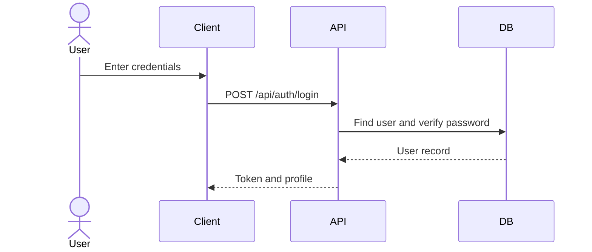

## 3. Product and Variant Management Flow

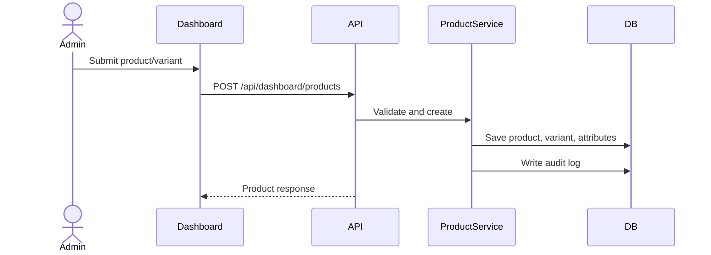

## 4. Inventory Adjustment Flow

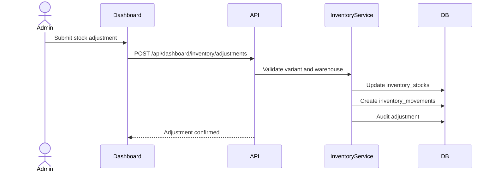

## 5. Stock Transfer Flow

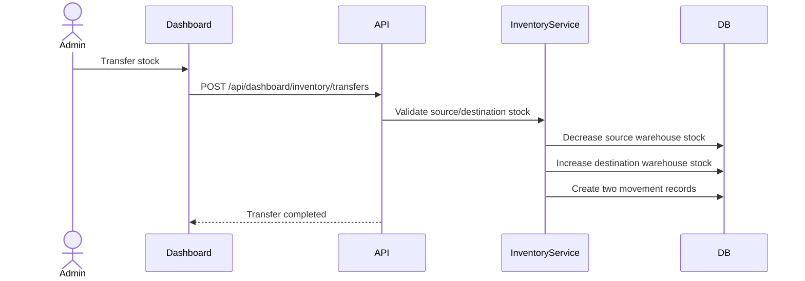

## 6. Quotation Creation Flow

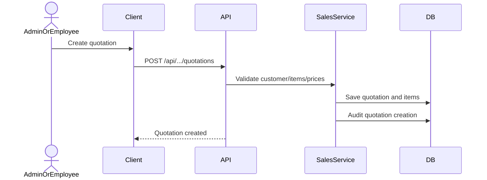

## 7. Customer Quotation Acceptance Flow

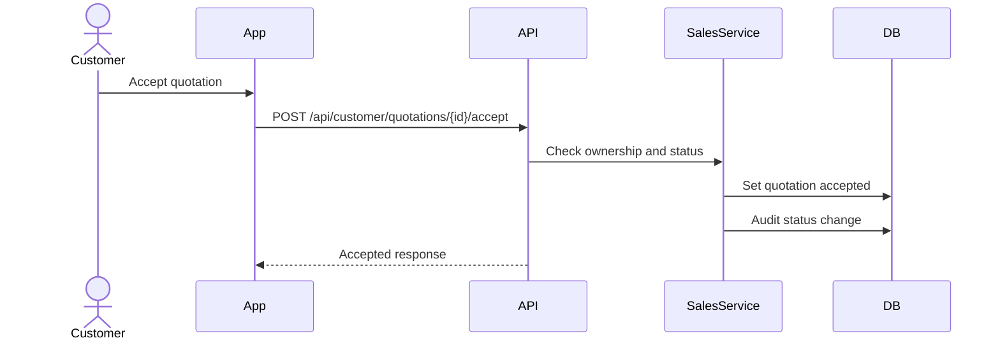

## 8. Delivery Note Confirmation Flow

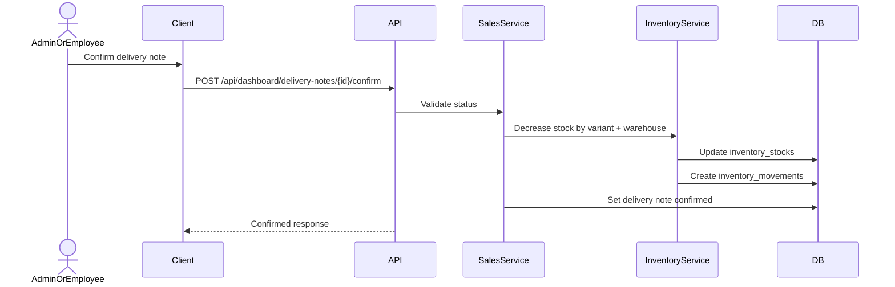

## 9. Invoice Creation and PDF Flow

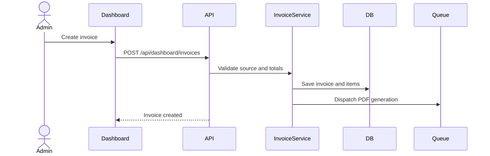

## 10. Stripe Payment and Tax Recognition Flow

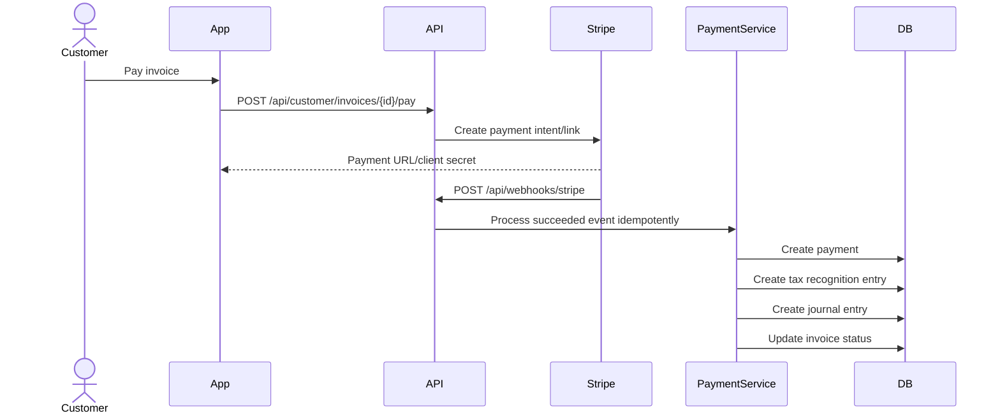

## 11. Manual Payment and Tax Recognition Flow

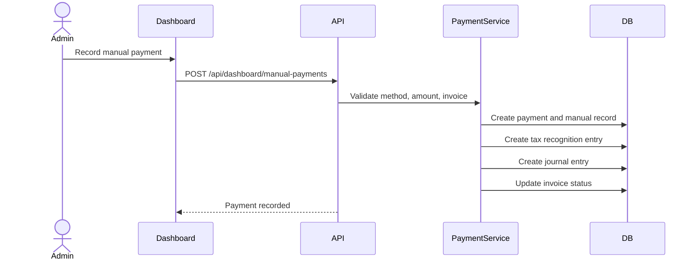

## 12. Credit Note Flow

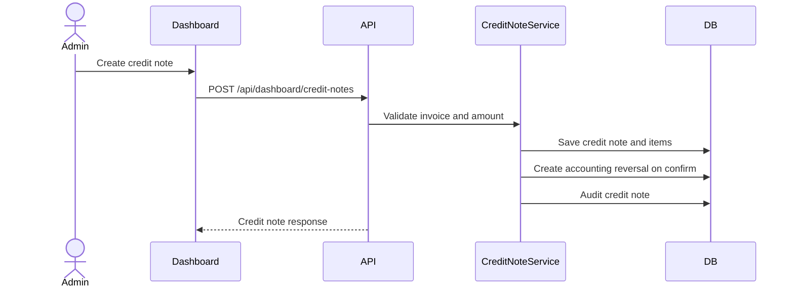

## 13. Supplier Confirmation Flow

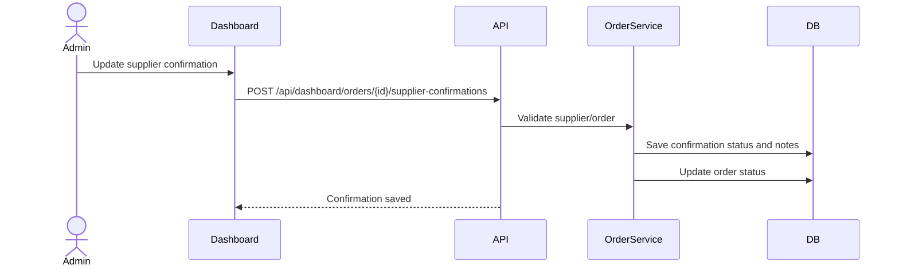

## 14. Employee Visit, GPS, and AI Voice Note Flow

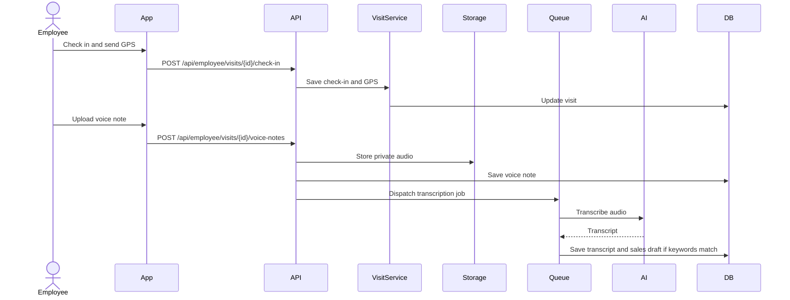

## 15. Ticket Payment and Live Status Flow

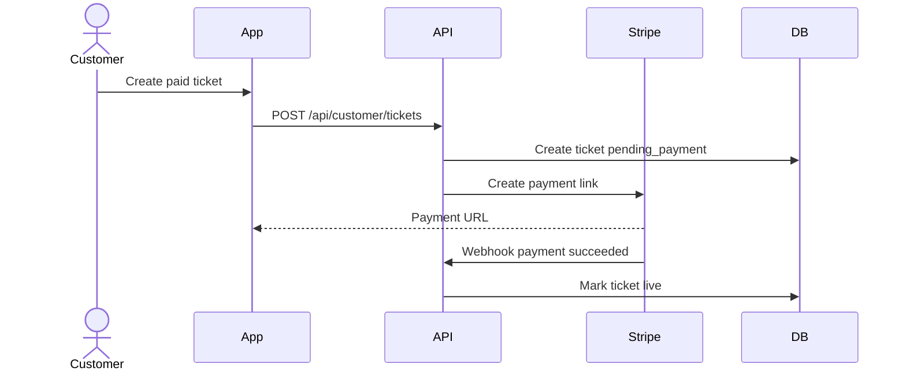

## 16. Open Questions

- Confirm whether the employee should see AI-detected drafts or only admins.

## 17. Future Spec Kit Extraction Map

See project Future Spec Kit extraction map in the main docs.
